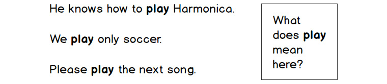
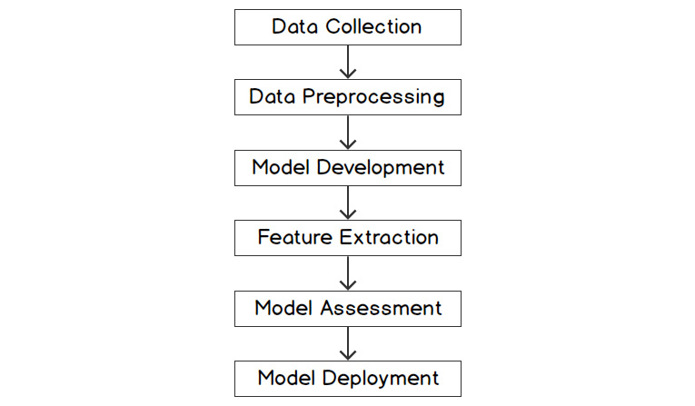

1. Introduction to Natural Language Processing
==============================================


Overview

In this chapter, you will learn the difference between **Natural
Language Processing** (**NLP**) and basic text analytics. You will
implement various preprocessing tasks such as tokenization,
lemmatization, stemming, stop word removal, and more. By the end of this
chapter, you will have a deep understanding of the various phases of an
NLP project, from data collection to model deployment.


Introduction
============


Before we can get into NLP in any depth, we first need to understand
what natural language is. To put it in simple terms, it is a means for
us to express our thoughts and ideas. To define it more specifically,
language is a mutually agreed upon set of protocols involving
words/sounds that we use to communicate with each other.

In this era of digitization and computation, we are constantly
interacting with machines around us through various means, such as voice
commands and typing instructions in the form of words. Thus, it has
become essential to develop mechanisms by which human language can be
comprehended accurately by computers. NLP helps us do this. So, NLP can
be defined as a field of computer science that is concerned with
enabling computer algorithms to understand, analyze, and generate
natural languages.

Let\'s look at an example. You have probably interacted with Siri or
Alexa at some point. Ask Alexa for a cricket score, and it will reply
with the current score. The technology behind this is NLP. Siri and
Alexa use techniques such as Speech to Text with the help of a search
engine to do this magic. As the name suggests, Speech to Text is an
application of NLP in which computers are trained to understand verbally
spoken words.

NLP works at different levels, which means that machines process and
understand natural language at different levels. These levels are as
follows:

-   **Morphological level**: This level deals with understanding word
    structure and word information.
-   **Lexical level**: This level deals with understanding the part of
    speech of the word.
-   **Syntactic level**: This level deals with understanding the
    syntactic analysis of a sentence, or parsing a sentence.
-   **Semantic level**: This level deals with understanding the actual
    meaning of a sentence.
-   **Discourse level**: This level deals with understanding the meaning
    of a sentence beyond just the sentence level, that is, considering
    the context.
-   **Pragmatic level**: This level deals with using real-world
    knowledge to understand the sentence.


History of NLP
==============


NLP is a field that has emerged from various other fields such as
artificial intelligence, linguistics, and data science. With the
advancement of computing technologies and the increased availability of
data, NLP has undergone a huge change. Previously, a traditional
rule-based system was used for computations, in which you had to
explicitly write hardcoded rules. Today, computations on natural
language are being done using machine learning and deep learning
techniques.

Consider an example. Let\'s say we have to extract the names of some
politicians from a set of political news articles. So, if we want to
apply rule-based grammar, we must manually craft certain rules based on
human understanding of language. Some of the rules for extracting a
person\'s name can be that the word should be a proper noun, every word
should start with a capital letter, and so on. As we can see, using a
rule-based system like this would not yield very accurate results.

Rule-based systems do work well in some cases, but the disadvantages far
outweigh the advantages. One major disadvantage is that the same rule
cannot be applicable in all cases, given the complex and nuanced nature
of most language. These disadvantages can be overcome by using machine
learning, where we write an algorithm that tries to learn a language
using the text corpus (training data) rather than us explicitly
programming it to do so.


Text Analytics and NLP
======================


**Text analytics** is the method of extracting meaningful insights and
answering questions from text data, such as those to do with the length
of sentences, length of words, word count, and finding words from the
text. Let\'s understand this with an example.

Suppose we are doing a survey using news articles. Let\'s say we have to
find the top five countries that contributed the most in the field of
space technology in the past 5 years. So, we will collect all the space
technology-related news from the past 5 years using the Google News API.
Now, we must extract the names of countries in these news articles. We
can perform this task using a file containing a list of all the
countries in the world.

Next, we will create a dictionary in which keys will be the country
names and their values will be the number of times the country name is
found in the news articles. To search for a country in the news
articles, we can use a simple word regex. After we have completed
searching all the news articles, we can sort the country names by the
values associated with them. In this way, we will come up with the top
five countries that contributed the most to space technology in the last
5 years.

This is a typical example of text analytics, in which we are generating
insights from text without getting into the semantics of the language.

It is important here to note the difference between text analytics and
NLP. The art of extracting useful insights from any given text data can
be referred to as text analytics. NLP, on the other hand, helps us in
understanding the semantics and the underlying meaning of text, such as
the sentiment of a sentence, top keywords in text, and parts of speech
for different words. It is not just restricted to text data; voice
(speech) recognition and analysis also come under the domain of NLP. It
can be broadly categorized into two types: **Natural Language
Understanding** (**NLU**) and **Natural Language Generation** (**NLG**).
A proper explanation of these terms is provided here:

-   **NLU**: NLU refers to a process by which an inanimate object with
    computing power is able to comprehend spoken language. As mentioned
    earlier, Siri and Alexa use techniques such as Speech to Text to
    answer different questions, including inquiries about the weather,
    the latest news updates, live match scores, and more.
-   **NLG**: NLG refers to a process by which an inanimate object with
    computing power is able to communicate with humans in a language
    that they can understand or is able to generate human-understandable
    text from a dataset. Continuing with the example of Siri or Alexa,
    ask one of them about the chances of rainfall in your city. It will
    reply with something along the lines of, \"Currently, there is no
    chance of rainfall in your city.\" It gets the answer to your query
    from different sources using a search engine and then summarizes the
    results. Then, it uses Text to Speech to relay the results in
    verbally spoken words.

So, when a human speaks to a machine, the machine interprets the
language with the help of the NLU process. By using the NLG process, the
machine generates an appropriate response and shares it with the human,
thus making it easier for humans to understand the machine. These tasks,
which are part of NLP, are not part of text analytics. Let\'s walk
through the basics of text analytics and see how we can execute it in
Python.

Before going to the exercises, let\'s define some prerequisites for
running the exercises. Whether you are using Windows, Mac or Linux, you
need to run your Jupyter Notebook in a virtual environment. You will
also need to ensure that you have installed the requirements as stated
in the *requirements.txt* file on <https://github.com/fenago/natural-language-processing-workshop>.


Exercise 1.01: Basic Text Analytics
-----------------------------------

In this exercise, we will perform some basic text analytics on some
given text data, including searching for a particular word, finding the
index of a word, and finding a word at a given position. Follow these
steps to implement this exercise using the following sentence:

\"The quick brown fox jumps over the lazy dog.\"

1.  Open a Jupyter Notebook.

2.  Assign a `sentence` variable the value
    `'The quick brown fox jumps over the lazy dog'`. Insert a
    new cell and add the following code to implement this:


    ```
    sentence = 'The quick brown fox jumps over the lazy dog'
    sentence
    ```


3.  Check whether the word `'quick'` belongs to that text
    using the following code:


    ```
    def find_word(word, sentence):
        return word in sentence
    find_word('quick', sentence)
    ```


    The preceding code will return the output `'True'`.

4.  Find out the `index` value of the word `'fox'`
    using the following code:


    ```
    def get_index(word, text):
        return text.index(word)
    get_index('fox', sentence)
    ```


    The code will return the output `16`.

5.  To find out the rank of the word `'lazy'`, use the
    following code:


    ```
    get_index('lazy', sentence.split())
    ```


    This code generates the output `7`.

6.  To print the third word of the given text, use the following code:


    ```
    def get_word(text,rank):
        return text.split()[rank]
    get_word(sentence,2)
    ```


    This will return the output `brown`.

7.  To print the third word of the given sentence in reverse order, use
    the following code:


    ```
    get_word(sentence,2)[::-1]
    ```


    This will return the output `nworb`.

8.  To concatenate the first and last words of the given sentence, use
    the following code:


    ```
    def concat_words(text):
        """
        This method will concat first and last 
        words of given text
        """
        words = text.split()
        first_word = words[0]
        last_word = words[len(words)-1]
        return first_word + last_word
    concat_words(sentence)
    ```


    Note

    The triple-quotes ( `"""` ) shown in the code snippet
    above are used to denote the start and end points of a multi-line
    code comment. Comments are added into code to help explain specific
    bits of logic.

    The code will generate the output `Thedog`.

9.  To print words at even positions, use the following code:


    ```
    def get_even_position_words(text):
        words = text.split()
        return [words[i] for i in range(len(words)) if i%2 == 0]
    get_even_position_words(sentence)
    ```


    This code generates the following output:


    ```
    ['The', 'brown', 'jumps', 'the', 'dog']
    ```


10. To print the last three letters of the text, use the following code:


    ```
    def get_last_n_letters(text, n):
        return text[-n:]
    get_last_n_letters(sentence,3)
    ```


    This will generate the output `dog`.

11. To print the text in reverse order, use the following code:


    ```
    def get_reverse(text):
        return text[::-1]
    get_reverse(sentence)
    ```


    This code generates the following output:


    ```
    'god yzal eht revo spmuj xof nworb kciuq ehT'
    ```


12. To print each word of the given text in reverse order, maintaining
    their sequence, use the following code:


    ```
    def get_word_reverse(text):
        words = text.split()
        return ' '.join([word[::-1] for word in words])
    get_word_reverse(sentence)
    ```


    This code generates the following output:


    ```
    ehT kciuq nworb xof spmuj revo eht yzal god
    ```


We are now well acquainted with basic text analytics techniques.

Note

To access the source code for this specific section, please refer to
<https://github.com/fenago/natural-language-processing-workshop>.

You can also run this example online at <https://github.com/fenago/natural-language-processing-workshop>.

In the next section, let\'s dive deeper into the various steps and
subtasks in NLP.


Various Steps in NLP
====================


We\'ve talked about the types of computations that are done with natural
language. Apart from these basic tasks, you can also design your own
tasks as per your requirements. In the coming sections, we will discuss
the various preprocessing tasks in detail and demonstrate each of them
with an exercise.

To perform these tasks, we will be using a Python library called
**NLTK** (**Natural Language Toolkit**). NLTK is a powerful open source
tool that provides a set of methods and algorithms to perform a wide
range of NLP tasks, including tokenizing, parts-of-speech tagging,
stemming, lemmatization, and more.


Tokenization
------------

**Tokenization** refers to the procedure of splitting a sentence into
its constituent parts---the words and punctuation that it is made up of.
It is different from simply splitting the sentence on whitespaces, and
instead actually divides the sentence into constituent words, numbers
(if any), and punctuation, which may not always be separated by
whitespaces. For example, consider this sentence: \"I am reading a
book.\" Here, our task is to extract words/tokens from this sentence.
After passing this sentence to a tokenization program, the extracted
words/tokens would be \"I,\" \"am,\" \"reading,\" \"a,\" \"book,\" and
\".\" -- this example extracts one token at a time. Such tokens are
called **unigrams**.

NLTK provides a method called `word_tokenize()`, which
tokenizes given text into words. It actually separates the text into
different words based on punctuation and spaces between words.

To get a better understanding of tokenization, let\'s solve an exercise
based on it in the next section.


Exercise 1.02: Tokenization of a Simple Sentence
------------------------------------------------

In this exercise, we will tokenize the words in a given sentence with
the help of the **NLTK** library. Follow these steps to implement this
exercise using the sentence, \"I am reading NLP Fundamentals.\"

1.  Open a Jupyter Notebook.

2.  Insert a new cell and add the following code to import the necessary
    libraries and download the different types of NLTK data that we are
    going to use for different tasks in the following exercises:


    ```
    from nltk import word_tokenize, download
    download(['punkt','averaged_perceptron_tagger','stopwords'])
    ```


    In the preceding code, we are using NLTK\'s `download()`
    method, which downloads the given data from NLTK. NLTK data contains
    different corpora and trained models. In the preceding example, we
    will be downloading the stop word list, `'punkt'`, and a
    perceptron tagger, which is used to implement parts of speech
    tagging using a structured algorithm. The data will be downloaded at
    `nltk_data/corpora/` in the home directory of your
    computer. Then, it will be loaded from the same path in further
    steps.

3.  The `word_tokenize()` method is used to split the sentence
    into words/tokens. We need to add a sentence as input to the
    `word_tokenize()` method so that it performs its job. The
    result obtained will be a list, which we will store in a
    `word` variable. To implement this, insert a new cell and
    add the following code:


    ```
    def get_tokens(sentence):
        words = word_tokenize(sentence)
        return words
    ```


4.  In order to view the list of tokens generated, we need to view it
    using the `print()` function. Insert a new cell and add
    the following code to implement this:


    ```
    print(get_tokens("I am reading NLP Fundamentals."))
    ```


    This code generates the following output:


    ```
    ['I', 'am', 'reading', 'NLP', 'Fundamentals', '.']
    ```


We can see the list of tokens generated with the help of the
`word_tokenize()` method.

Note

To access the source code for this specific section, please refer to
<https://github.com/fenago/natural-language-processing-workshop>.

You can also run this example online at <https://github.com/fenago/natural-language-processing-workshop>.

In the next section, we will see another pre-processing step:
**Parts-of-Speech (PoS) tagging**.


PoS Tagging
-----------

In NLP, the term PoS refers to parts of speech. PoS tagging refers to
the process of tagging words within sentences with their respective PoS.
We extract the PoS of tokens constituting a sentence so that we can
filter out the PoS that are of interest and analyze them. For example,
if we look at the sentence, \"The sky is blue,\" we get four tokens,
namely \"The,\" \"sky,\" \"is,\" and \"blue\", with the help of
tokenization. Now, using a **PoS tagger**, we tag the PoS for each
word/token. This will look as follows:


```
[('The', 'DT'), ('sky', 'NN'), ('is', 'VBZ'), ('blue', 'JJ')]
```


The preceding format is an output of the NLTK
`pos_tag()`method. It is a list of tuples in which every tuple
consists of the word followed by the PoS tag:

`DT` = Determiner

`NN` = Noun, common, singular or mass

`VBZ` = Verb, present tense, third-person singular

`JJ` = Adjective

For the complete list of PoS tags in NLTK, you can refer to
<https://pythonprogramming.net/natural-language-toolkit-nltk-part-speech-tagging/>.

PoS tagging is performed using different techniques, one of which is a
rule-based approach that builds a list to assign a possible tag for each
word.

PoS tagging finds application in many NLP tasks, including word sense
disambiguation, classification, **Named Entity Recognition** (**NER**),
and coreference resolution. For example, consider the usage of the word
\"planted\" in these two sentences: \"He planted the evidence for the
case \" and \" He planted five trees in the garden. \" We can see that
the PoS tag of \"planted\" would clearly help us in differentiating
between the different meanings of the sentences.

Let\'s perform a simple exercise to understand how PoS tagging is done
in Python.


Exercise 1.03: PoS Tagging
--------------------------

In this exercise, we will find out the PoS for each word in the
sentence, `I am reading NLP Fundamentals`. We first make use
of tokenization in order to get the tokens. Later, we will use the
`pos_tag()` method, which will help us find the PoS for each
word/token. Follow these steps to implement this exercise:

1.  Open a Jupyter Notebook.

2.  Insert a new cell and add the following code to import the necessary
    libraries:


    ```
    from nltk import word_tokenize, pos_tag
    ```


3.  To find the tokens in the sentence, we make use of the
    `word_tokenize()` method. Insert a new cell and add the
    following code to implement this:


    ```
    def get_tokens(sentence):
        words = word_tokenize(sentence)
        return words
    ```


4.  Print the tokens with the help of the `print()` function.
    To implement this, add a new cell and write the following code:


    ```
    words  = get_tokens("I am reading NLP Fundamentals")
    print(words)
    ```


    This code generates the following output:


    ```
    ['I', 'am', 'reading', 'NLP', 'Fundamentals']
    ```


5.  We\'ll now use the `pos_tag()` method. Insert a new cell
    and add the following code:


    ```
    def get_pos(words):
        return pos_tag(words)
    get_pos(words)
    ```


    This code generates the following output:


    ```
    [('I', 'PRP'),
     ('am', 'VBP'),
     ('reading', 'VBG'),
     ('NLP', 'NNP'),
     ('Fundamentals', 'NNS')]
    ```


In the preceding output, we can see that for each token, a PoS has been
allotted. Here, **PRP** stands for **personal pronoun**, **VBP** stands
for **verb present**, **VGB** stands for **verb gerund**, **NNP** stands
for **proper noun singular**, and **NNS** stands for **noun plural**.

Note

To access the source code for this specific section, please refer to
<https://github.com/fenago/natural-language-processing-workshop>.

You can also run this example online at <https://github.com/fenago/natural-language-processing-workshop>.

We have learned about assigning appropriate PoS labels to tokens in a
sentence. In the next section, we will learn about **stop words** in
sentences and ways to deal with them.


Stop Word Removal
-----------------

Stop words are the most frequently occurring words in any language and
they are just used to support the construction of sentences and do not
contribute anything to the semantics of a sentence. So, we can remove
stop words from any text before an NLP process, as they occur very
frequently and their presence doesn\'t have much impact on the sense of
a sentence. Removing them will help us clean our data, making its
analysis much more efficient. Examples of stop words include \"a,\"
\"am,\" \"and,\" \"the,\" \"in,\" \"of,\" and more.

In the next exercise, we will look at the practical implementation of
removing stop words from a given sentence.


Exercise 1.04: Stop Word Removal
--------------------------------

In this exercise, we will check the list of stop words provided by the
`nltk` library. Based on this list, we will filter out the
stop words included in our text:

1.  Open a Jupyter Notebook.

2.  Insert a new cell and add the following code to import the necessary
    libraries:


    ```
    from nltk import download
    download('stopwords')
    from nltk import word_tokenize
    from nltk.corpus import stopwords
    ```


3.  In order to check the list of stop words provided for
    `English`, we pass it as a parameter to the
    `words()` function. Insert a new cell and add the
    following code to implement this:


    ```
    stop_words = stopwords.words('english')
    ```


4.  In the code, the list of stop words provided by `English`
    is stored in the `stop_words` variable. In order to view
    the list, we make use of the `print()` function. Insert a
    new cell and add the following code to view the list:


    ```
    print(stop_words)
    ```


    This code generates the following output:


    


    Figure 1.1: List of stop words provided by English

5.  To remove the stop words from a sentence, we first assign a string
    to the `sentence` variable and tokenize it into words
    using the `word_tokenize()` method. Insert a new cell and
    add the following code to implement this:


    ```
    sentence = "I am learning Python. It is one of the "\
               "most popular programming languages"
    sentence_words = word_tokenize(sentence)
    ```


    Note

    The code snippet shown here uses a backslash ( `\` ) to
    split the logic across multiple lines. When the code is executed,
    Python will ignore the backslash, and treat the code on the next
    line as a direct continuation of the current line.

6.  To print the list of tokens, insert a new cell and add the following
    code:


    ```
    print(sentence_words)
    ```


    This code generates the following output:


    ```
    ['I', 'am', 'learning', 'Python', '.', 'It', 'is', 'one', 'of', 'the', 'most', 'popular', 'programming', 'languages']
    ```


7.  To remove the stop words, we need to loop through each word in the
    sentence, check whether there are any stop words, and then finally
    combine them to form a complete sentence. To implement this, insert
    a new cell and add the following code:


    ```
    def remove_stop_words(sentence_words, stop_words):
        return ' '.join([word for word in sentence_words if \
                         word not in stop_words])
    ```


8.  To check whether the stop words are filtered out from our sentence,
    print the `sentence_no_stops` variable. Insert a new cell
    and add the following code to print:


    ```
    print(remove_stop_words(sentence_words,stop_words))
    ```


    This code generates the following output:


    ```
    I learning Python. It one popular programming languages
    ```


    As you can see in the preceding code snippet, stop words such as
    \"am,\" \"is,\" \"of,\" \"the,\" and \"most\" are being filtered out
    and text without stop words is produced as output.

9.  Add your own stop words to the stop word list:


    ```
    stop_words.extend(['I','It', 'one'])
    print(remove_stop_words(sentence_words,stop_words))
    ```


    This code generates the following output:


    ```
    learning Python . popular programming languages
    ```


As we can see from the output, now words such as \"I,\" \"It,\" and\*
\"One\" are removed as we have added them to our custom stop word list.
We have learned how to remove stop words from given text.

Note

To access the source code for this specific section, please refer to
<https://github.com/fenago/natural-language-processing-workshop>.

You can also run this example online at <https://github.com/fenago/natural-language-processing-workshop>.

In the next section, we will focus on normalizing text.


Text Normalization
------------------

There are some words that are spelled, pronounced, and represented
differently---for example, words such as Mumbai and Bombay, and US and
United States. Although they are different, they refer to the same
thing. There are also different forms of words that need to be converted
into base forms. For example, words such as \"does\" and \"doing,\" when
converted to their base form, become \"do.\" Along these lines, **text
normalization** is a process wherein different variations of text get
converted into a standard form. We need to perform text normalization as
there are some words that can mean the same thing as each other. There
are various ways of normalizing text, such as spelling correction,
stemming, and lemmatization, which will be covered later.

For a better understanding of this topic, we will look into a practical
implementation of text normalization in the next section.


Exercise 1.05: Text Normalization
---------------------------------

In this exercise, we will normalize some given text. Basically, we will
be trying to replace select words with new words, using the
`replace()` function, and finally produce the normalized text.
`replace()` is a built-in Python function that works on
strings and takes two arguments. It will return a copy of a string in
which the occurrence of the first argument will be replaced by the
second argument.

Follow these steps to complete this exercise:

1.  Open a Jupyter Notebook.

2.  Insert a new cell and add the following code to assign a string to
    the `sentence` variable:


    ```
    sentence = "I visited the US from the UK on 22-10-18"
    ```


3.  We want to replace `"US"` with
    `"United States"`, `"UK"` with
    `"United Kingdom"`, and `"18"` with
    `"2018"`. To do so, use the `replace()` function
    and store the updated output in the
    `"normalized_sentence"` variable. Insert a new cell and
    add the following code to implement this:


    ```
    def normalize(text):
        return text.replace("US", "United States")\
                   .replace("UK", "United Kingdom")\
                   .replace("-18", "-2018")
    ```


4.  To check whether the text has been normalized, insert a new cell and
    add the following code to print it:


    ```
    normalized_sentence = normalize(sentence)
    print(normalized_sentence)
    ```


    The code generates the following output:


    ```
    I visited the United States from the United Kingdom on 22-10-2018
    ```


5.  Add the following code:


    ```
    normalized_sentence = normalize('US and UK are two superpowers')
    print(normalized_sentence)
    ```


    The code generates following output:


    ```
    United States and United Kingdom are two superpowers
    ```


In the preceding code, we can see that our text has been normalized.

Note

To access the source code for this specific section, please refer to
<https://github.com/fenago/natural-language-processing-workshop>.

You can also run this example online at <https://github.com/fenago/natural-language-processing-workshop>.

Over the next sections, we will explore various other ways in which text
can be normalized.


Spelling Correction
-------------------

Spelling correction is one of the most important tasks in any NLP
project. It can be time-consuming, but without it, there are high
chances of losing out on important information.

Spelling correction is executed in two steps:

1.  Identify the misspelled word, which can be done by a simple
    dictionary lookup. If there is no match found in the language
    dictionary, it is considered to be misspelled.
2.  Replace it or suggest the correctly spelled word. There are a lot of
    algorithms for this task. One of them is the minimum edit distance
    algorithm, which chooses the nearest correctly spelled word for a
    misspelled word. The nearness is defined by the number of edits that
    need to be made to the misspelled word to reach the correctly
    spelled word. For example, let\'s say there is a misspelled word,
    \"autocorect.\" Now, to make it \"autocorrect,\" we need to add one
    \"r,\" and to make it \"auto,\" we need to delete 6 characters,
    which means that \"autocorrect\" is the correct spelling because it
    requires the fewest edits.

We make use of the `autocorrect` Python library to correct
spellings.

`autocorrect` is a Python library used to correct the spelling
of misspelled words for different languages. It provides a method called
`spell()`, which takes a word as input and returns the correct
spelling of the word.

Let\'s look at the following exercise to get a better understanding of
this.


Exercise 1.06: Spelling Correction of a Word and a Sentence
-----------------------------------------------------------

In this exercise, we will perform spelling correction on a word and a
sentence, with the help of Python\'s `autocorrect` library.
Follow these steps in order to complete this exercise:

1.  Open a Jupyter Notebook.

2.  Insert a new cell and add the following code to import the necessary
    libraries:


    ```
    from nltk import word_tokenize
    from autocorrect import Speller
    ```


3.  In order to correct the spelling of a word, pass a wrongly spelled
    word as a parameter to the `spell()` function. Before
    that, you have to create a `spell` object of the
    `Speller` class using `lang='en'` to signify the
    English language. Insert a new cell and add the following code to
    implement this:


    ```
    spell = Speller(lang='en')
    spell('Natureal')
    ```


    This code generates the following output:


    ```
    'Natural'
    ```


4.  To correct the spelling of a sentence, first tokenize it into
    tokens. After that, loop through each token in `sentence`,
    autocorrect the words, and finally combine the words. Insert a new
    cell and add the following code to implement this:


    ```
    sentence = word_tokenize("Ntural Luanguage Processin deals with "\
                             "the art of extracting insightes from "\
                             "Natural Languaes")
    ```


5.  Use the `print()` function to print all tokens. Insert a
    new cell and add the following code to print the tokens:


    ```
    print(sentence)
    ```


    This code generates the following output:


    ```
    ['Ntural', 'Luanguage', 'Processin', 'deals', 'with', 'the', 'art', 'of', 'extracting', 'insightes', 'from', 'Natural', 'Languaes']
    ```


6.  Now that we have got the tokens, loop through each token in
    `sentence`, correct the tokens, and assign them to a new
    variable. Insert a new cell and add the following code to implement
    this:


    ```
    def correct_spelling(tokens):
        sentence_corrected = ' '.join([spell(word) \
                                       for word in tokens])
        return sentence_corrected
    ```


7.  To print the correct sentence, insert a new cell and add the
    following code:


    ```
    print(correct_spelling(sentence))
    ```


    This code generates the following output:


    ```
    ['Natural', 'Language', 'Procession', 'deals', 'with', 'the', 'art', 
     'of', 'extracting', 'insights', 'from', 'Natural', 'Languages']
    ```


In the preceding code snippet, we can see that most of the wrongly
spelled words have been corrected. But the word
\"`Processin`\" was wrongly converted into
\"`Procession`.\" It should have been
\"`Processing`.\" This happened because to change
\"`Processin`\" to \"`Procession`\" or
\"`Processing`,\" an equal number of edits is required. To
rectify this, we need to use other kinds of spelling correctors that are
aware of context.

Note

To access the source code for this specific section, please refer to
<https://github.com/fenago/natural-language-processing-workshop>.

You can also run this example online at <https://github.com/fenago/natural-language-processing-workshop>.

In the next section, we will look at stemming, which is another form of
text normalization.


Stemming
--------

In most languages, words get transformed into various forms when being
used in a sentence. For example, the word \"product\" might get
transformed into \"production\" when referring to the process of making
something or transformed into \"products\" in plural form. It is
necessary to convert these words into their base forms, as they carry
the same meaning in any case. Stemming is the process that helps us to
do so. If we look at the following figure, we get a perfect idea of how
words get transformed into their base forms:

<div>


</div>

Figure 1.2: Stemming of the word \"product\"

To get a better understanding of stemming, let\'s perform a simple
exercise.

In this exercise, we will be using two algorithms, called the porter
stemmer and the snowball stemmer, provided by the NLTK library. The
porter stemmer is a rule-based algorithm that transforms words to their
base form by removing suffixes from words. The snowball stemmer is an
improvement over the porter stemmer and is a little bit faster and uses
less memory. In NLTK, this is done by the `stem()` method
provided by the `PorterStemmer` class.


Exercise 1.07: Using Stemming
-----------------------------

In this exercise, we will pass a few words through the stemming process
so that they get converted into their base forms. Follow these steps to
implement this exercise:

1.  Open a Jupyter Notebook.

2.  Insert a new cell and add the following code to import the necessary
    libraries:


    ```
    from nltk import stem
    ```


3.  Now pass the following words as parameters to the `stem()`
    method. To implement this, insert a new cell and add the following
    code:


    ```
    def get_stems(word,stemmer):
        return stemmer.stem(word)
    porterStem = stem.PorterStemmer()
    get_stems("production",porterStem)
    ```


4.  When the input is `"production"`, the following output is
    generated:


    ```
    'product'
    ```


5.  Similarly, the following code would be used for the input
    `"coming"`.


    ```
    get_stems("coming",porterStem)
    ```


    We get the following output:


    ```
    'come'
    ```


6.  Similarly, the following code would be used for the input
    `"firing"`.


    ```
      get_stems("firing",porterStem)
    ```


    When the input is `"firing"`, the following output is
    generated:


    ```
    'fire'
    ```


7.  The following code would be used for the input
    `"battling"`.


    ```
      get_stems("battling",porterStem)
    ```


    If we give the input `"battling"`, the following output is
    generated:


    ```
    'battl'
    ```


8.  The following code will also generate the same output as above, for
    the input `"battling".`


    ```
    stemmer = stem.SnowballStemmer("english")
    get_stems("battling",stemmer)
    ```


    The output will be as follows:


    ```
    'battl'
    ```


As you have seen while using the snowball stemmer, we have to provide
the language as `"english"`. We can also use the stemmer for
different languages such as Spanish, French, and many more. From the
preceding code snippets, we can see that the entered words are converted
into their base forms.

Note

To access the source code for this specific section, please refer to
<https://github.com/fenago/natural-language-processing-workshop>.

You can also run this example online at <https://github.com/fenago/natural-language-processing-workshop>.

In the next section, we will focus on **lemmatization**, which is
another form of text normalization.


Lemmatization
-------------

Sometimes, the stemming process leads to incorrect results. For example,
in the last exercise, the word `battling` was transformed to
`"battl"`, which is not a word. To overcome such problems with
stemming, we make use of lemmatization. Lemmatization is the process of
converting words to their base grammatical form, as in \"battling\" to
\"battle,\" rather than just randomly axing words. In this process, an
additional check is made by looking through a dictionary to extract the
base form of a word. Getting more accurate results requires some
additional information; for example, PoS tags along with words will help
in getting better results.

In the following exercise, we will be using
`WordNetLemmatizer`, which is an NLTK interface of WordNet.
WordNet is a freely available lexical English database that can be used
to generate semantic relationships between words. NLTK\'s
`WordNetLemmatizer` provides a method called
`lemmatize()`, which returns the lemma (grammatical base form)
of a given word using WordNet.

To put lemmatization into practice, let\'s perform an exercise where
we\'ll use the `lemmatize()` function.


Exercise 1.08: Extracting the Base Word Using Lemmatization
-----------------------------------------------------------

In this exercise, we will use the lemmatization process to produce the
proper form of a given word. Follow these steps to implement this
exercise:

1.  Open a Jupyter Notebook.

2.  Insert a new cell and add the following code to import the necessary
    libraries:


    ```
    from nltk import download
    download('wordnet')
    from nltk.stem.wordnet import WordNetLemmatizer
    ```


3.  Create an object of the `WordNetLemmatizer` class. Insert
    a new cell and add the following code to implement this:


    ```
    lemmatizer = WordNetLemmatizer()
    ```


4.  Bring the word to its proper form by using the
    `lemmatize()` method of the `WordNetLemmatizer`
    class. Insert a new cell and add the following code to implement
    this:


    ```
    def get_lemma(word):
        return lemmatizer.lemmatize(word)
    get_lemma('products')
    ```


    With the input `products`, the following output is
    generated:


    ```
    'product'
    ```


5.  Similarly, use the input as `production` now:


    ```
    get_lemma('production')
    ```


    With the input `production`, the following output is
    generated:


    ```
    'production'
    ```


6.  Similarly, use the input as `coming` now:


    ```
    get_lemma('coming')
    ```


    With the input `coming`, the following output is
    generated:


    ```
    'coming'
    ```


    Hence, we have learned how to use the lemmatization process to
    transform a given word into its base form.

    Note

    To access the source code for this specific section, please refer to
    <https://github.com/fenago/natural-language-processing-workshop>.

    You can also run this example online at
    <https://github.com/fenago/natural-language-processing-workshop>.

In the next section, we will look at another preprocessing step in NLP:
**named entity recognition** (**NER**).


Named Entity Recognition (NER)
------------------------------

NER is the process of extracting important entities, such as person
names, place names, and organization names, from some given text. These
are usually not present in dictionaries. So, we need to treat them
differently. The main objective of this process is to identify the named
entities (such as proper nouns) and map them to categories, which are
already defined. For example, categories might include names of people,
places, and so on.

NER has found use in many NLP tasks, including assigning tags to news
articles, search algorithms, and more. NER can analyze a news article
and extract the major people, organizations, and places discussed in it
and assign them as tags for new articles.

In the case of search algorithms, let\'s suppose we have to create a
search engine, meant specifically for books. If we were to submit a
given query for all the words, the search would take a lot of time.
Instead, if we extract the top entities from all the books using NER and
run a search query on the entities rather than all the content, the
speed of the system would increase dramatically.

To get a better understanding of this process, we\'ll perform an
exercise. Before moving on to the exercise, let me introduce you to
chunking, which we are going to use in the following exercise. Chunking
is the process of grouping words together into chunks, which can be
further used to find noun groups and verb groups, or can also be used
for sentence partitioning.


Exercise 1.09: Treating Named Entities
--------------------------------------

In this exercise, we will find the named entities in a given sentence.
Follow these steps to implement this exercise using the following
sentence:

\"We are reading a book published by Packt which is based out of
Birmingham.\"

1.  Open a Jupyter Notebook.

2.  Insert a new cell and add the following code to import the necessary
    libraries:


    ```
    from nltk import download
    from nltk import pos_tag
    from nltk import ne_chunk
    from nltk import word_tokenize
    download('maxent_ne_chunker')
    download('words')
    ```


3.  Declare the `sentence` variable and assign it a string.
    Insert a new cell and add the following code to implement this:


    ```
    sentence = "We are reading a book published by Packt "\
               "which is based out of Birmingham."
    ```


4.  To find the named entities from the preceding text, insert a new
    cell and add the following code:


    ```
    def get_ner(text):
        i = ne_chunk(pos_tag(word_tokenize(text)), binary=True)
        return [a for a in i if len(a)==1]
    get_ner(sentence)
    ```


    This code generates the following output:


    ```
    [Tree('NE', [('Packt', 'NNP')]), Tree('NE', [('Birmingham', 'NNP')])]
    ```


    In the preceding code, we can see that the code identifies the named
    entities \"`Packt`\" and \"`Birmingham`\" and
    maps them to an already-defined category, \"`NNP`.\"

    Note

    To access the source code for this specific section, please refer to
    <https://github.com/fenago/natural-language-processing-workshop>.

    You can also run this example online at
    <https://github.com/fenago/natural-language-processing-workshop>.

In the next section, we will focus on word sense disambiguation, which
helps us to identify the right sense of any word.


Word Sense Disambiguation
=========================


There\'s a popular saying: \"A man is known by the company he keeps.\'\'
Similarly, a word\'s meaning depends on its association with other words
in a sentence. This means two or more words with the same spelling may
have different meanings in different contexts. This often leads to
ambiguity. Word sense disambiguation is the process of mapping a word to
the sense that it should carry. We need to disambiguate words based on
the sense they carry so that they can be treated as different entities
when being analyzed. The following figure displays a perfect example of
how ambiguity is caused due to the usage of the same word in different
sentences:

<div>





</div>

Figure 1.3: Word sense disambiguation

One of the algorithms to solve word sense disambiguation is the Lesk
algorithm. It has a huge corpus in the background (generally
`WordNet` is used) that contains definitions of all the
possible synonyms of all the possible words in a language. Then it takes
a word and the context as input and finds a match between the context
and all the definitions of the word. The meaning with the highest number
of matches with the context of the word will be returned.

For example, suppose we have a sentence such as \"We play only soccer\"
in a given text. Now, we need to find the meaning of the word \"play\"
in this sentence. In the Lesk algorithm, each word with ambiguous
meaning is saved in background synsets. In this case, the word \"play\"
will be saved with all possible definitions. Let\'s say we have two
definitions of the word \"play\":

1.  Play: Participating in a sport or game
2.  Play: Using a musical instrument

Then, we will find the similarity between the context of the word
\"play\" in the text and both of the preceding definitions using text
similarity techniques. The definition best suited to the context of
\"play\" in the sentence will be considered the meaning or definition of
the word. In this case, we will find that our first definition fits best
in context, as the words \"sport\" and \"game\" are present in the
preceding sentences.

In the next exercise, we will be using the Lesk module from NLTK. It
takes a sentence and the word as input, and returns the meaning or
definition of the word. The output of the Lesk method is
`synset`, which contains the ID of the matched definition.
These IDs can be matched with their definitions using the
`definition()` method of `wsd.synset('word')`.

To get a better understanding of this process, let\'s look at an
exercise.


Exercise 1.10: Word Sense Disambiguation
----------------------------------------

In this exercise, we will find the sense of the word \"bank\" in two
different sentences. Follow these steps to implement this exercise:

1.  Open a Jupyter Notebook.

2.  Insert a new cell and add the following code to import the necessary
    libraries:


    ```
    import nltk
    nltk.download('wordnet')
    from nltk.wsd import lesk
    from nltk import word_tokenize
    ```


3.  Declare two variables, `sentence1` and
    `sentence2`, and assign them with appropriate strings.
    Insert a new cell and the following code to implement this:


    ```
    sentence1 = "Keep your savings in the bank"
    sentence2 = "It's so risky to drive over the banks of the road"
    ```


4.  To find the sense of the word \"bank\" in the preceding two
    sentences, use the Lesk algorithm provided by the
    `nltk.wsd` library. Insert a new cell and add the
    following code to implement this:


    ```
    def get_synset(sentence, word):
        return lesk(word_tokenize(sentence), word)
    get_synset(sentence1,'bank')
    ```


    This code generates the following output:


    ```
    Synset('savings_bank.n.02')
    ```


5.  Here, `savings_bank.n.02` refers to a container for
    keeping money safely at home. To check the other sense of the word
    \"bank,\" write the following code:


    ```
    get_synset(sentence2,'bank')
    ```


    This code generates the following output:


    ```
    Synset('bank.v.07')
    ```


    Here, `bank.v.07` refers to a slope in the turn of a road.

    Thus, with the help of the Lesk algorithm, we were able to identify
    the sense of a word in whatever context.

    Note

    To access the source code for this specific section, please refer to
    <https://github.com/fenago/natural-language-processing-workshop>.

    You can also run this example online at
    <https://github.com/fenago/natural-language-processing-workshop>.

In the next section, we will focus on **sentence boundary detection**,
which helps detect the start and end points of sentences.


Sentence Boundary Detection
===========================


Sentence boundary detection is the method of detecting where one
sentence ends and another begins. If you are thinking that this sounds
pretty easy, as a period (.) or a question mark (?) denotes the end of a
sentence and the beginning of another sentence, then you are wrong.
There can also be instances where the letters of acronyms are separated
by full stops, for instance. Various analyses need to be performed at a
sentence level; detecting the boundaries of sentences is essential.

An exercise will provide us with a better understanding of this process.


Exercise 1.11: Sentence Boundary Detection
------------------------------------------

In this exercise, we will extract sentences from a paragraph. To do so,
we\'ll be using the `sent_tokenize()` method, which is used to
detect sentence boundaries. The following steps need to be performed:

1.  Open a Jupyter Notebook.

2.  Insert a new cell and add the following code to import the necessary
    libraries:


    ```
    import nltk
    from nltk.tokenize import sent_tokenize
    ```


3.  Use the `sent_tokenize()` method to detect sentences in
    some given text. Insert a new cell and add the following code to
    implement this:


    ```
    def get_sentences(text):
        return sent_tokenize(text)
    get_sentences("We are reading a book. Do you know who is "\
                  "the publisher? It is Packt. Packt is based "\
                  "out of Birmingham.")
    ```


    This code generates the following output:


    ```
    ['We are reading a book.'
     'Do you know who is the publisher?'
     'It is Packt.',
     'Packt is based out of Birmingham.']
    ```


4.  Use the `sent_tokenize()` method for text that contains
    periods (.) other than those found at the ends of sentences:


    ```
    get_sentences("Mr. Donald John Trump is the current "\
                  "president of the USA. Before joining "\
                  "politics, he was a businessman.")
    ```


    The code will generate the following output:


    ```
    ['Mr. Donald John Trump is the current president of the USA.',
     'Before joining politics, he was a businessman.']
    ```


As you can see in the code, the `sent_tokenize` method is able
to differentiate between the period (.) after \"Mr\" and the one used to
end the sentence. We have covered all the preprocessing steps that are
involved in NLP.

Note

To access the source code for this specific section, please refer to
<https://github.com/fenago/natural-language-processing-workshop>.

You can also run this example online at <https://github.com/fenago/natural-language-processing-workshop>.

Now, using the knowledge we\'ve gained, let\'s perform an activity.


Activity 1.01: Preprocessing of Raw Text
----------------------------------------

We have a text corpus that is in an improper format. In this activity,
we will perform all the preprocessing steps that were discussed earlier
to get some meaning out of the text.

Note

The text corpus, `file.txt`, can be found at this location:
<https://github.com/fenago/natural-language-processing-workshop/blob/master/Lab01/data/file.txt>[](https://github.com/fenago/natural-language-processing-workshop/blob/master/Lab01/data/file.txt)

After downloading the file, place it in the same directory as the
notebook.

Follow these steps to implement this activity:

1.  Import the necessary libraries.

2.  Load the text corpus to a variable.

3.  Apply the tokenization process to the text corpus and print the
    first 20 tokens.

4.  Apply spelling correction on each token and print the initial 20
    corrected tokens as well as the corrected text corpus.

5.  Apply PoS tags to each of the corrected tokens and print them.

6.  Remove stop words from the corrected token list and print the
    initial 20 tokens.

7.  Apply stemming and lemmatization to the corrected token list and
    then print the initial 20 tokens.

8.  Detect the sentence boundaries in the given text corpus and print
    the total number of sentences.

    Note

    The solution to this activity can be found below.

We have learned about and achieved the preprocessing of given data. By
now, you should be familiar with what NLP is and what basic
preprocessing steps are needed to carry out any NLP project. In the next
section, we will focus on the different phases of an NLP project.


Kick Starting an NLP Project
============================


We can divide an NLP project into several sub-projects or phases. These
phases are completed in a particular sequence. This tends to increase
the overall efficiency of the process, as memory usage changes from one
phase to the next. An NLP project has to go through six major phases,
which are outlined in the following figure:

<div>





</div>

Figure 1.4: Phases of an NLP project

Suppose you are working on a project in which you need to classify
emails as important and unimportant. We will explain how this is carried
out by discussing each phase in detail.


Data Collection
---------------

This is the initial phase of any NLP project. Our sole purpose is to
collect data as per our requirements. For this, we may either use
existing data, collect data from various online repositories, or create
our own dataset by crawling the web. In our case, we will collect
different email data. We can even get this data from our personal emails
as well, to start with.


Data Preprocessing
------------------

Once the data is collected, we need to clean it. For the process of
cleaning, we will make use of the different preprocessing steps that we
have learned about in this chapter. It is necessary to clean the
collected data to ensure effectiveness and accuracy. In our case, we
will follow these preprocessing steps:

1.  Converting all the text data to lowercase
2.  Stop word removal
3.  Text normalization, which will include replacing all numbers with
    some common term and replacing punctuation with empty strings
4.  Stemming and lemmatization


Feature Extraction
------------------

Computers understand only binary digits: 0 and 1. As such, every
instruction we feed into a computer gets transformed into binary digits.
Similarly, machine learning models tend to understand only numeric data.
Therefore, it becomes necessary to convert text data into its equivalent
numerical form.

To convert every email into its equivalent numerical form, we will
create a dictionary of all the unique words in our data and assign a
unique index to each word. Then, we will represent every email with a
list having a length equal to the number of unique words in the data.
The list will have 1 at the indices of words that are present in the
email and 0 at the other indices. This is called one-hot encoding. We
will learn more about this in coming chapters.


Model Development
-----------------

Once the feature set is ready, we need to develop a suitable model that
can be trained to gain knowledge from the data. These models are
generally statistical, machine learning-based, deep learning-based, or
reinforcement learning-based. In our case, we will build a model that is
capable of differentiating between important and unimportant emails.


Model Assessment
----------------

After developing a model, it is essential to benchmark it. This process
of benchmarking is known as model assessment. In this step, we will
evaluate the performance of our model by comparing it to others. This
can be done by using different parameters or metrics. These parameters
include precision, recall, and accuracy. In our case, we will evaluate
the newly created model by seeing how well it performs at classifying
emails as important and unimportant.


Model Deployment
----------------

This is the final stage for most industrial NLP projects. In this stage,
the models are put into production. They are either integrated into an
existing system or new products are created by keeping this model as a
base. In our case, we will deploy our model to production, so that it
can classify emails as important and unimportant in real time.


Summary
=======


In this chapter, we learned about the basics of NLP and how it differs
from text analytics. We covered the various preprocessing steps that are
included in NLP, such as tokenization, PoS tagging, stemming,
lemmatization, and more. We also looked at the different phases an NLP
project has to pass through, from data collection to model deployment.

In the next chapter, you will learn about the different methods of
extracting features from unstructured text, such as TF-IDF and bag of
words. You will also learn about NLP tasks such as tokenization,
lemmatization, and stemming in more detail. Furthermore, text
visualization techniques such as word clouds will be introduced.
