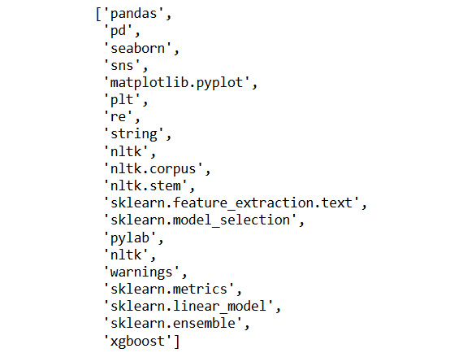
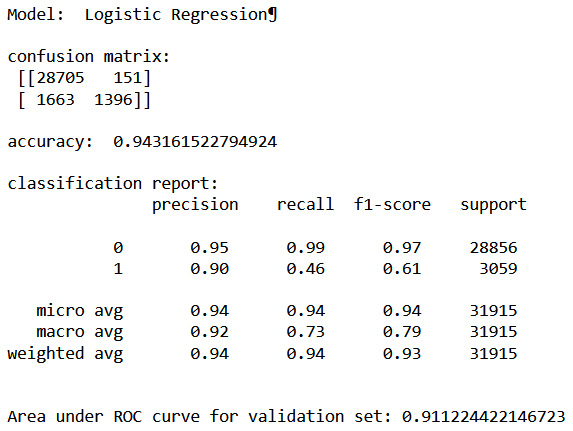
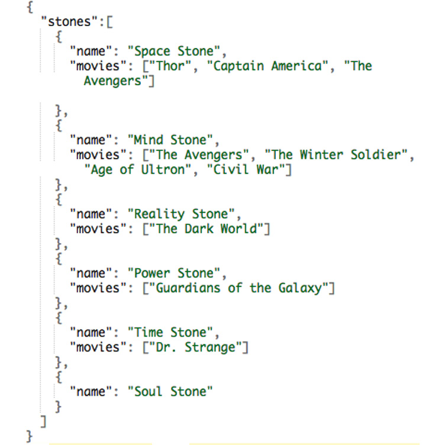
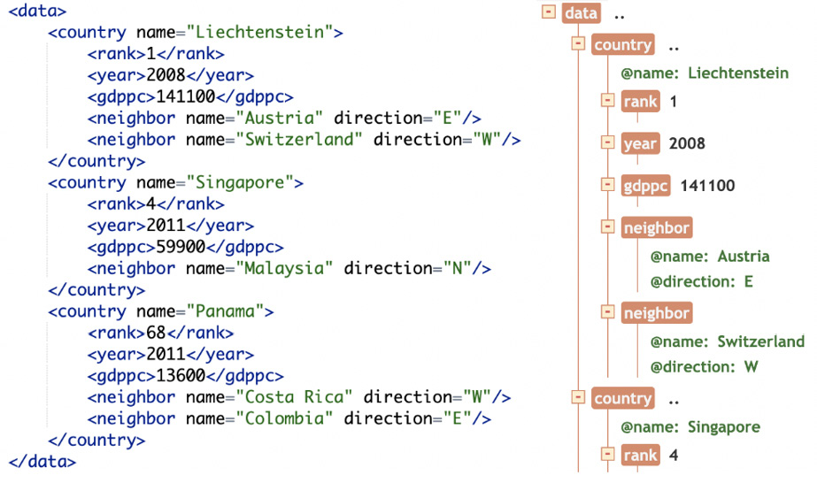
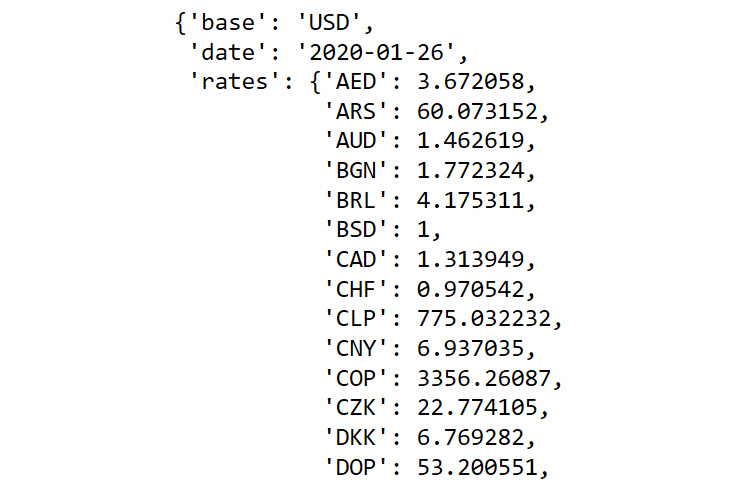
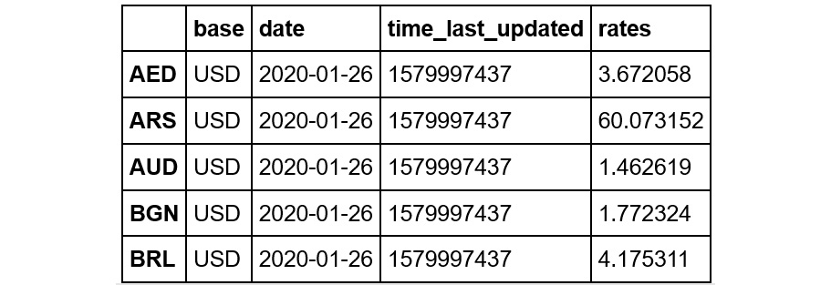

Lab 4. Collecting Text Data with Web Scraping and APIs
==================================================

Overview

This lab introduces you to the concept of web scraping. You will
first learn how to extract data (such as text, images, lists, and
tables) from pages that are written using HTML. You will then learn
about the various types of semi-structured data used to create web pages
(such as JSON and XML) and extract data from them. Finally, you will use
APIs for data extraction from Twitter, using the `tweepy`
package.


Introduction
============


In the last lab, we developed a simple classifier using feature
extraction methods. We also covered different algorithms that fall under
supervised and unsupervised learning. In this lab, you will learn
how to collect text data by scraping web pages, and then you will learn
how to process that data. Web scraping helps you extract useful data
from online content, such as product prices and customer reviews, which
can then be used for market research, price comparison for products, or
data analysis. You will also learn how to handle various kinds of
semi-structured data, such as JSON and XML. We will cover different
methods for extracting data using **Application Programming Interfaces**
(**APIs**). Finally, we will explore different ways to extract data from
different types of files.


Collecting Data by Scraping Web Pages
=====================================


The basic building block of any web page is HTML (Hypertext Markup
Language*)*---a markup language that specifies the structure of your
content. HTML is written using a series of tags, combined with optional
content. The content encompassed within HTML tags defines the appearance
of the web page. It can be used to make words bold or italicize them, to
add hyperlinks to the text, and even to add images. Additional
information can be added to the element using attributes within tags.
So, a web page can be considered to be a document written using HTML.
Thus, we need to know the basics of HTML to scrape web pages
effectively.

The following figure depicts the contents that are included within an
HTML tag:


As you can see in the preceding figure, we can easily identify different
elements within an HTML tag. The basic HTML structure and commonly used
tags are shown and explained as follows:


-   `DOCTYPE`: This is a must-have preamble for every HTML
    page. It informs the browser that the document is written in HTML.
-   `<html>` tag: This is considered the root of the page,
    encompassing all of the page content. It is mainly divided into two
    tags---`<head>` and `<body>`.
-   `<head>` tag: This tag provides meta-information about the
    web page.
-   `<body>` tag: This tag comprises content such as text,
    image, tables, and lists.
-   `<title>` tag: This sets the title of your page, which is
    what you\'ll see in the browser\'s tab.
-   `<headline>` tag: As the name suggests, this represents
    six levels of section headings, from `<h1>` to
    `<h6>`.
-   `<p>` tag: This is used to define the paragraph text
    content.
-   `<i>` tag: We can use this tag to italicize the text.
-   `<strong>` tag: This makes the text bold.
-   `<li>` tag: We can use this tag to list the content in
    ordered (the `<ol>` tag) or unordered (the
    `<ul>` tag) list format.
-   `` tag: This tag is used to add an image in the HTML
    document.
-   `<h1>` to `<h6>` tags: These represent the
    various levels of headings, with `<h1>` having the biggest
    size and `<h6>` having the smallest size.
-   `<span>` tag: Although this tag provides no visual change
    by itself, it is useful for grouping inline-elements in a document
    and adding a hook to a part of a text or a part of a document.
-   `<q>` tag: Quotes are written within the `<q>`
    tag in HTML.
-   `table` tag: Tabular content is represented as a
    `table` tag, which contains `<th>` (table
    header), `<tr>` (table row), and `<td>` (table
    data).
-   `<address>` tag: In HTML documents, addresses are enclosed
    within `<address>` tags.

In the next section, we will walk through an exercise in which we\'ll
extract tag-based information from HTML files.

Exercise 4.01: Extraction of Tag-Based Information from HTML Files
------------------------------------------------------------------

In this exercise, we will extract addresses, quotes, text written in
bold, and a table present in an HTML file.

**Note**

The data for this sample HTML file can be accessed from


Follow these steps to implement this exercise:

1.  Open a Jupyter Notebook.

2.  Insert a new cell and add the following code to import the
    `BeautifulSoup` library:

    ```
    from bs4 import BeautifulSoup
    ```


    `BeautifulSoup` is a Python library for pulling data out
    of HTML and XML files. It provides a parser for HTML/XML formats,
    allowing us to navigate, search, and modify the parsed tree.

3.  Create an object of the `BeautifulSoup` class and pass the
    location of the HTML file to it:

    ```
    soup = BeautifulSoup(open('../data/sample_doc.html'), \
                         'html.parser')
    ```


    In the preceding line, `html.parser` is Python\'s built-in
    standard library parser. `BeautifulSoup` also supports
    third-party parsers such as `html5lib`, `lxml`,
    and others.

4.  Add the following code to check the text contents of the
    `sample_doc.html` file:

    ```
    soup.text
    ```


    The preceding code generates the following output:


5.  Similarly, to see the contents, you can simply write the following
    code:

    ```
    soup.contents
    ```


6.  To find the addresses from the document, insert a new cell and add
    the following code:

    ```
    soup.find('address')
    ```


    The preceding code generates the following output:

    ```
    <address> Mess on No. 72, Banamali Naskar Lane, Kolkata.</address>
    ```


7.  To locate all the `address` tags within the given content,
    write the following code:

    ```
    soup.find_all('address')
    ```


    The preceding code generates the following output:

    ```
    [<address> Mess on No. 72, Banamali Naskar Lane, Kolkata.</address>,
     <address>221B, Baker Street, London, UK.</address>]
    ```


8.  To find the quotes in the document, add the following code:

    ```
    soup.find_all('q')
    ```


    The preceding code generates the following output:

    ```
    [<q> There are more things in heaven and earth, Horatio, <br/> 
     Than are dreamt of in your philosophy. </q>]
    ```


9.  To check all the bold items, write the following command:

    ```
    soup.find_all('b')
    ```


    The preceding code generates the following output:

    ```
    [<b>Sherlock </b>, <b>Hamlet</b>, <b>Horatio</b>]
    ```


10. Write the following command to extract the tables in the document:

    ```
    table = soup.find('table')
    table
    ```


    The preceding code generates the following output:


11. You can also view the contents of `table` by looping
    through it. Insert a new cell and add the following code to
    implement this:

    ```
    for row in table.find_all('tr'):
        columns = row.find_all('td')
        print(columns)
    ```


    The preceding code generates the following output:

    ```
    [ ]
    [<td>Gangaram</td>, <td>B.Tech</td>, <td>NA</td>, <td>NA</td>]
    [<td>Ganga</td>, <td>B.A.</td>, <td>NA</td>, <td>NA</td>]
    [<td>Ram</td>, <td>B.Tech</td>, <td>M.Tech</td>, <td>NA</td>]
    [<td>Ramlal</td>, <td>B.Music</td>, <td>NA </td>, <td>Diploma in Music</td>]
    ```


12. You can also locate specific content in the table. To locate the
    value at the intersection of the third row and the second column,
    write the following command:

    ```
    table.find_all('tr')[3].find_all('td')[2]
    ```


    The preceding code generates the following output:

    ```
    <td>M.Tech</td>
    ```


We have learned how to extract tag-based information from an HTML file.

**Note**


In the next section, we will focus on fetching content from web pages.

Requesting Content from Web Pages
---------------------------------

Whenever you visit a web page from your web browser, you are actually
sending a request to fetch its content. This can be done using Python
scripts. The Python `requests` package is widely used to
handle all forms of HTTP requests. Let\'s walk through an exercise to
get a better understanding of this concept.

To fetch content, you can use the `get()` method, which, as
the name suggests, sends a `GET` request to the web page from
which you want to fetch data. Let\'s perform a simple exercise now to
get a better idea of how we can implement this in Python.

Exercise 4.02: Collecting Online Text Data
------------------------------------------

In this exercise, we will be fetching the web content with the help of
`requests`. We will be pulling a text file from *Project
Gutenberg*, the free e-book website, specifically, from the text file
for Charles Dickens\' famous book, *David Copperfield*. Follow these
steps to complete this exercise:

1.  Use the `requests` library to request the content of a
    book available online with the following set of commands:

    ```
    import requests
    """"
    Let's read the text version of david copper field 
    available online
    """
    r = requests.get('https://www.gutenberg.org/files/766/766-0.txt')
    r.status_code
    ```


    The preceding code generates the following output:

    ```
    200
    ```


    When the browser visits the website, it fetches the content of the
    specified URL. Similarly, using `requests`, we get the
    content from the specified URL and all the information gets stored
    in the `r` object. `200` indicates that we
    received the right response from the URL.

2.  Locate the text content of the fetched file by using the
    `requests` object `r` and referring to the
    `text` attribute. Write the following code for this:

    ```
    r.text[:1000]
    ```


    The preceding code generates the following output:


3.  Now, write the fetched content into a text file. To do this, add the
    following code:

    ```
    from pathlib import Path
    open(Path("../data/David_Copperfield.txt"),'w',\
         encoding='utf-8').write(r.text)
    ```


    The preceding code generates the following output:

    ```
    2033139
    ```


4.  Similarly, we can do the same using Urllib3.First add the following
    code:

    ```
    import urllib3
    http = urllib3.PoolManager()
    rr = http.request('GET', \
                      'http://www.gutenberg.org/files/766/766-0.txt')
    rr.status
    ```


    Again, we will get the output as `200`, similar to the
    previous method.

5.  Add the following code to locate the text content:

    ```
    rr.data[:1000]
    ```

6.  Again, add the following code to write the fetched content into a
    text file:

    ```
    open(Path("../data/David_Copperfield_new.txt"), \
         'wb').write(rr.data)
    ```


    The preceding code will generate the following output:

    ```
    2033139
    ```


We have just learned how to collect data from online sources with the
help of the `requests` library.


Now, let\'s look at analyzing HTML content from Jupyter Notebooks.

Exercise 4.03: Analyzing the Content of Jupyter Notebooks (in HTML Format)
--------------------------------------------------------------------------

In this exercise, we will analyze the content of a Jupyter Notebook. We
will count the number of images, list the packages that have been
imported, and check the models and their performance.

**Note**

The HTML file used for this exercise, can be accessed at


Follow these steps to complete this exercise:

1.  Import `BeautifulSoup` and pass the location of the given
    HTML file using the following commands:

    ```
    from bs4 import BeautifulSoup
    soup = BeautifulSoup(open('../data/text_classifier.html'), \
                         'html.parser')
    soup.text[:100]
    ```


    Here, we are loading HTML using `BeautifulSoup` and
    printing parsed content. The preceding code generates the following
    output:

    ```
    '\n\n\nCh3_Activity7_Developing_end_to_end_Text_Classifiers\n\n\n\n    /*!\n*\n* Twitter Bootstrap\n*\n*/\n/*!\n*'
    ```


2.  Use the `img` tag to count the number of images:

    ```
    len(soup.find_all('img'))
    ```


    The output shows that there are three `img` tags:

    ```
    3
    ```


3.  If you open the HTML file in the text editor or your web browser\'s
    console, you will see all `import` statements have the
    `class` attribute set to `nn`. So, to list all
    the packages that are imported, add the following code, referring to
    finding the `span` element with an `nn` class
    attribute:

    ```
    [i.get_text() for i in soup.find_all\
    ('span',attrs={"class":"nn"})]
    ```


    The preceding code generates the following
    output:



4.  To extract the models and their performance, look at the HTML
    document and see which `class` attribute the models and
    their performance belong to. You will see the `h2` and
    `div` tags with the `class` attribute
    `output_subarea output_stream output_stdout output_text`.
    Add the following code to extract the models:

    ```
    for md,i in zip(soup.find_all('h2'), \
    soup.find_all('div',\
    attrs={"class":"output_subarea output_stream "\
           "output_stdout output_text"})):
        print("Model: ",md.get_text())
        print(i.get_text())
        print("---------------------------------------------------------\n\n\n")
    ```


    The preceding code generates the following output:



So, in the preceding output, we have extracted a classification report
from the HTML file using `BeautifulSoup` by referring to the
`<h2>` and `<div>` tags.


So far, we have seen how to get content from the web using the
`requests` package, and in this exercise, we saw how to parse
and extract the desired information. Next time you come across an
article and want to extract certain information from it, you will be
able to put these skills to use, instead of manually going over all of
the content.

Activity 4.01: Extracting Information from an Online HTML Page
--------------------------------------------------------------

In this activity, we will extract data about Rabindranath Tagore from
the Wikipedia page about him.

**Note**

Rabindranath Tagore was a poet and musician from South Asia whose art
has had a profound influence on shaping the cultural landscape of the
region. He was also the first Indian to win the Nobel Prize for
Literature, in 1913.

After extracting the data, we will analyze information from the page.
This should include the list of headings in the *Works* section, the
list of his works, and the list of universities named after him. Follow
these steps to implement this activity:

1.  Open a Jupyter Notebook.

2.  Import the requests and `BeautifulSoup` libraries.

3.  Fetch the Wikipedia page from
    <https://en.wikipedia.org/wiki/Rabindranath_Tagore> using the
    `get` method of the `requests` library.

4.  Convert the fetched content into HTML format using an HTML parser.

5.  Print the list of headings in the *Works* section.

6.  Print the list of original works written by Tagore in Bengali.

7.  Print the list of universities named after Tagore.

    Note:

    The solution to this activity can be found below.

We are now well-versed in extracting generic data from HTML pages.
Let\'s perform another activity now, where we\'ll be using regular
expressions.

Activity 4.02: Extracting and Analyzing Data Using Regular Expressions
----------------------------------------------------------------------

To perform this activity, you will extract data from Packt\'s website.
The data to be extracted includes frequently asked questions (FAQs) and
their answers, phone numbers for customer care services, and the email
addresses for customer care services. Follow these steps to complete
this activity:

1.  Import the necessary libraries and extract data from
    <https://www.packtpub.com/support/faq> using the
    `requests` library.

2.  Fetch questions and answers from the data.

3.  Create a DataFrame consisting of questions and answers.

4.  Fetch email addresses with the help of regular expressions.

5.  Fetch the phone numbers, with the help of regular expressions.

    Note:

    The solution to this activity can be found below.

In this activity, we were able to fetch data from online sources and
analyze it in various ways. Now that we are well-versed in scraping web
pages with the help of HTML, in the next section, we will discuss how to
scrape web pages with semi-structured data.


Dealing with Semi-Structured Data
=================================


We learned about various types of data in *Lab 2*, *Feature
Extraction Methods*. Let\'s quickly recapitulate what semi-structured
data refers to. A dataset is said to be semi-structured if it is not in
a row-column format but, if required, can be converted into a structured
format that has a definite number of rows and columns. Often, we come
across data that is stored as key-value pairs or embedded between tags,
as is the case with **JSON** (**JavaScript Object Notation**) and
**XML** (**Extensible Markup Language**) files. These are the most
popularly used instances of semi-structured data.

JSON
----

JSON files are used for storing and exchanging data. JSON is
human-readable and easy to interpret. Just like text files and CSV
files, JSON files are language-independent. This means that different
programming languages, such as Python, Java, and so on, can work with
JSON files effectively. In Python, a built-in data structure called a
**dictionary** is capable of storing JSON objects as is. Generally, data
in JSON objects is present in the form of key-value pairs. The datatype
of values of JSON objects must be any of the following:

-   A string
-   A number
-   Another JSON object
-   An array
-   A boolean
-   Null

NoSQL databases (such as MongoDB) store data in the form of JSON
objects. Most APIs return JSON objects. The following figure depicts
what a JSON file looks like:




Often, the response we get when requesting a URL is in the form of JSON
objects. To deal with a JSON file effectively, we need to know how to
parse it. The following exercise throws light on this.

Exercise 4.04: Working with JSON Files
--------------------------------------

In this exercise, we will extract details such as the names of students,
their qualifications, and additional qualifications from a JSON file.


Follow these steps to complete this exercise:

1.  Open a Jupyter Notebook.

2.  Insert a new cell and import `json`. Pass the location of
    the file mentioned using the following commands:


    ```
    import json
    from pprint import pprint
    data = json.load(open('../data/sample_json.json'))
    pprint(data)
    ```


    In the preceding code, we are importing Python\'s built-in
    `json` module and loading the local JSON file using the
    standard I/O operation of Python. This turns JSON into the Python
    `dict` object. The preceding code generates the following
    output:


3.  To extract the names of the students, add the following code:

    ```
    [dt['name'] for dt in data['students']]
    ```


    The preceding code generates the following output:

    ```
    ['Gangaram', 'Ganga', 'Ram', 'Ramlal']
    ```


4.  To extract their respective qualifications, enter the following
    code:

    ```
    [dt['qualification'] for dt in data['students']]
    ```


    The preceding code generates the following output:

    ```
    ['B.Tech', 'B.A.', 'B.Tech', 'B.Music']
    ```


5.  To extract their additional qualifications, enter the following
    code. Remember, not every student will have additional
    qualifications. Thus, we need to check this separately. Add the
    following code to implement this:

    ```
    [dt['additional qualification'] if 'additional qualification' \
    in dt.keys() else None for dt in data['students']]
    ```


    The preceding code generates the following output:

    ```
    [None, None, 'M.Tech', None]
    ```


As JSON objects are similar to the dictionary data structure of Python,
they are widely used on the web to send and receive data across web
applications.

**Note**


Now that we have learned how to load JSON data, let\'s extract data
using another format, called **Extensible Markup Language** (**XML**),
which is also used by web apps and Word documents to store information.

XML
---

Just like HTML, XML is another kind of markup language that stores data
in between tags. It is human-readable and extensible; that is, we have
the liberty to define our own tags. Attributes, elements, and tags in
the case of XML are similar to those of HTML. An XML file may or may not
have a declaration. But, if it has a declaration, then that must be the
first line of the XML file.

This declaration statement has three parts: `Version`,
`Encoding`, and `Standalone`. `Version`
states which version of the XML standard is being used;
`Encoding` states the type of character encoding being used in
this file; `Standalone` tells the parser whether external
information is needed for interpreting the content of the XML file. The
following figure depicts what an XML file looks like:


An XML file can be represented as a tree called an XML tree. This XML
tree begins with the root element (the parent). This root element
further branches into child elements. Each element of the XML file is a
node in the XML tree. Those elements that don\'t have any children are
leaf nodes. The following figure clearly differentiates between an
original XML file and a tree representation of an XML file:




XML files are somewhat similar in structure to HTML, with the main
difference being that, in XML, we have custom tags rather than the fixed
tags vocabulary like HTML. As we learned how to parse HTML using
`BeautifulSoup` before, let\'s learn how to parse XML files in
the following exercise.

Exercise 4.05: Working with an XML File
---------------------------------------

In this exercise, we will parse an XML file and print the details from
it, such as the names of employees, the organizations they work for, and
the total salaries of all employees.

**Note**

The sample XML data file can be accessed here:


Follow these steps to complete this exercise:

1.  Open a Jupyter Notebook.

2.  Insert a new cell, import `xml.etree.ElementTree`, and
    pass the location of the XML file using the following code:

    ```
    import xml.etree.ElementTree as ET
    tree = ET.parse('../data/sample_xml_data.xml')
    root = tree.getroot()
    root
    ```


    The preceding code generates the following output:

    ```
    <Element 'records' at 0.112291710>
    ```


3.  To check the tag of the fetched element, type the following code:

    ```
    root.tag
    ```


    The preceding code generates the following output:

    ```
    'records'
    ```


4.  Look for the `name` and `company` tags in the
    XML and print the data enclosed within them:

    ```
    for record in root.findall('record')[:20]:
        print(record.find('name').text, "---",\
              record.find('company').text)
    ```


    The preceding code generates the following output:


5.  To find the sum of the salaries, create a list consisting of the
    salaries of all employees by iterating over each record and finding
    the `salary` tag in it. Next, remove the `$` and
    `,` from the string of salary content, and finally, type
    cast into the integer to get the sum at the end. Add the following
    code to do so:

    ```
    sum([int(record.find('salary').text.replace('$','').\
    replace(',','')) for record in root.findall('record')])
    ```


    The preceding code generates the following output:

    ```
    745609
    ```


Thus, we can see that the sum of all the salaries is \$745,609. We just
learned how to extract data from a local XML file. When we request data,
many URLs return an XML file.

**Note**


In the next section, we will look at how APIs can be used to retrieve
real-time data.

Using APIs to Retrieve Real-Time Data
-------------------------------------

**API** stands for **Application Programming Interface**. To understand
what an API is, let\'s consider a real-life example. Suppose you have a
socket plug in the wall, and you need to charge your cellphone using it.
How will you do it? You will have to use a charger/adapter, which will
enable you to connect the cellphone to the socket. Here, this adapter is
acting as a mediator that connects the cellphone and the socket, thus
enabling the smooth transfer of electricity between them.

Similarly, some websites do not provide their data directly. Instead,
they provide APIs, which we can use to extract data from the websites.
Just like the cellphone charger, an API acts as a mediator, enabling the
smooth transfer of data between those websites and us. Let\'s perform a
simple exercise to get hands-on experience of collecting data using
APIs.

Exercise 4.06: Collecting Data Using APIs
-----------------------------------------

In this exercise, we will use the Currency Exchange Rates API to convert
USD to another currency rate. Follow these steps to implement this
exercise:

1.  Open a Jupyter Notebook.

2.  Import the necessary packages. Add the following code to do so:


    ```
    import json 
    import pprint 
    import requests 
    import pandas as pd
    ```


3.  Load the `json` data. Add the following code to do this:

    ```
    r = requests.get("https://api.exchangerate-api.com/"\
                     "v4/latest/USD")
    data = r.json()
    pprint.pprint(data)
    ```


    Note:

    Watch out for the slashes in the string below. Remember that the
    backslashes ( `\` ) are used to split the code across
    multiple lines, while the forward slashes ( `/` ) are part
    of the URL.

    The preceding code generates the following output:



4.  To create the DataFrame of the fetched data and print it, add the
    following code:

    ```
    df = pd.DataFrame(data)
    df.head()
    ```


    The preceding code generates the following output:



**Note** that you will get a different output depending on the present
currency exchange rates. We just learned how to collect data using APIs.

**Note**


In the next section, we will see how to create an API.

Extracting data from Twitter Using the OAuth API
------------------------------------------------

Many popular websites, such as Twitter, provide an API that allows
access to parts of their services so that people can build software that
integrates with the website. We\'ll be focusing mainly on Twitter in
this section. Twitter\'s data and services (such as tweets,
advertisements, direct messages, and much more) can be accessed via the
Twitter API. The Twitter API requires authentication and authorization
to interact with its services using the `OAuth` method.
Authentication is required to prove identity, while authorization proves
the right to access its services and data. To access Twitter data and
services using an API, you would need to register using a Twitter
developer account.

You can collect data from Twitter using their Python module, named
`Tweepy`. `Tweepy` is a Python library for accessing
the Twitter API. It is great for simple automation and creating Twitter
bots. It provides abstraction to communicate with Twitter and use its
API to ease interactions, which makes this approach more efficient than
using the `requests` library and Twitter API endpoints.

To use the `Tweepy` library, simply go to
<https://dev.twitter.com/apps/new> and fill in the form; you\'ll need to
complete the necessary fields, such as `App Name`,
`Website URL`, `Callback URL`, and
`App Usage`. Once you\'ve done this, submit and receive the
keys and tokens, which you can use for extracting tweets and more.
However, before you do any of this, you\'ll first need to import the
`tweepy` library.

Your Python code should look like this:

```
import tweepy
consumer_key = 'your consumer key here'
consumer_secret = 'your consumer secret key here'
access_token = 'your access token here'
access_token_secret = 'your access token secret here'
auth = tweepy.OAuthHandler(consumer_key, consumer_secret)
auth.set_access_token(access_token, access_token_secret)
api = tweepy.API(auth)
```


The preceding code uses `auth` instantiation from
`OAuthHandler`, which takes in our consumer token and secret
keys that were obtained during app registration.
`OAuthHandler` handles interaction with Twitter\'s
`OAuth` system.

To search for a query named `randomquery` using
`tweepy`, you can use the `Cursor` object as
follows:

```
tweepy.Cursor(api.search, q='randomquery', lang="en")
```


`Cursor` handles all the iterating-over-pages work for us
behind the scenes, whereas the `api.search` method provides
tweets that match a specified query given with the `q`
parameter.

Let\'s do an activity now, to put our knowledge into practice.

Activity 4.03: Extracting Data from Twitter
-------------------------------------------

In this activity, you will extract 100 tweets containing the hashtag
*\#climatechange* from Twitter, using the Twitter API via the tweepy
library, and load them into a pandas DataFrame. The following steps will
help you implement this activity:

1.  Log in to your Twitter account with your credentials.

2.  Visit <https://dev.twitter.com/apps/new> and fill in the form by
    completing the necessary fields, such as `App Name`,
    providing `Website URL`, `Callback URL`, and
    `App Usage`.

3.  Submit the form and receive the keys and tokens.

4.  Use these keys and tokens in your application when making an API
    call for *\#climatechange*.

5.  Import the necessary libraries.

6.  Fetch the data using the keys and tokens.

7.  Create a DataFrame consisting of tweets.

    Note:

    The full solution to this activity can be found below.

In this activity, we extracted data from Twitter and loaded it into a
pandas DataFrame. This data can also be used to analyze tweets and
create a word cloud out of them, something that we will explore in
detail in *Lab 8*, *Sentiment Analysis*.

Publisher\'s **Note**

The preceding messages were extracted without bias from a given dataset
and written by private individuals not affiliated with this company. The
views expressed in these tweets do not necessarily reflect our
company\'s official policies.


Summary
=======


In this lab, we have learned various ways to collect data by
scraping web pages. We also successfully scraped data from
semi-structured formats such as JSON and XML and explored different
methods of retrieving data in real time from a website without
authentication. In the next lab, you will learn about topic
modeling---an unsupervised natural language processing technique that
helps group documents according to the topics that it detects in them.
