Lab 5. Topic Modeling
=================

Overview

This lab introduces topic modeling, which means using unsupervised
machine learning to find \"topics\" within a given set of documents. You
will explore the most common approaches to topic modeling, which are
**Latent Semantic Analysis** (**LSA**), **Latent Dirichlet Allocation**
(**LDA**), and the **Hierachical Dirichlet Process** (**HDP**), and
learn the differences between them. You will then practice implementing
these approaches in Python and review the common practical challenges in
topic modeling. By the end of this lab, you will be able to create
topic models from any given dataset.


Introduction
============


In the previous lab, we learned about different ways to collect data
from local files and online resources. In this lab, we will focus on
**topic modeling**, which is an important area within natural language
processing. Topic modeling is a simple way to capture the sense of what
a document or a collection of documents is about. Note that in this
case, documents are any coherent collection of words, which could be as
short as a tweet or as long as an encyclopedia.

Topic modeling may be thought of as a way to automate the manual task of
reading given document(s) to write an abstract, which you will then use
to map the document(s) to a set of topics. Topic modeling is mostly done
using unsupervised learning algorithms that detect topics on their own.
Topic-modeling algorithms operate by performing statistical analysis on
words or tokens in documents and using those statistics to automatically
assign each document to multiple topics. A topic is represented by an
arbitrary number and its keywords. When the topics are not
interpretable, then topic modeling may be thought of as an automated
process of a manual task in which the semantic structure or meaning of
the documents was neither understood nor abstracted before mapping the
document(s) to a set of topics.

Topic modeling generally uses unsupervised learning algorithms, as
opposed to supervised learning algorithms. This means that, during
training, we do not have to provide labels (that is, topic names
corresponding to each document) in order to teach the model. This not
only helps us discover interesting topics that might exist, but also
reduces the manual effort spent in labeling texts. On the flip side, it
can be a lot more challenging to evaluate the output of a topic model.

Topic modeling is often used as a first step to explore textual data in
order to get a feel for the content of the text. This is especially true
when abstracts/summaries are unavailable, and when the text is too large
to be manually analyzed in the available timeframe.


Topic Discovery
===============


The main goal of topic modeling is to find a set of topics that can be
used to classify a set of documents. These topics are implicit because
we do not know what they are beforehand, and they are unnamed.

The number of topics could vary from around 3 to, say, 400 (or even
more) topics. Since it is the algorithm that discovers the topics, the
number is generally fixed as an input to the algorithm, except in the
case of non-parametric models in which the number of topics is inferred
from the text. These topics may not always directly correspond to topics
that a human would find meaningful. In practice, the number of topics
should be much smaller than the number of documents. In general, the
number of topics specified in a parametric model ought to be greater
than or equal to the expected number of topics in the text. In other
words, one should err on the side of a greater number of topics rather
than fewer topics. This is because fewer topics can cause a problem for
the interpretability of topics. Also, the more documents that we
provide, the better the algorithm can map the documents to non-mutually
exclusive topics.

The number of topics chosen depends on the documents and the objectives
of the project. You may want to increase the number of topics if you
have a large number of documents or if the documents are fairly diverse.
Conversely, if you are analyzing a narrow set of documents, you may want
to decrease the number of topics. This generally flows from your
assumptions about the documents. If you think that the document set
might inherently contain a large number of topics, you should configure
the algorithm to look for a similar number of topics.

Exploratory Data Analysis
-------------------------

It is recommended to do exploratory data analysis prior to performing
any machine learning project. This helps you learn about the probability
distribution of the items in the dataset. We have seen this with word
clouds in *Lab 2*, *Feature Extraction Methods*. Even better
exploration is possible with topic modeling. Doing this can give you a
sense of the statistical properties of the text dataset and how the
documents can be grouped.

For example, you might want to know whether the text dataset is skewed
to any particular set of topics, or whether the sources are uniform or
disparate. This data further allows us to choose the appropriate
algorithms for the actual project.

Transforming Unstructured Data to Structured Data
-------------------------------------------------

Topic modeling clusters documents based on their topics. Specifically,
it is a soft clustering method, as each document gets mapped to multiple
topics. This is unlike hard clustering, which results in membership of
an exemplar or a point of only one cluster. Topic models typically give
a weight/probability of the document being associated with a topic.

Thus, you can have a matrix of documents by topic, wherein the
intersection of a document and a topic refers to the weight/probability
that the document is associated with the topic. This matrix is
effectively a numeric representation of the text and can be considered a
way to transform unstructured text into structured data. Such a
transformation is also an example of dimensionality reduction, as
unstructured text can have many more dimensions (each dimension
corresponds to a unique word) than the number of dimensions in
structured data (each dimension corresponds to a topic).

Bag of Words
------------

Before we explore modeling algorithms in depth, let\'s make a few
simplifying assumptions. Firstly, we treat a document as a **bag of
words**, meaning we ignore the structure and grammar of the document and
just use the count of each word in the document to infer patterns in the
variation of word counts. Ignoring the structure, sequences, and grammar
allows us to use algorithms that rely on counts and probability to make
the inferences.

As we have seen previously, a bag of words is a dictionary containing
each unique word and the integer count of the occurrences of the word in
the document. Like all models, it is, at best, an approximation of
reality. All the topic-modeling algorithms that we will discuss consider
the text as a bag of words.

**Note**

We will look at approaches that explicitly model sequences in later
chapters. The sequential structure of languages is different from the
sequential structure in time-series data. Moreover, some aspects of the
sequential structure may be specific to the natural language being
considered. This will be discussed in more detail in *Lab 6*,
*Vector Representation*.


Topic-Modeling Algorithms
=========================


Topic-modeling algorithms operate on the following assumptions:

-   Topics contain a set of words.
-   Documents are made up of a set of topics.

Topics can be considered to be a weighted collection of words. After
these common assumptions, different algorithms diverge in how they go
about discovering topics. In the upcoming sections, we will cover in
detail three topic-modeling algorithms---namely LSA, LDA, and HDP. Here,
the term *latent* (the *L* in these acronyms) refers to the fact that
the probability distribution of the topics is not directly observable.
We can observe the documents and the words but not the topics.

**Note**

The LDA algorithm builds on the LSA algorithm. In this case, similar
acronyms are indicative of this association.

Latent Semantic Analysis (LSA)
------------------------------

We will start by looking at LSA. LSA actually predates the **World Wide
Web**. It was first described in 1988. LSA is also known by an
alternative name, **Latent Semantic Indexing** (**LSI**), particularly
when it is used for semantic searches of document indices. The goal of
LSA is to uncover the latent topics that underlie documents and words.

LSA -- How It Works
-------------------

Consider that we have a collection of documents, and these documents are
made up of words. Our goal is to discover the latent topics in the
documents. So, in the beginning, we have a collection of documents that
we can represent as a term-to-document matrix. This term-to-document
matrix has terms as rows and documents as columns. The following table
gives a simplified illustration of a term-to-document matrix:

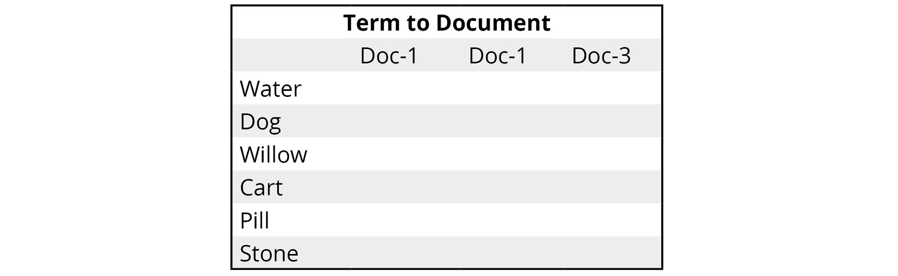


Now, we break this matrix down into three separate matrix factors,
namely a term-to-topics matrix, a topic-importance matrix, and a
topic-to-documents matrix. Let\'s consider the matrix shown on the
left-hand side and the corresponding factor matrices on the right-hand
side:

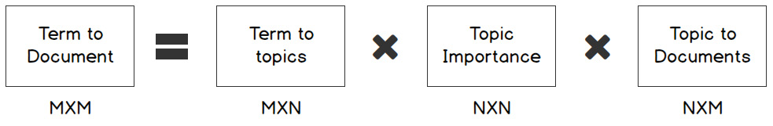


As we can see in this diagram, the rectangular matrix is separated into
the product of other matrices. The process takes a matrix, *M*, and
splits it, as shown in the following formula:


The following are the broad definitions of the preceding equation:

-   M is an m×m matrix.
-   U is an m×n matrix.
-   Σ is an n×n diagonal matrix with non-negative real numbers.
-   V is an m×n matrix.
-   V[T]{.superscript} is an n×m matrix, which is the transpose of V.

The matrices U and V[T]{.superscript} are not unique as matrix
factorization does not give unique factors. This is analogous to the
fact that the number 108 can be factorized using three factors in more
than one way: 9x1x12, 27x1x4, 3x1x36, and so on. In order to
consistently get similar factors, a regularization parameter can be
used. Moreover, the multiplication of the factor matrices gives a matrix
approximately and not exactly equal to the original matrix. Collectively
there are fewer elements in the factor matrices than in the original
matrix and this is possible because the original matrix had many
elements that were zero or close to zero.

The **gensim** library is a popular Python library for topic modeling.
It is easy to use and provides various topic-modeling model classes,
including **LdaModel** (for LDA) and **LsiModel** (for LSI).

The tomotopy library is also a powerful Python library for topic
modeling. It too is easy to use and includes popular topic-modeling
model classes, including **HDPModel** (for HDP) and **LDAModel** (for
LDA).

Other Python topic-modeling libraries include scikit-learn and lda (for
LDA).


Key Input Parameters for LSA Topic Modeling
===========================================


We will be using the gensim library to perform LSA topic modeling. The
key input parameters for gensim are `corpus`, the number of
topics, and `id2word`. Here, the `corpus` is
specified in the form of a list of documents in which each document is a
list of tokens. The `id2word` parameter refers to a dictionary
that is used to convert the corpus from a textual representation to a
numeric representation such that each word corresponds to a unique
number. Let\'s do an exercise to understand this concept better.

spaCy is a popular natural language processing Library for Python. In
our exercises, we will be using spaCy to tokenize the text, lemmatize
the tokens, and check which part-of-speech that token is. We will be
using spaCy v2.1.3. After installing spaCy v2.1.3 we will need to
download the English language model using the following code, so that we
can load this model (since there are models for many different
languages).

```
python -m spacy download en_core_web_sm
```


Exercise 5.01: Analyzing Wikipedia World Cup Articles with Latent Semantic Analysis
-----------------------------------------------------------------------------------

In this exercise, you will perform topic modeling using LSA on a
Wikipedia World Cup dataset. For this, you will make use of the
`LsiModel` class provided by the gensim library. You will use
the Wikipedia library to fetch articles, the spaCy engine for the
tokenization of the text, and the newline character to separate
documents within an article.

**Note**

The dataset used for this exercise can be found at


Follow these steps to complete this exercise:

1.  Open a Jupyter Notebook.

2.  Insert a new cell and add the following code to import the necessary
    libraries:


    ```
    import numpy as np
    import matplotlib.pyplot as plt
    %matplotlib inline
    import pandas as pd
    from gensim import corpora
    from gensim.models import LsiModel
    from gensim.parsing.preprocessing import preprocess_string
    ```


3.  To clean the text, define a function to remove the non-alphanumeric
    characters and replace numbers with the `#` character.
    Replace instances of multiple newline characters with a single
    newline character. Use the newline character to separate out the
    documents in the corpus. Insert a new cell and add the following
    code to implement this:


    ```
    import re
    HANDLE = '@\w+'
    LINK = 'https?://t\.co/\w+'
    SPECIAL_CHARS = '&lt;|&lt;|&amp;|#'
    PARA='\n+'
    def clean(text):
        text = re.sub(LINK, ' ', text)
        text = re.sub(SPECIAL_CHARS, ' ', text)
        text = re.sub(PARA, '\n', text)
        return text
    ```


4.  Insert a new cell and add the following code to find Wikipedia
    articles related to the World Cup:

    ```
    import wikipedia
    wikipedia.search('Cricket World Cup'),\
    wikipedia.search('FIFA World Cup')
    ```


    The code generates the following output:
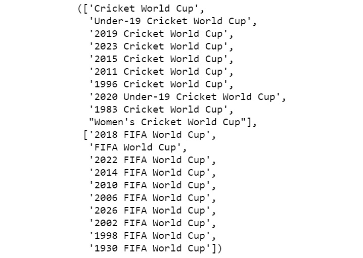


5.  Insert a new cell and add the following code fetch the Wikipedia
    articles about the 2018 FIFA World Cup and the 2019 Cricket World
    Cup, concatenate them, and show the result:

    ```
    latest_soccer_cricket=['2018 FIFA World Cup',\
                           '2019 Cricket World Cup']
    corpus=''
    for cup in latest_soccer_cricket:
        corpus=corpus+wikipedia.page(cup).content
    corpus
    ```


    The code generates the following output:
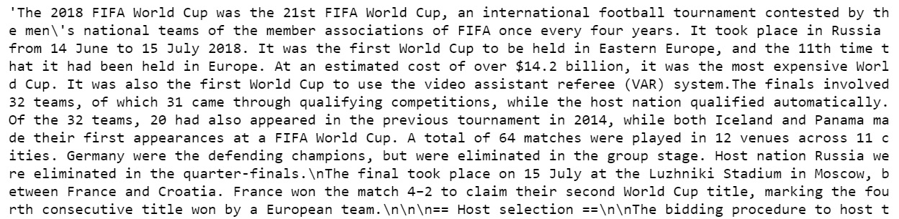


6.  Insert a new cell and add the following code to clean the text,
    using the spaCy English language model to tokenize the corpus and
    exclude all tokens that are not detected as nouns:

    ```
    text=clean(corpus)
    import spacy
    nlp = spacy.load('en_core_web_sm')
    doc=nlp(text)
    pos_list=['NOUN']
    preproc_text=[]
    preproc_sent=[]
    for token in doc:
        if token.text!='\n':
            if not(token.is_stop) and not(token.is_punct) \
            and token.pos_ in pos_list:
                preproc_sent.append(token.lemma_)
        else:
            preproc_text.append(preproc_sent)
            preproc_sent=[]
    #last sentence
    preproc_text.append(preproc_sent) 
    print(preproc_text)
    ```


    The code generates the following output:
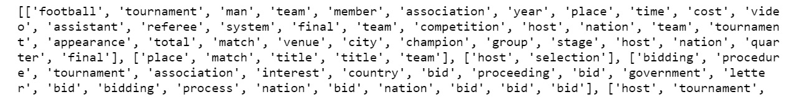


7.  Insert a new cell and add the following code to convert the corpus
    into a list in which each token corresponds to a number for more
    efficient representation, as gensim requires it in this form. Then,
    find the topics in the corpus:

    ```
    dictionary = corpora.Dictionary(preproc_text)
    corpus = [dictionary.doc2bow(text) for text in preproc_text]
    NUM_TOPICS=3
    lsamodel=LsiModel(corpus, num_topics=NUM_TOPICS, \
                      id2word = dictionary)
    lsamodel.print_topics()
    ```


    The code generates the following output:
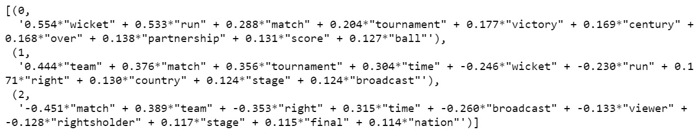


    To create our `LsiModel`, we had to decide up front how
    many topics we wanted. This would not necessarily match the number
    of topics that are actually in the corpus.

    **Note** that, in the output, you can see that negative weights are
    associated with some words in a few topics. Also, the sum of the
    weights does not add up to one. The weights are not to be
    interpreted as probabilities. This makes it difficult to even
    mechanically view the topic as a probability distribution over
    words. Additionally, it may be observed that topic `0` is
    essentially about cricket even though the corpus includes both
    soccer and cricket. Topic `1` seems to be related to a
    sports broadcast. Topic `2` does not seem to be
    interpretable.

8.  To determine which topics have the highest weight for a document,
    insert a new cell and add the following code:

    ```
    model_arr = np.argmax(lsamodel.get_topics(),axis=0)
    y, x = np.histogram(model_arr, bins=np.arange(NUM_TOPICS+1))
    fig, ax = plt.subplots()
    plt.xticks(ticks=np.arange(NUM_TOPICS),\
               labels=np.arange(NUM_TOPICS+1))
    ax.plot(x[:-1], y)
    fig.show()
    ```


    The code generates the following output:
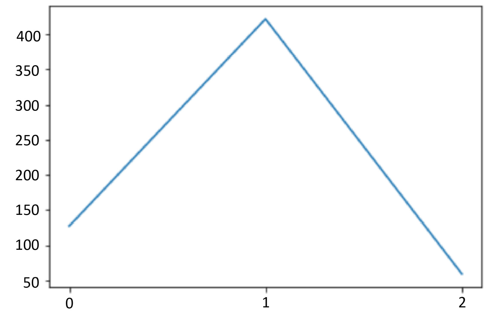


We can see that topic `1` and topic `0` have the
highest weight in almost all the documents.

**Note**

In general, the topics found are extremely sensitive to randomization in
both gensim and tomotopy. While setting a `random_state` in
gensim could help in reproducibility, in general, the topics found using
tomotopy are superior from the perspective of interpretability.
Generally, your output is expected to be different. In order to have
exactly the same topic model, we can save and load topic models, which
we\'ll do in *Exercise 5.04*, *Topics in The Life and Adventures of
Robinson Crusoe by Daniel Defoe*.


We have now performed topic modeling with the help of LSA. In the next
section, we will learn about another topic-modeling algorithm: LDA.
Before we move onto its implementation, let\'s quickly try and build a
basic intuition about a couple of concepts that will help us in the
subsequent sections.

Dirichlet Process and Dirichlet Distribution
--------------------------------------------

A Dirichlet process is a distribution over a distribution. It can be
represented as *DP(α,G)* where *G* is the base distribution and *α* is
the concentration parameter that defines how close *DP(α,G)* is to the
base distribution *G*. It is for this reason that the Dirichlet process
is a versatile way to represent various probability distributions. It is
used for the HDP topic-modeling algorithm.

The Dirichlet distribution is a special case of the Dirichlet process,
in which the number of topics needs to be specified explicitly. It is
used for the LDA topic-modeling algorithm.

Latent Dirichlet Allocation (LDA)
---------------------------------

Instead of using matrix factorization, like we did for LSA, it is
possible to consider a generative model called LDA. LDA is considered an
advancement over probabilistic LSA. Probabilistic LSA is prone to
overfitting as it does not probabilistically model the distribution of
the documents. LDA is a three-level hierarchical generative statistical
model that maps documents to topics, which in turn get mapped to
words---all in a probabilistic way. In this case, we have two
concentration parameters corresponding to the document level and the
topic level.

LDA -- How It Works
-------------------

To understand how LDA works, let\'s look at a simple example. We have
four documents that contain only three unique words: **Cat**, **Dog**,
and **Hippo**. The following figure shows the documents and the number
of times each word is found in each document:


As we can see in the figure, the word **Cat** is found **10** times in
**Document 1** and **Document 4** and **0** times in documents **2** and
**3**. **Document 4** contains all three words **10** times each. For
its analysis, LDA maintains two probability tables. The first table
tracks the probability of selecting a specific word when sampling a
specific topic. The second table keeps track of the probability of
selecting a specific topic when sampling a particular document:

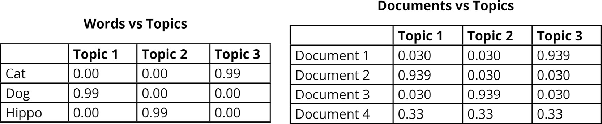


These probability tables reflect how likely it is to get a word if you
sampled from each topic. If you sampled a word from **topic 3**, it
would likely be **Cat** (probability 99%). If you sampled **Document
4**, then there is a one-third chance of getting each of the topics,
since it contains all three t in equal proportions. In this example, a
word is exclusive to a topic. In general, though, this is not the case.

The gensim and the scikit-learn libraries use one way of implementing
LDA (called variational inference). The tomotopy and `lda`
libraries use another way (called collapsed Gibbs sampling). It is
essentially because of these differing implementations: when tomotopy is
able to generate the topics in the available time, we usually prefer
using tomotopy; otherwise we use gensim.

The parameters that we use for tomotopy are as follows:

-   `corpus`: This refers to text that we want to analyze.
-   Number of topics: This is the number of topics that the corpus
    contains.
-   `iter`: This refers to the number of iterations that the
    model considers the corpus.
-   `α`: This is associated with document generation.
-   `η`: This is associated with topic generation.
-   `seed`: This helps with fixing the initial randomization.

Measuring the Predictive Power of a Generative Topic Model
----------------------------------------------------------

The predictive power of a generative topic model can be measured by
analyzing the distribution of the generated corpus. Perplexity is a
measure of how close the distribution of the words in the generated
corpus is to reality. Log perplexity is a more convenient measure for
this closeness. The formula for log perplexity is as follows:


Here, *n* is number of words and *P(w)* is the probability associated
with word *w*. We can see that negative log likelihood is identical to
log perplexity.

Usually, a lower log perplexity means better performance. This is
because the probability distribution of words is not uniform. It is
concentrated on a small subset of words. And such a concentration (a
non-uniform probability density function) causes a lower negative
likelihood. In order to be sure that the model is generalizing well, the
log likelihood should be computed on a hold-out sample. An extremely low
negative log likelihood is indicative of an extremely low capacity of
the model to learn. If a topic model has an unacceptable log perplexity
on the corpus used for training then it is unlikely to perform well on a
hold-out sample as it is indicative of the model having a low capacity
to learn or it is indicative of the dataset not being generalizable. The
negative log likelihood is approximately estimated in topic modeling
libraries as it is intractable to calculate.

Exercise 5.02: Finding Topics in Canadian Open Data Inventory Using the LDA Model
---------------------------------------------------------------------------------

In this exercise, we will use the tomotopy LDA model to analyze the
Canadian Open Data Inventory. For simplicity, we will consider that the
corpus has twenty topics.

**Note**

The dataset used for this exercise can be found at


The following steps will help you complete this exercise:

1.  Open a Jupyter Notebook.

2.  Insert a new cell and add the following code to import the necessary
    libraries:


    ```
    import pandas as pd
    pd.set_option('display.max_colwidth', 800)
    import numpy as np
    import matplotlib.pyplot as plt
    %matplotlib inline
    ```


3.  Insert a new cell and add the following code to read from a download
    of the Canadian Open Data Inventory, and clean the text:


    ```
    OPEN_DATA_URL = '../data/canada-open-data/inventory.csv'
    import re
    HANDLE = '@\w+'
    LINK = 'https?://t\.co/\w+'
    SPECIAL_CHARS = '&lt;|&lt;|&amp;|#'
    PARA='\n+'
    def clean(text):
        text = re.sub(LINK, ' ', text)
        text = re.sub(SPECIAL_CHARS, ' ', text)
        text = re.sub(PARA, '\n', text)
        return text
    catalog['description_en'].sample(frac=0.25,replace=False,\
                                     random_state=0).to_c \
                                     sv(OPEN_DATA_URL,\
                                     encoding='utf-8')
    file='../data/canada-open-data/catalog.txt'
    f=open(file,'r',encoding='utf-8')
    text=f.read()
    f.close()
    text = clean(text)
    ```


4.  Insert a new cell and add the following code to clean the text,
    using the spaCy English language model to tokenize the corpus and to
    exclude all tokens that are not detected as nouns:

    ```
    import spacy
    nlp = spacy.load('en_core_web_sm')
    doc=nlp(text)
    pos_list=['NOUN']
    preproc_text=[]
    preproc_sent=[]
    for token in doc:
        if token.text!='\n':
            if not(token.is_stop) and not(token.is_punct) \
            and token.pos_ in pos_list:
                preproc_sent.append(token.lemma_)
        else:
            preproc_text.append(preproc_sent)
            preproc_sent=[]
    #last sentence
    preproc_text.append(preproc_sent) 
    print(preproc_text)
    ```


    The code generates the following output:


    The pandas DataFrame was sampled. 25% of the dataset has been
    considered so that the memory restrictions related to spaCy can be
    addressed, since this is a fairly large sample.

5.  Insert a new cell and add the following code to see how the negative
    log likelihood varies by the number of iterations:

    ```
    import tomotopy as tp
    NUM_TOPICS=20
    mdl = tp.LDAModel(k=NUM_TOPICS,seed=1234)
    for line in preproc_text:
        mdl.add_doc(line)
    for i in range(0, 110, 10):
        mdl.train(i)
        print('Iteration: {}\tLog-likelihood: {}'.\
              format(i, mdl.ll_per_word))
    ```


    The code generates the following output:
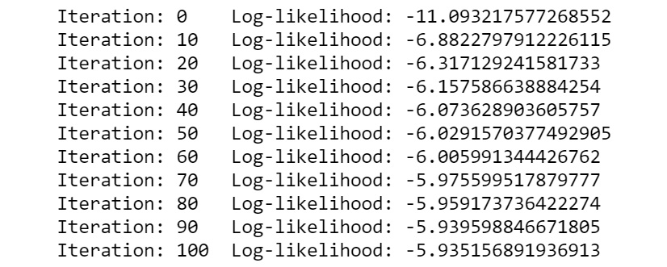

    iterations

6.  Insert a new cell and add the following code to train a topic model
    with ten iterations and to show the inferred topics:

    ```
    mdl.train(10)
    for k in range(mdl.k):
        print('Top 10 words of topic #{}'.format(k))
        print(mdl.get_topic_words(k, top_n=7))
    ```


    The code generates the following output:

    ```
    Top 10 words of topic #0
    [('polygon', 0.36050185561180115), ('dataset', 0.0334757782722234726), ('information', 0.03004324994981289), ('soil', 0,029185116291046143), ('area', 0,026610717177391052), ('surface', 0.025752583518624306), ('map', 0.024036318063735962)]
    ```


7.  Insert a new cell and add the following code to
    see the probability distribution of topics if you consider the
    entire dataset as a single document:

    ```
    bag_of_words=[word for sent in preproc_text for word in sent]
    doc_inst = mdl.make_doc(bag_of_words)
    mdl.infer(doc_inst)[0]
    np.argsort(np.array(mdl.infer(doc_inst)[0]))[::-1]
    ```


    The code generates the following output:

    ```
    array([11,17,14,19,12,  7,  4, 13, 10,  2,  3, 15,  1, 18, 16,  9,  0,
            6,  8,  5], dtype=int64)
    ```


8.  Insert a new cell and add the following code to see the probability
    distribution of topic 11:

    ```
    print(mdl.get_topic_words(11, top_n=7))
    ```


    The code generates the following output

    ```
    [('table', 0.24849626421928406), ('census', 0.1265643984079361), ('level', 0.06526772677898407), ('series', 0.06306280940771103), ('topic', 0.062401335686445236), ('geography', 0.062401335686445236), ('country', 0.06218084320425987)]
    ```


9.  Insert a new cell and add the following code to see the probability
    distribution of topic 17:

    ```
    print(mdl.get_topic_words(17, top_n=7))
    ```


    The code generates the following output:

    ```
    [('datum', 0.0603327676653862), ('information', 0.057247743010520935), ('year', 0.03462424501776695), ('dataset', 0.03291034325957298), ('project', 0.017828006289734993), ('website', 0.014057422056794167), ('activity', 0.012000739574432373)]
    ```


10. Insert a new cell and add the following code to see the probability
    distribution of topic 5:

    ```
    print(mdl.get_topic_words(5, top_n=7))
    ```


    The code generates the following output:

    ```
    [('survey', 0.04966237023472786), ('catch', 0.03862873837351799), ('sponge', 0.0364220105111599), ('sea', 0.0342152863740921), ('datum', 0.028698472306132317), ('fishing', 0.02759511023759842), ('matter', 0.026491746306419373)]
    ```


Topic 11, topic 17, and topic 5 seem to be interpretable. One could say
that topic 11, topic 17, and topic 5 seem to be broadly about
geographical data, internet data, and marine life data respectively.

**Note**

In general, the topics found are extremely sensitive to randomization in
both gensim and tomotopy. While setting a `random_state` in
gensim could help in reproducibility, in general, the topics found using
tomotopy are superior from the perspective of interpretability.
Generally, your output is expected to be different. In order to have
exactly the same topic model, we can save and load topic models; we do
this in *Exercise 5.04*, *Topics in The Life and Adventures of Robinson
Crusoe by Daniel Defoe*.


This section does not currently have an online interactive example and
will need to be run locally.

Activity 5.01: Topic-Modeling Jeopardy Questions
------------------------------------------------

Jeopardy is a popular TV show that covers a variety of topics. In this
show, participants are given answers and then asked to frame questions.
The purpose of this activity is to give a real-world feel to some of the
complexity associated with topic modeling. In this activity, you will do
topic modeling on a dataset of Jeopardy questions.

**Note**

The dataset to be used for this activity can be found at


Follow these steps to complete this activity:

1.  Open a Jupyter Notebook.

2.  Insert a new cell and import pandas and other necessary libraries.

3.  Load the dataset into a pandas DataFrame.

4.  Clean the data by dropping the DataFrame rows where the
    `Question` column has empty cells.

5.  Find the unique number of categories based on the
    `Category` column.

6.  Randomly select 4% of the questions. Tokenize the text using spaCy.
    Select tokens that are nouns/verbs/adjectives or a combination.

7.  Train a tomotopy LDA model with 1,000 topics.

8.  Print the log perplexity.

9.  Find the probability distribution on the entire dataset.

10. Sample a few topics and check for interpretability.

    **Note**

    The full solution to this activity can be found below.


Hierarchical Dirichlet Process (HDP)
====================================


HDP is a non-parametric variant of LDA. It is called \"non-parametric\"
since the number of topics is inferred from the data, and this parameter
isn\'t provided by us. This means that this parameter is learned and can
increase (that is, it is theoretically unbounded).

The tomotopy HDP implementation can infer between 1 and 32,767 topics.
gensim\'s HDP implementation seems to fix the number of topics at 150
topics. For our purposes, we will be using the tomotopy HDP
implementation.

The gensim and the scikit-learn libraries use variational inference,
while the tomotopy library uses collapsed Gibbs sampling. When the time
required by collapsed Gibbs sampling is not an issue, then it is
preferable to use collapsed Gibbs sampling over variational inference.
In other cases, we may prefer to use variational inference. For the
tomotopy library, the following parameters are used:

`iter`: This refers to the number of iterations that the model
considers the corpus.

`α`: This concentration parameter is associated with document
generation.

`η`: This concentration parameter is associated with topic
generation.

`seed`: This fixes the initial randomization.

`min_cf`: This helps eliminate those words that occur fewer
times than the frequency specified by us.

To get a better understanding of this, let\'s perform some simple
exercises.

Exercise 5.03: Topics in Around the World in Eighty Days
--------------------------------------------------------

In this exercise, we will make use of the tomotopy HDP model to analyze
the text file for Jules Verne\'s *Around the World in Eighty Days*,
available from the Gutenberg Project. We will use the `min_cf`
hyperparameter that is used to ignore words that occur fewer times than
the specified frequency and discuss its impact on the interpretability
of topics.

**Note**

The dataset used for this exercise can be found at


1.  Open a Jupyter Notebook.

2.  Insert a new cell and add the following code to import the necessary
    libraries:


    ```
    import pandas as pd
    pd.set_option('display.max_colwidth', 800)
    import numpy as np
    import matplotlib.pyplot as plt
    %matplotlib inline
    ```


3.  Insert a new cell and add the following code to read from a download
    of the Gutenberg Project\'s *Around the World in Eighty Days* by
    Jules Verne, and clean the text:

    ```
    OPEN_DATA_URL = '../data/aroundtheworld/pg103.txt'
    f=open(OPEN_DATA_URL,'r',encoding='utf-8')
    text=f.read()
    f.close()
    import re
    HANDLE = '@\w+'
    LINK = 'https?://t\.co/\w+'
    SPECIAL_CHARS = '&lt;|&lt;|&amp;|#'
    PARA='\n+'
    def clean(text):
        text = re.sub(LINK, ' ', text)
        text = re.sub(SPECIAL_CHARS, ' ', text)
        text = re.sub(PARA, '\n', text)
        return text
    text = clean(text)
    text
    ```


    The code generates the following output:
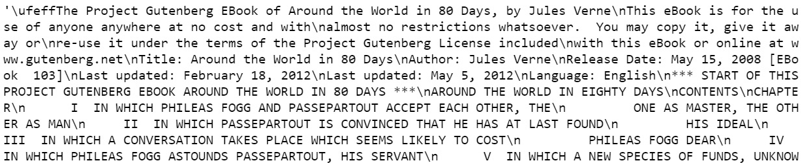


4.  Insert a new cell and add the following code to import the necessary
    libraries, clean the text (using the spaCy English language model to
    tokenize the corpus), and exclude all tokens that are not detected
    as nouns:

    ```
    import spacy
    nlp = spacy.load('en_core_web_sm')
    doc=nlp(text)
    pos_list=['NOUN']
    preproc_text=[]
    preproc_sent=[]
    for token in doc:
        if token.text!='\n':
            if not(token.is_stop) and not(token.is_punct) \
            and token.pos_ in pos_list:
                preproc_sent.append(token.lemma_)
        else:
            preproc_text.append(preproc_sent)
            preproc_sent=[]
    preproc_text.append(preproc_sent) #last sentence
    print(preproc_text)
    ```


    The code generates the following output:


5.  Insert a new cell and add the following code to create HDP models in
    which tokens that occur fewer than five times are ignored, and then
    show how the negative log likelihood varies according to the number
    of iterations:

    ```
    import tomotopy as tp
    mdl = tp.HDPModel(min_cf=5,seed=0)
    for line in preproc_text:
        mdl.add_doc(line)
    for i in range(0, 100, 10):
        mdl.train(i)
        print('Iteration: {}\tLog-likelihood: {}'.\
              format(i, mdl.ll_per_word))
    for k in range(mdl.k):
        print('Top 10 words of topic #{}'.format(k))
        print(mdl.get_topic_words(k, top_n=7))
    ```


    The code generates the following output:
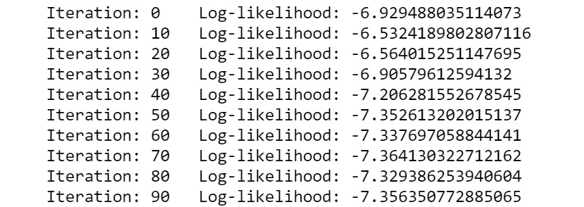

    iterations

6.  Insert a new cell and add the following code to see the probability
    distribution of topics if you consider the entire dataset as a
    single document:

    ```
    bag_of_words=[word for sent in preproc_text for word in sent]
    doc_inst = mdl.make_doc(bag_of_words)
    np.argsort(np.array(mdl.infer(doc_inst)[0]))[::-1]
    ```


    The code generates the following output:
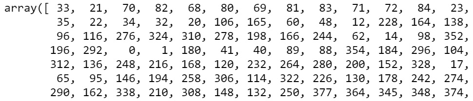

    dataset is considered

7.  Insert a new cell and add the following code to see the probability
    distribution of topic 33:

    ```
    print(mdl.get_topic_words(33, top_n=7))
    ```


    The code generates the following output:

    ```
    [('danger', 0.1534954458475113), ('hour', 0.0015197568573057652), ('time', 0.0015197568573057652), ('train', 0.0015197568573057652), ('master', 0.0015197568573057652), ('man', 0.0015197568573057652), ('steamer', 0.0015197568573057652)]
    ```


8.  Insert a new cell and add the following code to see the probability
    distribution of topic 21:

    ```
    print(mdl.get_topic_words(21, top_n=7))
    ```


    The code generates the following output:

    ```
    [('hour', 0.1344495415687561), ('minute', 0.1232500821352005), ('day', 0.08405196666717529), ('quarter', 0.07285250723361969), ('moment', 0.07285250723361969), ('clock', 0.005605331063270569), ('card', 0.039254117757081985)]
    ```


9.  Insert a new cell and add the following code to see the probability
    distribution of topic 70:

    ```
    print(mdl.get_topic_words(70, top_n=7))
    ```


    The code generates the following output:

    ```
    [('event', 0.12901155650615692), ('midnight', 0.12901155650615692), ('detective', 0.06482669711112976), ('bed', 0.06482669711112976), ('traveller', 0.06482669711112976), ('watch', 0.06482669711112976), ('clown', 0.06482669711112976)]
    ```


10. Insert a new cell and add the following code to see the probability
    distribution of topic 4:

    ```
    print(mdl.get_topic_words(4, top_n=7))
    ```


    The code generates the following output:

    ```
    [('house', 0.20237493515014648), ('opium', 0.10131379961967468), ('town', 0.07604850828647614), ('brick', 0.07604850828647614), ('mansion', 0.07604850828647614), ('glimpse', 0.50783220678567886), ('ball', 0.050783220678567886)]
    ```


We can see that ignoring tokens that occur fewer than five times
significantly improves the interpretability of the topic model. Also, we
have 378 topics in all, many of which are not likely to be
interpretable. So, what does this mean? Let\'s analyze a corpus from
another classic and then return to these questions.

**Note**

In general, the topics found are extremely sensitive to randomization in
both gensim and tomotopy. While setting a `random_state` in
gensim could help reproducibility, the topics found using tomotopy are
superior from the perspective of interpretability. Your output is
expected to be different. In order to have exactly the same topic model,
we can save and load topic models, which we\'ll do now in *Exercise
5.04*, *Topics in The Life and Adventures of Robinson Crusoe by Daniel
Defoe*.


Exercise 5.04: Topics in The Life and Adventures of Robinson Crusoe by Daniel Defoe
-----------------------------------------------------------------------------------

In this exercise, we will make use of the tomotopy HDP model to analyze
a text corpus taken from the text file for Daniel Defoe\'s *The Life and
Adventures of Robinson Crusoe*, available on the Gutenberg Project
website. Here, we will take the value of `α` as 0.8 and
experiment with selecting tokens based on different combinations of
parts of speech, before training the model.

**Note**

The dataset used for this exercise can be found at


1.  Open a Jupyter Notebook.

2.  Insert a new cell and add the following code to import the necessary
    libraries:


    ```
    import pandas as pd
    pd.set_option('display.max_colwidth', 800)
    import numpy as np
    import matplotlib.pyplot as plt
    %matplotlib inline
    ```


3.  Insert a new cell and add the following code to read from a download
    of the Gutenberg Project\'s *The Life and Adventures of Robinson
    Crusoe* by Daniel Defoe, and clean the text:

    ```
    OPEN_DATA_URL = '../data/robinsoncrusoe/521-0.txt'
    f=open(OPEN_DATA_URL,'r',encoding='utf-8')
    text=f.read()
    f.close()
    import re
    HANDLE = '@\w+'
    LINK = 'https?://t\.co/\w+'
    SPECIAL_CHARS = '&lt;|&lt;|&amp;|#'
    PARA='\n+'
    def clean(text):
        text = re.sub(LINK, ' ', text)
        text = re.sub(SPECIAL_CHARS, ' ', text)
        text = re.sub(PARA, '\n', text)
        return text
    text = clean(text)
    text
    ```


    The code generates the following output:
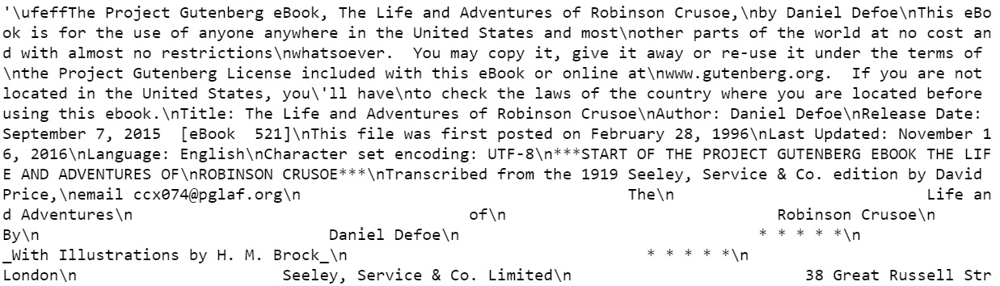


4.  Insert a new cell and add the following code to import the necessary
    libraries. Clean the text using the spaCy English language model to
    tokenize the corpus and to exclude all tokens that are not detected
    as nouns:

    ```
    import spacy
    nlp = spacy.load('en_core_web_sm')
    doc=nlp(text)
    """
    We can experiment with other or a combinations of parts of speech ['NOUN','ADJ','VERB','ADV'] #['NOUN','ADJ']
    """
    pos_list=['NOUN'] 
    preproc_text=[]
    preproc_sent=[]
    for token in doc:
        if token.text!='\n':
            if not(token.is_stop) and not(token.is_punct) \
            and token.pos_ in pos_list:
                preproc_sent.append(token.lemma_)
        else:
            preproc_text.append(preproc_sent)
            preproc_sent=[]
    preproc_text.append(preproc_sent) #last sentence
    print(preproc_text)
    ```


    The code generates the following output:
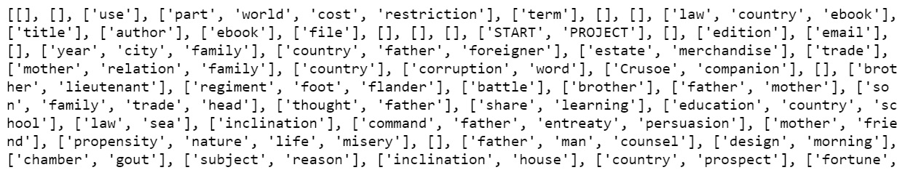


5.  Insert a new cell and add the following code to import the necessary
    libraries. Create an HDP model with the `α` concentration
    parameter as `0.8` and see how the negative log likelihood
    varies with the number of iterations:

    ```
    import tomotopy as tp 
    mdl = tp.HDPModel(alpha=0.8,seed=0)
    for line in preproc_text:
        mdl.add_doc(line)
    for i in range(0, 110, 10):
        mdl.train(i)
        print('Iteration: {}\tLog-likelihood: {}'.\
              format(i, mdl.ll_per_word))
    for k in range(mdl.k):
        print('Top 10 words of topic #{}'.format(k))
        print(mdl.get_topic_words(k, top_n=7))
    ```


    The code generates the following output:
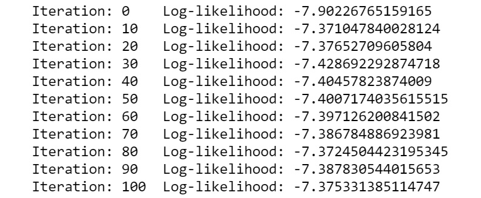

6.  Insert a new cell and add the following code to save the topic
    model:


    ```
    mdl.save('../data/robinsoncrusoe/hdp_model.bin')
    ```


7.  Insert a new cell and add the following code to load the topic
    model:


    ```
    mdl = tp.HDPModel.load('../data/robinsoncrusoe/'\
                           'hdp_model.bin')
    ```


8.  Insert a new cell and add the following code to see the probability
    distribution of topics if you consider the entire dataset as a
    single document:

    ```
    bag_of_words=[word for sent in preproc_text for word in sent]
    doc_inst = mdl.make_doc(bag_of_words)
    mdl.infer(doc_inst)[0]
    np.argsort(np.array(mdl.infer(doc_inst)[0]))[::-1]
    ```


    The code generates the following output:
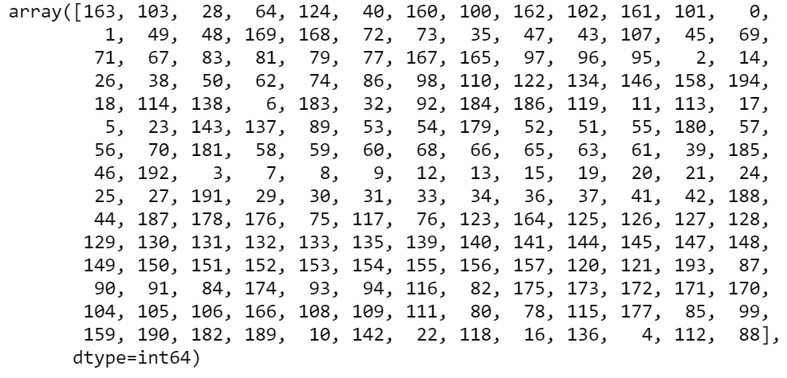

    considered

9.  Insert a new cell and add the following code to see the probability
    distribution of topic 163:

    ```
    print(mdl.get_topic_words(163, top_n=7))
    ```


    The code generates the following output:

    ```
    [('horse', 0.13098040223121643), ('way', 0.026405228301882744), ('mankind', 0.26405228301882744), ('fire', 0.026405228301882744), ('object', 0.026405228301882744), ('bridle', 0.026405228301882744), ('distress', 0.026405228301882744)]
    ```


10. Insert a new cell and add the following code to see the probability
    distribution of topic 103:

    ```
    print(mdl.get_topic_words(103, top_n=7))
    ```


    The code generates the following output:

    ```
    [('manor', 0.03706422075629234), ('inheritance', 0.03706422075629234), ('lord', 0.03706422075629234), ('man', 0.0003669724682377309), ('shore', 0.0003669724682377309), ('ship',0.0003669724682377309)]
    ```


11. Insert a new cell and add the following code to see the probability
    distribution of topic 28:

    ```
    print(mdl.get_topic_words(28, top_n=7))
    ```


    The code generates the following output:

    ```
    [('thought', 0.07716038823127747), ('mind', 0.045609116554260254), ('word', 0.038597721606492996), ('face', 0.03509202599525452), ('terror', 0.03509202599525452), ('tear', 0.3158633038401604), ('apprehension', 0.3158633038401604)]
    ```


    We see that we have 195 topics in all, many of which are likely not
    interpretable. In general, finding interpretable topics is difficult
    and connecting the words to interpret topics often requires
    familiarity with the domain. We have seen that log perplexity has
    very limited utility. In the case of prior knowledge of the corpus,
    the topic model has a much smaller role to play in the discovery of
    the thematic structure.

    **Note**

    In general, the topics found are extremely sensitive to
    randomization in both gensim and tomotopy. While setting a
    `random_state` in gensim could help reproducibility, in
    general, the topics found using tomotopy are superior from the
    perspective of interpretability. Generally, your output is expected
    to be different. In order to have exactly the same topic model, we
    can save and load topic models, and this was used in this exercise.

    
    

    This section does not currently have an online interactive example
    and will need to be run locally.

We have explored three of the most popular approaches to topic modeling.
Let\'s now discuss the practical challenges in using topic modeling and
the state-of-the-art topic modeling technologies.

Practical Challenges
--------------------

The selection of the number of topics and topic-modeling algorithms, the
number of iterations, and the evaluation of the topic model are the main
challenges faced by a practitioner. Having prior knowledge about the
domain can greatly help in choosing the number of topics. In the absence
of prior knowledge about the expected number of topics, we may need to
rely on experimentation for the choice of the topic-modeling algorithm.
The HDP model is an attractive choice when there isn\'t much information
about the number of topics. In the case of a small corpus, the LSA model
could be used.

One factor that makes interpreting topics difficult is that they contain
a lot of very frequently occurring (but indistinctive) words. To
overcome this, we can iteratively identify these words and add them to a
list of stop words. At times, we may want to filter out words that are
too rare and/or too common. The use of only nouns, only verbs, or a
combination of various parts of speech can improve the interpretability
of topics.

Qualitative evaluation of the topics is essential. We may have to accept
a mix of interpretable and non-interpretable topics in the real world.
In the absence of human participants, we can use qualitative ways of
considering word intrusion. Unless there is a downstream use of the
topic model being developed, a complete lack of interpretability will
render the topic model useless. When we have a downstream application,
even non-interpretable topics are useful as they offer a convenient
means to carry out dimensionality reduction on the dataset.

State-of-the-Art Topic Modeling
-------------------------------

There is no known benchmark for quantitively identifying the
state-of-the-art topic-modeling algorithm. It necessarily involves human
participation whenever interpretable topics are required. In cases where
the interpretation of topics is not necessary, the topic model needs to
be evaluated by downstream tasks. A qualitative approach to interpreting
topic models may be useful if there is prior knowledge or familiarity
with the corpus.

While there have been attempts at using labeled topic modeling, there is
no evidence of these models broadly outperforming unsupervised
topic-modeling algorithms. Interestingly, given that much of the topic
modeling literature was published prior to 2014, this is not among the
most active areas of research. This suggests that complete automation is
hard and human participation is here to stay as the state-of-the-art
technique in the near future.

Activity 5.02: Comparing Different Topic Models
-----------------------------------------------

The **Consumer Financial Protection Bureau** (**CFPB**) publishes
consumer complaints made against organizations in the financial sector.
This original dataset is available at
<https://www.consumerfinance.gov/data-research/consumer-complaints/#download-the-data>.
In this activity, you will qualitatively compare how HDP and LDA models
perform on the interpretability of topics by analyzing student loan
complaints.

**Note**

The dataset to be used for this activity can be found at


Follow these steps to complete this activity:

1.  Open a Jupyter Notebook.

2.  Import the `pandas` library and load the dataset from a
    text file produced by partially processing the dataset from the CFPB
    website mentioned at the beginning of this section.

3.  Tokenize the text using spaCy. Select tokens that may be a part of
    speech (noun/verb/adjective or a combination).

4.  Train an HDP model.

5.  Save and load the HDP model. To save a topic model, use the
    following line of code:

    ```
    mdl.save('../data/consumercomplaints/hdp_model.bin')
    ```


    To load a topic model, use the following:

    ```
    mdl = tp.HDPModel.load('../data/consumercomplaints/hdp_model.bin')
    ```


6.  Determine the topics in the entire set of complaints. Sample a few
    topics and check for interpretability.

7.  Repeat steps 3-8 for an LDA model instead of an HDP model. Consider
    the number of topics in the LDA model to around the number of topics
    found in the HDP model.

8.  Select the qualitatively better model from the HDP and LDA models
    trained in this activity. Also, compare these two models
    quantitatively.

    **Note**

    The full solution to this activity can be found below.

In this activity, we successfully compared two different models both
qualitatively and quantitatively.


Summary
=======


In this lab, we discussed topic modeling in detail. Without delving
into advanced statistics, we reviewed various topic-modeling algorithms
(such as LSA, LDA, and HDP) and how they can be used for topic modeling
on a given dataset. We explored the challenges involved in topic
modeling, how experimentation can help address those challenges, and,
finally, broadly discussed the current state-of-the-art approaches to
topic modeling.

In the next lab, we will learn about vector representation of text,
which helps us convert text into a numerical format to make it more
easily understandable by machines.
