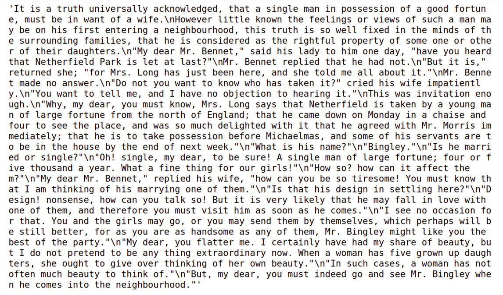
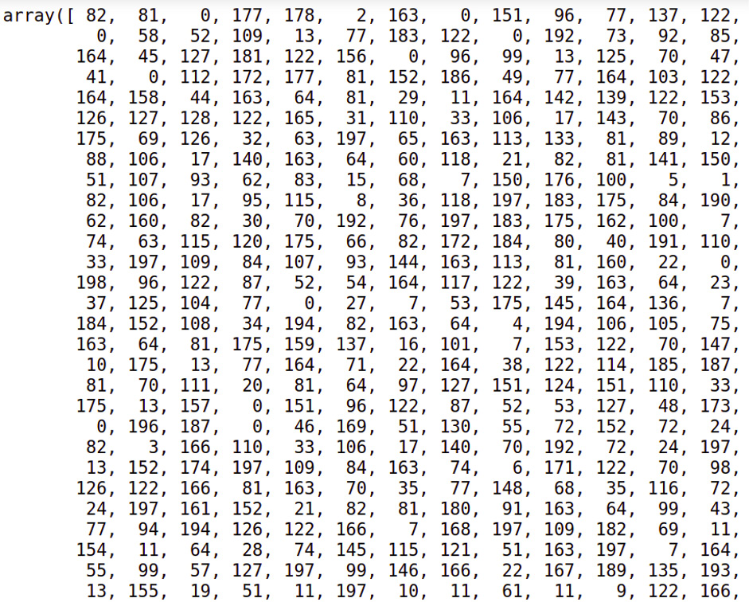
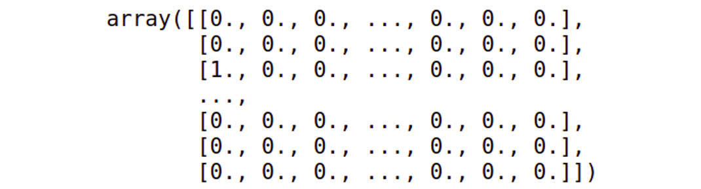
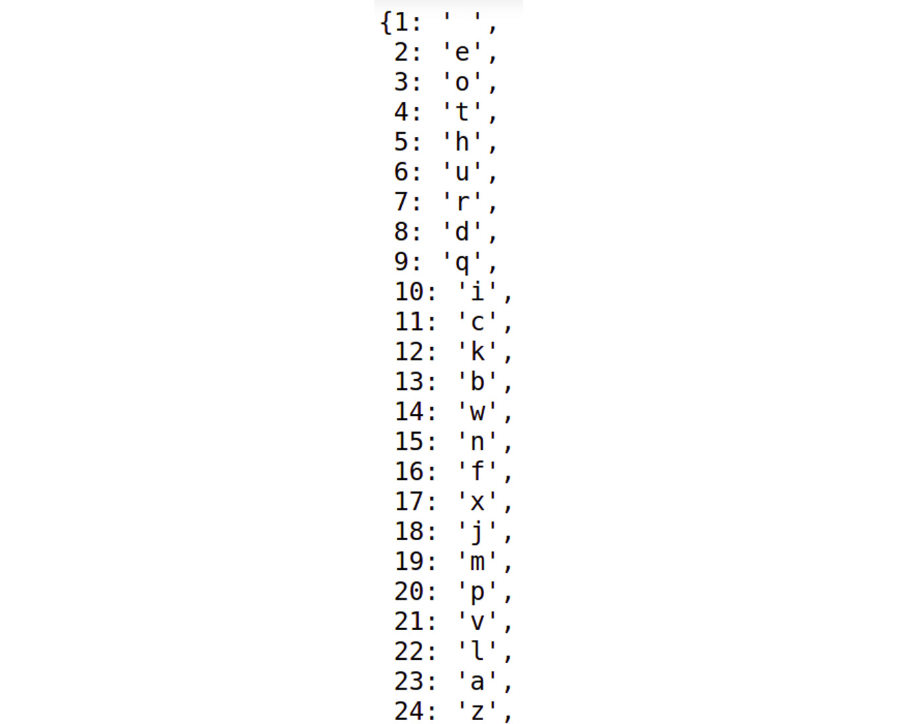
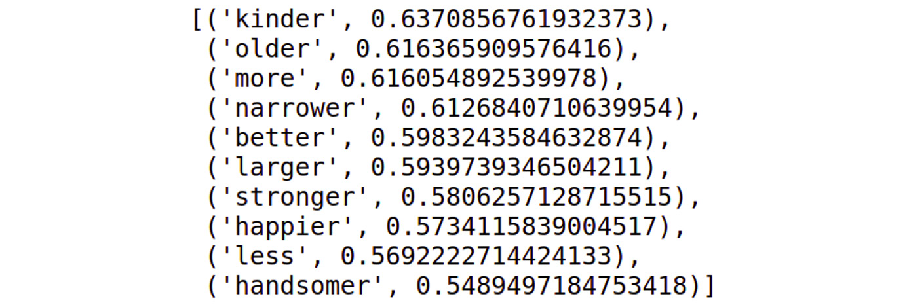
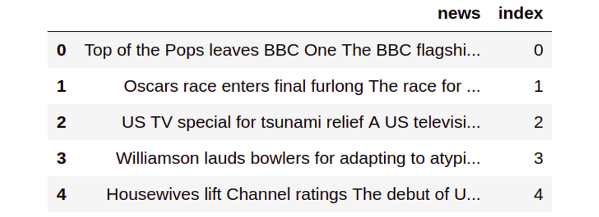

6. Vector Representation
========================


Overview

This chapter introduces you to the various ways in which text can be
represented in the form of vectors. You will start by learning why this
is important, and the different types of vector representation. You will
then perform one-hot encoding on words, using the
`preprocessing` package provided by scikit-learn, and
character-level encoding, both manually and using the powerful Keras
library. After covering learned word embeddings and pre-trained
embeddings, you will use `Word2Vec` and `Doc2Vec`
for vector representation for **Natural Language Processing** (**NLP**)
tasks, such as finding the level of similarity between multiple texts.


Introduction
============


The previous chapters laid a firm foundation for NLP. But now we will go
deeper into a key topic---one that gives us surprising insights into how
language processing works and how some of the key advances in
human-computer interaction are facilitated. At the heart of NLP is the
simple trick of representing text as numbers. This helps software
algorithms perform the sophisticated computations that are required to
understand the meaning of the text.

As we have already discussed in previous chapters, most machine learning
algorithms take numeric data as input and do not understand the text as
such. We need to represent our text in numeric form so that we can apply
different machine learning algorithms and other NLP techniques to it.
These numeric representations are called vectors and are also sometimes
called word embeddings or simply embeddings.

This chapter begins with a discussion of vectors, how text can be
represented as vectors, and how vectors can be composed to represent
complex speech. We will walk through the various representations in both
directions---learning how to encode text as vectors as well as how to
retrieve text from vectors. We will also look at some cutting-edge
techniques used in NLP that are based on the idea of representing text
as vectors.


What Is a Vector?
=================


The basic mathematical definition of a vector is an object that has both
magnitude and direction. In our definition, it is mostly compared with a
scalar, which can be defined as an object that has only magnitude.
Vectors are also defined as an element in vector space---for example, a
point in space with the coordinates (x=4, y=5, z=6) is a vector. Here,
we can see the vector dimensions are the geometric coordinates of a
point or element in space. However, the vector dimensions can also
represent any quantity or property of some element or object in addition
to mere geometric coordinates.

As an example, let\'s say that we\'re defining the weather at a given
place using five features: temperature, humidity, precipitation, wind
speed, and air pressure. The units that these would be measured in are
Celsius, percentage, centimeters, kilometers per hour (km/h), and
millibar (mbar), respectively. The following are the values for two
places:

<div>


</div>

Figure 6.1: Weather indicators at two different places

So, we can represent the weather of these places in vector form as
follows:

-   Vector for place 1: \[25, 50, 1, 18, 1200.0\]
-   Vector for place 2: \[32, 60, 0, 7, 1019.0\]

In the preceding representation, the first
dimension represents temperature, the second dimension represents
humidity, and so on. Note that the order of these dimensions should be
consistent among all the vectors.

Similarly, we can also represent text as a vector in which each
dimension can represent either the presence or absence of certain
metrics. Examples of these are bag of words and TFIDF vectors that we
looked at in the previous chapters. There are other techniques as well
for vector representation of text---learned word embeddings, for
instance. We will discuss all these different techniques in the upcoming
sections. These techniques can be broadly classified into two
categories:

-   Frequency-based embeddings
-   Learned word embeddings


Frequency-Based Embeddings
--------------------------

Frequency-based embedding is a technique in which the text is
represented in vector form by considering the frequency of the word in a
corpus. The techniques that come under this category are the following:

-   Bag of words: As we\'ve already seen in *Chapter 2*, *Feature
    Extraction Methods*, bag of words is the technique of converting
    text into vector or numeric form by representing each sentence or
    document in a list the length of which is equal to the total number
    of unique words in the corpus.
-   TFIDF: As seen previously in *Chapter 2*, *Feature Extraction
    Methods*, this technique considers the frequency of a term as well
    as the inverse of its occurrence in the corpus.
-   Term frequency-based technique: This is a somewhat simpler version
    of TFIDF. We represent each word in the vector by its number of
    occurrences in the document. For example, let\'s say that a document
    contains the following sentences:

1.  The girl is pretty, and the boy is handsome.

2.  Do whatever your heart says.

3.  The boy has a bike.

4.  His bike was red in color.

    Now let\'s build term frequency vectors of all these sentences. We
    will first create a **dictionary** of unique words as follows. Note
    that we are considering every word in lowercase only:

    *{1: the*

    *2: girl*

    *3: pretty*

    *4: and*

    *5: boy*

    *5: is*

    *7: handsome*

    *8: do*

    *9: whatever*

    *10: your*

    *11: heart*

    *12: says*

    *13: was*

    *14: has*

    *15: bike*

    *16: his*

    *17: red*

    *18: in*

    *19: color*

    *}*

    Now every document will be represented by a vector with 19
    dimensions, where every dimension represents the frequency of a word
    in that document. So, for sentence 1, the vector will be \[2, 1, 1,
    1, 1, 2, 1, 0, 0, 0, 0, 0, 0, 0, 0, 0, 0, 0, 0, 0\]. Similarly, for
    sentence 2, the vector representation will be \[0, 0, 0, 0, 0, 0, 0,
    1, 1, 1, 1, 1, 0, 0, 0, 0, 0, 0, 0, 0\], and so on. Note that the
    order needs to be consistent here, too.

    Note

    It is recommended that you use preprocessing techniques such as
    stemming, stop word removal, and conversion to lowercase before
    converting a text into the aforementioned vector format. Term
    frequency is a simple and quick technique for converting text into
    vector form. However, the TFIDF technique is a more effective
    technique than term frequency as it not only considers the frequency
    of a word in the current document but also in the background corpus.

    -   One-hot encoding: In all techniques described previously, we
        have represented a word with a single number. Using one-hot
        encoding, we can represent a word with an array. To understand
        this concept better, let\'s take the following sentences:

5.  I love cats and dogs.

6.  Cats are light in weight.

    We will use a **dictionary** to assign a numeric label or index to
    each unique word (after converting to lowercase) as follows:

    *{1: i*

    *2: love*

    *3: cats*

    *4: and*

    *5: dogs*

    *6: are*

    *7: light*

    *8: in*

    *9: weight*

    *}*

    Now we will represent each word in these sentences as follows:

    i \[1 0 0 0 0 0 0 0 0\]

    love \[0 1 0 0 0 0 0 0 0\]

    cats \[0 0 1 0 0 0 0 0 0\]

    and \[0 0 0 1 0 0 0 0 0\]

    dogs \[0 0 0 0 1 0 0 0 0\]

    are \[0 0 0 0 0 1 0 0 0\]

    light \[0 0 0 0 0 0 1 0 0\]

    in \[0 0 0 0 0 0 0 1 0\]

    weight \[0 0 0 0 0 0 0 0 1\]

We can see that each vector consists of 9 elements; that is, the number
of elements equals the total number of words in the **dictionary**. For
each word, the value of an element will be 1, only if the word is
present at the corresponding position in the **dictionary**. When
one-hot encoding words, you also need to consider the **vocabulary**.
The meaning of vocabulary here is the total number of unique words in
the text sources for your project. So, if you have a large source, then
you will end up with a huge vocabulary and large one-hot vector sizes,
which will eventually consume a lot of memory. The next exercise on
word-level one-hot encoding will help us understand this better.

Label encoding is a technique used to convert categorical data in
numerical data, where each category is represented by a unique number.
In order to perform label encoding and one-hot encoding, we will be
using the `LabelEncoder()` and `OneHotEncoder()`
classes from the `preprocessing` package provided by the
scikit-learn library. The following exercise will help us get a better
understanding of this.


Exercise 6.01: Word-Level One-Hot Encoding
------------------------------------------

In this exercise, we will one-hot encode words with the help of the
`preprocessing` package provided by the scikit-learn library.
For this, we shall make use of a file containing lines from Jane
Austen\'s *Pride and Prejudice*.

Note

The text file used for this exercise can be found at
<https://github.com/fenago/natural-language-processing-workshop>.

Follow these steps to implement this exercise:

1.  Open a Jupyter notebook.

2.  First, load the file containing the lines from the novel using the
    `Path` class provided by the `pathlib` library
    to specify the location of the file. Insert a new cell and add the
    following code:


    ``` {.language-markup}
    from pathlib import Path
    data = Path('../data')
    novel_lines_file = data / 'novel_lines.txt'
    ```


3.  Now that you have the file, open it and read its contents. Use the
    `open()` and `read()` functions to perform these
    actions. Store the results in the `novel_lines` file
    variable. Insert a new cell and add the following code to implement
    this:


    ``` {.language-markup}
    with novel_lines_file.open() as f:
        novel_lines_raw = f.read()
    ```


4.  After reading the contents of the file, load it by inserting a new
    cell and adding the following code:


    ``` {.language-markup}
    novel_lines_raw
    ```


    The code generates the following output:


    


    Figure 6.2: Raw text from the file

    In the output, you will see a lot of newline characters. This is
    because we loaded the entire content at once into a single variable
    instead of separate lines. You will also see a lot of
    non-alphanumeric characters.

5.  The main objective is to create one-hot vectors for each word in the
    file. To do this, construct a vocabulary, which is the entire list
    of unique words in the file, by tokenizing the string into words and
    removing newlines and non-alphanumeric characters. Define a function
    named `clean_tokenize()` to do this. Store the vocabulary
    created using `clean_tokenize()` inside a variable named
    `novel_lines`. Add the following code:


    ``` {.language-markup}
    import string
    import re
    alpha_characters = str.maketrans('', '', string.punctuation)
    def clean_tokenize(text):
        text = text.lower()
        text = re.sub(r'\n', '*** ', text)
        text = text.translate(alpha_characters)
        text = re.sub(r' +', ' ', text)
        return text.split(' ')
    novel_lines = clean_tokenize(novel_lines_raw)
    ```


6.  Take a look at the content inside `novel_lines` now. It
    should look like a list. Insert a new cell and add the following
    code to view it:


    ``` {.language-markup}
    novel_lines
    ```


    The code generates the following output:


    


    Figure 6.3: Text after preprocessing is done

7.  Insert a new cell and add the following code to convert the list to
    a NumPy array and print the shape of the array:


    ``` {.language-markup}
    import numpy as np
    novel_lines_array = np.array([novel_lines])
    novel_lines_array = novel_lines_array.reshape(-1, 1)
    novel_lines_array.shape
    ```


    The code generates the following output:


    ``` {.language-markup}
    (459, 1)
    ```


    As you can see, the `novel_lines_array` array consists of
    `459` rows and `1` column. Each row is a word in
    the original `novel_lines` file.

    Note

    NumPy arrays are more specific to NLP algorithms than Python lists.
    It is the format that is required for the scikit-learn library,
    which we will be using to one-hot encode words.

8.  Now use encoders, such as the `LabelEncoder()` and
    `OneHotEncoder()` classes from scikit-learn\'s
    `preprocessing` package, to convert
    `novel_lines_array` to one-hot encoded format. Insert a
    new cell and add the following lines of code to implement this:


    ``` {.language-markup}
    from sklearn import preprocessing
    labelEncoder = preprocessing.LabelEncoder()
    novel_lines_labels = labelEncoder.fit_transform(\
                         novel_lines_array)
    import warnings
    warnings.filterwarnings('ignore')
    wordOneHotEncoder = preprocessing.OneHotEncoder()
    line_onehot = wordOneHotEncoder.fit_transform(\
                  novel_lines_labels.reshape(-1,1))
    ```


    In the code, the `LabelEncoder()` class encodes the
    labels, and the `fit_transform()` method fits the label
    encoder and returns the encoded labels.

9.  To check the list of encoded labels, insert a new cell and add the
    following code:


    ``` {.language-markup}
    novel_lines_labels
    ```


    The preceding code generates output that looks as follows:


    


    Figure 6.4: List of encoded labels

    The `OneHotEncoder()` class encodes the categorical
    integer features as a one-hot numeric array. The
    `fit_transform()` method of this class takes the
    `novel_lines_labels` array as input. This is a numeric
    array, and each feature included in this array is encoded using the
    one-hot encoding scheme.

10. Create a binary column for each category. A **sparse matrix** is
    returned as output. To view the matrix, insert a new cell and type
    the following code:


    ``` {.language-markup}
    line_onehot
    ```


    The code generates the following output:


    ``` {.language-markup}
    <459x199 sparse matrix of type '<class 'numpy.float64'>'
                    With 459 stored elements in Compressed Sparse Row format>
    ```


11. To convert the sparse matrix into a **dense array**, use the
    `toarray()` function. Insert a new cell and add the
    following code to implement this:


    ``` {.language-markup}
    line_onehot.toarray()
    ```


    The code generates the following output:


    


Figure 6.5: Dense array

Note

To access the source code for this specific section, please refer to
<https://github.com/fenago/natural-language-processing-workshop>.

You can also run this example online at <https://github.com/fenago/natural-language-processing-workshop>.

The preceding output shows that we have achieved our objective of
one-hot encoding words.

One-hot encoding is mostly used in techniques such as language
generation models, where a model is trained to predict the next word in
the sequence given the words that precede it (think about your phone
recommending words while you\'re chatting with your friends). Language
models are used in many important natural language tasks nowadays,
including machine translation, spell correction, text summarization, and
in tools like Amazon Echo, Alexa, and more.

In addition to word-level language models, we can also build
character-level language models, which can be trained to predict the
next character in a sequence of characters. For character-level language
models, we need character-level one-hot encoding. Let\'s explore this in
the next section.


Character-Level One-Hot Encoding
--------------------------------

In character-level one-hot encoding, we assign a numeric value to all
the possible characters. We can use alpha-numeric characters and
punctuation as well. Then, we represent each character by an array of
size equal to all the characters in the document. This array contains
zero at all the indices, other than the index assigned with the
character. Let\'s explain this with an example. Consider the word
\"hello\". Let\'s say our vocabulary contains only twenty-six
characters, so our **dictionary** will look like this:

{\'a\': 0

\'b\': 1

\'c\': 2

\'d\': 3

\'e\': 4

\'f\': 5

\'g\': 6

\'h\': 7

\'i\': 8

\'j\': 9

\'k\': 10

.......\'z\': 25}

Now, \'h\' will be represented as \[0 0 0 0 0 0 0 1 0 0 0 0 0 0 0 0 0 0
0 0 0 0 0 0 0 0 0\]. Similarly, \'e\' can be represented as \[0 0 0 0 1
0 0 0 0 0 0 0 0 0 0 0 0 0 0 0 0 0 0 0 0 0\]. Let\'s see how we can
implement this in the next exercise.


Exercise 6.02: Character One-Hot Encoding -- Manual
---------------------------------------------------

In this exercise, we will create our own function that can one-hot
encode the characters of the word \"data\". Follow these steps to
complete this exercise:

1.  Open a Jupyter notebook.

2.  To one-hot encode the characters of a given word, create a function
    named `onehot_word()`. Within this function, create a
    `lookup` table for each of the characters in the given
    word. Then, map each character to an index. Add the following code
    to implement this:


    ``` {.language-markup}
    def onehot_word(word):
        lookup = {v[1]: v[0] for v in enumerate(set(word))}
        word_vector = []
    ```


3.  Next, loop through the characters in the word and create a vector
    named `one_hot_vector` of the same size as the number of
    characters in the lookup. This vector is filled with zeros. Then,
    use the `lookup` table to find the position of the
    character and set that character\'s value to `1`.

    Note

    Execute the code for *step 1* and *step 2* together.

    Add the following code:


    ``` {.language-markup}
        for c in word:
            one_hot_vector = [0] * len(lookup)
        
            one_hot_vector[lookup[c]] = 1
            word_vector.append(one_hot_vector)
        return word_vector
    ```


    The function created earlier will return a word vector.

4.  Once the `onehot_word()` function has been created, test
    it by adding some input as a parameter. Add the word \"data\" as an
    input to the function. To implement this, add a new cell and write
    the following code:


    ``` {.language-markup}
    onehot_vector = onehot_word('data')
    print(onehot_vector)
    ```


    The code generates the following output:


    ``` {.language-markup}
    [0, 0, 1], [1, 0, 0], [0, 1, 0], [1, 0, 0]
    ```


    Since there are four characters in the input (`data`),
    there will be four one-hot vectors. To determine the size of each
    one-hot vector for `data`, we enumerate the total number
    of characters in it. It is important to note that only one index
    gets assigned for repeated characters. After enumerating through the
    characters, the character `d` will be assigned index
    `0`, the character `a` will be assigned index
    `1`, and the character `t` will be assigned
    index `2`.

    Based on each character\'s index position, the elements in each
    one-hot vector will be marked as `1`, leaving other
    elements marked `0`. In this way, we can manually one-hot
    encode any given text. Note that, in most practical applications,
    the size of one-hot encoded vector is equal to the size of all the
    characters, and sometimes, non-alphabetical characters are also
    considered.

    Note

    To access the source code for this specific section, please refer to
    <https://github.com/fenago/natural-language-processing-workshop>.

    You can also run this example online at
    <https://github.com/fenago/natural-language-processing-workshop>.

We have learned how character-level one-hot encoding can be performed
manually by developing our own function. We will focus on performing
character-level one-hot encoding using Keras in the next exercise. Keras
is a machine learning library that works along with TensorFlow to create
deep learning models.

We will be using the `Tokenizer` class from Keras to create
vectors from the text. `Tokenizer` can work on both characters
and words, depending on the `char_level` argument. If
`char_level` is set to `true`, then it will work on
the character level; otherwise, it will work on the word level. The
`Tokenizer` class comes with the following functions:

-   `fit_on_text()`: This method reads all the text and
    creates an internal **dictionary**, either word-wise or
    character-wise. We should always call it for the entire text, so
    that no word or character is left out of the dictionary. All the
    methods/variables listed after this should be called or used only
    after calling this method.
-   `word_index`: This is a **dictionary** that contains all
    the possible words or characters in the vocabulary. Each word or
    character is assigned a unique number/index.
-   `index_word`: This is the reverse dictionary of
    `word_index`; it contains key-value pairs with the index
    as the key and the word or character as its value.
-   `texts_to_sequences()`: This function converts each word
    or character sequence into its corresponding index value.
-   `texts_to_matrix()`: This converts each word or character
    in a given text into one-hot vector using a built-in dictionary. It
    takes the text as input, processes it, and returns a NumPy array of
    one-hot encoded vectors.


Exercise 6.03: Character-Level One-Hot Encoding with Keras
----------------------------------------------------------

In this exercise, we will perform one-hot encoding on a given word using
the Keras library. Follow these steps to implement this exercise:

1.  Open a Jupyter notebook.

2.  Insert a new cell and the following code to import the necessary
    libraries:


    ``` {.language-markup}
    from keras.preprocessing.text import Tokenizer
    import numpy as np
    ```


3.  Once you have imported the `Tokenizer` class, create an
    instance of it by inserting a new cell and adding the following
    code:


    ``` {.language-markup}
    char_tokenizer = Tokenizer(char_level=True)
    ```


    Since you are encoding at the character level, in the constructor,
    `char_level` is set to `True`.

    Note

    By default, `char_level` is set to `False` if we
    are encoding words.

4.  To test the `Tokenizer` instance, you will require some
    text to work on. Insert a new cell and add the following code to
    assign a string to the `text` variable:


    ``` {.language-markup}
    text = 'The quick brown fox jumped over the lazy dog'
    ```


5.  After getting the text, use the `fit_on_texts()` method
    provided by the `Tokenizer` class. Insert a new cell and
    add the following code to implement this:


    ``` {.language-markup}
    char_tokenizer.fit_on_texts(text)
    ```


    In this code, `char_tokenizer` will break `text`
    into characters and internally keep track of the tokens, the
    indices, and everything else needed to perform one-hot encoding.

6.  Now, look at the possible output. One type of output is the sequence
    of the characters---that is, the integers assigned with each
    character in the text. The `texts_to_sequences()` method
    of the `Tokenizer` class helps assign integers to each
    character in the text. Insert a new cell and add the following code
    to implement this:


    ``` {.language-markup}
    seq =char_tokenizer.texts_to_sequences(text)
    seq
    ```


    The code generates the following output:


    


    Figure 6.6: List of integers assigned to each character

    As you can see, there were **44** characters in the `text`
    variable. From the output, we can see that for every unique
    character in `text`, an integer is assigned.

7.  Use `sequences_to_texts()` to get text from the sequence
    with the following code:


    ``` {.language-markup}
    char_tokenizer.sequences_to_texts(seq)
    ```


    The snippet of the preceding output follows:


    


    Figure 6.7: Text generated from the sequence

8.  Now look at the actual one-hot encoded values. For this, use the
    `texts_to_matrix()` function. Insert a new cell and add
    the following code to implement this:


    ``` {.language-markup}
    char_vectors = char_tokenizer.texts_to_matrix(text)
    ```


    Here, the results of the array are stored in the
    `char_vectors` variable.

9.  In order to view the vector values, just insert a new cell and add
    the following line:


    ``` {.language-markup}
    char_vectors
    ```


    On execution, the code displays the array of one-hot encoded
    vectors:


    


    Figure 6.8: Actual one-hot encoded values for the given text

10. In order to investigate the dimensions of the NumPy array, make use
    of the `shape` attribute. Insert a new cell and add the
    following code to execute it:


    ``` {.language-markup}
    char_vectors.shape
    ```


    The following output is generated:


    ``` {.language-markup}
    (44, 27)
    ```


    So, `char_vectors` is a NumPy array with `44`
    rows and `27` columns. This is because we are considering
    26 characters and an additional character for space.

11. To access the first row of `char_vectors` NumPy array,
    insert a new cell and add the following code:


    ``` {.language-markup}
    char_vectors[0]
    ```


    This returns a one-hot vector, which can be seen in the following
    figure:


    ``` {.language-markup}
    array([0 ., 0., 0., 0., 1., 0., 0., 0., 0 .,
           0., 0., 0., 0., 0., 0., 0.,0., 0 .,
           0., 0., 0., 0., 0., 0., 0 ., 0., 0])
    ```


12. To access the index of this one-hot vector, use the
    `argmax()` function provided by NumPy. Insert a new cell
    and write the following code to implement this:


    ``` {.language-markup}
    np.argmax(char_vectors[0])
    ```


    The code generates the following output:


    ``` {.language-markup}
    4
    ```


13. The `Tokenizer` class provides two dictionaries,
    `index_word` and `word_index`, which you can use
    to view the contents of `Tokenizer` in key-value form.
    Insert a new cell and add the following code to view the
    `index_word` dictionary:


    ``` {.language-markup}
    char_tokenizer.index_word
    ```


    The code generates the following output:


    


    Figure 6.9: The index\_word dictionary

    As you can see in this figure, the indices act as keys, and the
    characters act as values. Now insert a new cell and the following
    code to view the `word_index` dictionary:


    ``` {.language-markup}
    char_tokenizer.word_index
    ```


    The code generates the following output:


    


    Figure 6.10: The word\_index dictionary

    In this figure, the characters act as keys, and the indices act as
    values.

14. In the preceding steps, you saw how to access the index of a given
    one-hot vector by using the `argmax()` function provided
    by NumPy. Using this index as a key, you can access its value in the
    `index_word` dictionary. To implement this, we insert a
    new cell and write the following code:


    ``` {.language-markup}
    char_tokenizer.index_word[np.argmax(char_vectors[0])]
    ```


    The preceding code generates the following output:


    ``` {.language-markup}
    't'
    ```


    In this code, `np.argmax(char_vectors[0])` produces an
    output of `4`. This will act as a key in finding the value
    in the `index_word` dictionary. So, when
    `char_tokenizer.index_word[4]` is executed, it will scan
    through the dictionary and find that, for key `4`, the
    value is `t`, and finally, it will print `t`.

    Note

    To access the source code for this specific section, please refer to
    <https://github.com/fenago/natural-language-processing-workshop>.

    You can also run this example online at
    <https://github.com/fenago/natural-language-processing-workshop>.

In the preceding section, we learned how to convert text into one-hot
vectors at either the character level or the word level. One-hot
encoding is a simple representation of a word, but it has a
disadvantage. Whenever the corpus is large (that is, when the number of
unique characters or words increases), the size of the one-hot encoded
vector also increases. Thus, it becomes very memory intensive and is
sometimes not feasible; speed and simplicity here lead to the \"curse of
dimensionality\" by creating a new dimension for each category/word. To
tackle this problem, learned embeddings can be used, as explained in the
following sections.


Learned Word Embeddings
-----------------------

The vector representations discussed in the preceding section have some
serious disadvantages, as discussed here:

-   **Sparsity and large size**: The sizes of one-hot encoded or other
    frequency-based vectors depend upon the number of unique words in
    the corpus. This means that when the size of the corpus increases,
    the number of unique words increases, thereby increasing the size of
    the vectors in turn.
-   **Context**: None of these vector representations consider the words
    with respect to its context while representing it as a vector.
    However, the meaning of a word in any language depends upon the
    context it is used in. Not taking the context into account can often
    lead to inaccurate results.

Prediction-based word embeddings or learned word embeddings try to
address both problems. For starters, these methods represent words with
a fixed number of dimensions. Moreover, these representations are
actually learned from the different contexts in which the word has been
used at different places. **Learned word embeddings** is actually a
collective name given to a set of language models that represent words
in such a way that words with similar meanings have somewhat similar
representations. There are different techniques for creating learned
word embeddings, such as `Word2Vec` and GloVe. Let\'s discuss
them one by one.


Word2Vec
--------

`Word2Vec` is a prediction-based algorithm that represents a
word by a vector of a fixed size. This is a form of unsupervised
learning algorithm, which means that we need not to provide manually
annotated data; we just feed the raw text. It will train a model in such
a way that each word is represented in terms of its context throughout
the training data.

This algorithm has two variations, as follows:

-   **Continuous Bag of Words** (**CBoW**): This model tends to predict
    the probability of a word given the context. The learning problem
    here is to predict the word given a fixed-window context---that is,
    a fixed set of continuous words in text.
-   **Skip-Gram model**: This model is the reverse of the CBoW model, as
    it tends to predict the context of a word.

These vectors find application in a lot of NLP tasks including text
generation, machine translation, speech to text, text to speech, text
classification, and text similarity.

Let\'s explore how they can be used for text similarity. Suppose we
generated 300 dimensional vectors from words such as \"love\",
\"adorable\", and \"hate\". If we find the cosine similarity between the
vectors for \"love\" and \"adorable\", and \"love\" and \"hate\", we
will find a higher similarity between the former pair of words than the
latter.

In the next exercise, we will train word vectors using the gensim
library. Specifically, we\'ll be using the `Word2Vec` class.
The `Word2Vec` class has parameters such as
`documents`, `size`, `window`,
`min_count`, and `workers`. Here,
`documents` refers to the sentences that we have to provide to
the class, `size` represents the length of the dense vector to
represent each token, `min_count` represents the minimum count
of words that can be taken into consideration when training a particular
model, and `workers` represents the number of threads that are
required when training a model.

For training a model, we use the `model.train()` method. This
method takes arguments such as `documents`,
`total_examples`, and `epochs`. Here,
`documents` represents the sentences, and
`total_examples` represents the count of sentences, while
`epochs` represents the total number of iterations over the
given data. Finally, the trained word vectors get stored in
`model.wv`, which is an instance of `KeyedVectors`.

In order to perform basic text cleaning, before it\'s processed, we will
make use of the `textcleaner` class from gensim. Some of the
most useful functions available in `textcleaner` that we will
be using are as follows:

-   `split_sentences()`: As the name suggests, this function
    splits the text and gets a list of sentences from the text.
-   `simple_preprocess()`: This function converts a document
    into a list consisting of lowercase tokens.

Let\'s see how we can use these functions to create word vectors.


Exercise 6.04: Training Word Vectors
------------------------------------

In this exercise, we will train word vectors. We will be using books
freely available on Project Gutenberg for this. We will also see the
vector representation using Matplotlib\'s pyplot framework.

Note

The file we are using for this exercise can be found at
<https://github.com/fenago/natural-language-processing-workshop>.

Follow these steps to implement this exercise:

1.  Open a Jupyter notebook.

2.  Use the `requests` library to load books from the Project
    Gutenberg website, the `json` library to load a book
    catalog, and the `regex` package to clean the text by
    removing newline characters. Insert a new cell and add the following
    code to implement this:


    ``` {.language-markup}
    import requests
    import json
    import re
    ```


3.  After importing all the necessary libraries, load the
    `json` file, which contains details of 10 books, including
    the title, the author, and the ID. Insert a new cell and add the
    following steps to implement this:


    ``` {.language-markup}
    with open('../data/ProjectGutenbergBooks.json', 'r') \
        as catalog_file:
        catalog = json.load(catalog_file)
    ```


4.  To print the details of all the books, insert a new cell and add the
    following code:


    ``` {.language-markup}
    catalog
    ```


    The preceding code generates the following output:


    


    Figure 6.11: Book details in the catalog

5.  Create a function named `load_book()`, which will take
    `book_id` as a parameter and, based on that
    `book_id`, fetch the book and load it. It should also
    clean the text by removing the newline characters. Insert a new cell
    and add the following code to implement this:


    ``` {.language-markup}
    GUTENBERG_URL ='https://www.gutenberg.org/files/{}/{}-0.txt'
    def load_book(book_id):
        url = GUTENBERG_URL.format(book_id, book_id)
        contents = requests.get(url).text
        cleaned_contents = re.sub(r'\r\n', ' ', contents)
        return cleaned_contents
    ```


6.  Once you have defined our `load_book()` function, you will
    loop through the catalog, fetch all the `id` instances of
    the books, and store them in the `book_ids` list. The
    `id` instances stored in the `book_ids` list
    will act as parameters for our `load_book()` function. The
    book information fetched for each book ID will be loaded in the
    `books` variable. Insert a new cell and add the following
    code to implement this:


    ``` {.language-markup}
    book_ids = [ book['id'] for book in catalog ]
    books = [ load_book(id) for id in book_ids]
    ```


    To view the information of the `books` variable, add the
    following code in a new cell:


    ``` {.language-markup}
    books[:5]
    ```


    A snippet of the output generated by the preceding code is as
    follows:


    


    Figure 6.12: Information of various books

7.  Before you can train the word vectors, you need to split the books
    into a list of documents. In this case, you want to teach the
    `Word2Vec` algorithm about words in the context of the
    sentences that they are in. So here, a document is actually a
    sentence. Thus, you need to create a list of sentences from all 10
    books. Insert a new cell and add the following code to implement
    this:


    ``` {.language-markup}
    from gensim.summarization import textcleaner
    from gensim.utils import simple_preprocess
    def to_sentences(book):
        sentences = textcleaner.split_sentences(book)
        sentence_tokens = [simple_preprocess(sentence) \
                           for sentence in sentences]
        return sentence_tokens
    ```


    In the preceding code, all the text preprocessing takes place inside
    the `to_sentences()` function that you have defined.

8.  Now, loop through each book in `books` and pass each book
    as a parameter to the `to_sentences()` function. The
    results should be stored in the `book_sentences` variable.
    Also, split books into sentences and sentences into documents. The
    result should be stored in the `documents` variable.
    Insert a new cell and add the following code to implement this:


    ``` {.language-markup}
    books_sentences = [to_sentences(book) for book in books]
    documents = [sentence for book_sent in books_sentences \
                 for sentence in book_sent]
    ```


9.  To check the length of the documents, use the `len()`
    function as follows:


    ``` {.language-markup}
    len(documents)
    ```


    The code generates the following output:


    ``` {.language-markup}
    32922
    ```


10. Now that you have your documents, train the model by making use of
    the `Word2Vec` class provided by the gensim package.
    Insert a new cell and add the following code to implement this:


    ``` {.language-markup}
    from gensim.models import Word2Vec
    # build vocabulary and train model
    model = Word2Vec(
            documents,
            size=100,
            window=10,
            min_count=2,
            workers=10)
    model.train(documents, total_examples=len(documents), \
                epochs=50)
    ```


    The code generates the following output:


    ``` {.language-markup}
    (27809439, 37551450)
    ```


    Now make use of the `most_similar()` function of the
    `model.wv` instance to find the similar words. The
    `most_similar()` function takes `positive` as a
    parameter and returns a list of strings that contribute positively.
    Insert a new cell and add the following code to implement this:


    ``` {.language-markup}
    model.wv.most_similar(positive="worse")
    ```


    The code generates the following output:


    


    Figure 6.13: Most similar words

    Note

    You may get a slightly different output as the output depends on the
    model training process, so you may have a different model than the
    one we have trained here.

11. Create a `show_vector()` function that will display the
    vector using `pyplot`, a plotting framework in Matplotlib.
    Insert a new cell and add the following code to implement this:


    ``` {.language-markup}
    %matplotlib inline
    import matplotlib.pyplot as plt
    def show_vector(word):
        vector = model.wv[word]
        fig, ax = plt.subplots(1,1, figsize=(10, 2))
        ax.tick_params(axis='both', \
                       which='both',\
                       left=False, \
                       bottom=False, \
                       top=False,\
                       labelleft=False, \
                       labelbottom=False)
        ax.grid(False)
        print(word)
        ax.bar(range(len(vector)), vector, 0.5)
    show_vector('sad')
    ```


    The code generates the following output:


    


Figure 6.14: Graph of the vector when the input is \"sad\"

Note

To access the source code for this specific section, please refer to
<https://github.com/fenago/natural-language-processing-workshop>.

You can also run this example online at <https://github.com/fenago/natural-language-processing-workshop>.

In the preceding figure, we can see the vector representation when the
word provided to the `show_vector()` function is \"sad\". We
have learned about training word vectors and representing them using
`pyplot`. In the next section, we will focus more on using
**pre-trained word vectors**, which are required for NLP projects.


Using Pre-Trained Word Vectors
------------------------------

For a machine learning model, the more data you have, the better the
model you get. But training the model on large amounts of data is
intensively resource-consuming in terms of both time and memory. So, we
usually train a `Word2Vec` model on a large amount of data and
retain the model for future use. There are also a lot of pre-trained
models publicly available have been trained on huge datasets such as
Wikipedia articles. These models include gensim by fastText (research
group by Facebook), and `Word2Vec` has recently proved to be
state-of-the-art for tasks including checking for word analogies and
word similarities, as follows:

-   *vector(\'Paris\') - vector(\'France\') + vector(\'Italy\')* results
    in a vector that is very close to *vector(\'Rome\')*.
-   *vector(\'king\') - vector(\'man\') + vector(\'woman\')* is close to
    *vector(\'queen\')*.

Google\'s publicly available glove model is similar to the
`Word2Vec` model and has produced incredible results. In some
applications, we may need to train a `Word2Vec` model on our
own specific dataset rather than train a new model from scratch; that
is, we can train a pre-trained model on more data. This process is
called transfer learning. Transfer learning is based on the concept of
transferring knowledge from one domain into another.

Note

Pre-trained word vectors can get pretty large. For example, vectors
trained on Google News contain 3 million words, and on disk, its
compressed size is 1.5 GB.

To better understand how we can use pre-trained word vectors in Python,
let\'s walk through a simple exercise.


Exercise 6.05: Using Pre-Trained Word Vectors
---------------------------------------------

In this exercise, we will load and use pre-trained word embeddings. We
will also show the image representation of a few word vectors using the
pyplot framework of the Matplotlib library. We will be using
`glove6B50d.txt`, which is a pre-trained model.

Note

The pre-trained model being used for this file can be found at
<https://www.kaggle.com/watts2/glove6b50dtxt/download>. Download this
file and place it in the `data` folder of *Chapter 6, Vector
Representation*.

Follow these steps to complete this exercise:

1.  Open a Jupyter notebook.

2.  Add the following statement to import the `numpy` library:


    ``` {.language-markup}
    import numpy as np
    import zipfile
    ```


3.  Move the downloaded model from the preceding link to the location
    given in the following code snippet. In order to extract data from a
    ZIP file, use the `zipfile` Python package. Add the
    following code to unzip the embeddings from the ZIP file:


    ``` {.language-markup}
    GLOVE_DIR = '../data/'
    GLOVE_ZIP = GLOVE_DIR + 'glove6B50d.txt.zip'
    print(GLOVE_ZIP)
    zip_ref = zipfile.ZipFile(GLOVE_ZIP, 'r')
    zip_ref.extractall(GLOVE_DIR)
    zip_ref.close()
    ```


4.  Define a function named `load_glove_vectors()` to return a
    model Python dictionary. Insert a new cell and add the following
    code to implement this:


    ``` {.language-markup}
    def load_glove_vectors(fn):
        print("Loading Glove Model")
        with open( fn,'r', encoding='utf8') as glove_vector_file:
            model = {}
            for line in glove_vector_file:
                parts = line.split()
                word = parts[0]
                embedding = np.array([float(val) \
                            for val in parts[1:]])
                model[word] = embedding
            print("Loaded {} words".format(len(model)))
        return model
    glove_vectors = load_glove_vectors(GLOVE_DIR +'glove6B50d.txt')
    ```


    Here, `glove_vector_file` is a text file containing a
    dictionary. In this, words act as keys and vectors act as values.
    So, we need to read the file line by line, split it, and then map it
    to a Python dictionary. The preceding code generates the following
    output:


    ``` {.language-markup}
    Loading Glove Model
    Loaded 400000 words
    ```


    If we want to view the values of `glove_vectors`, then we
    insert a new cell and add the following code:


    ``` {.language-markup}
    glove_vectors
    ```


    You will get the following output:


    


    Figure 6.15: Dictionary of glove\_vectors

    The order of the result dictionary can vary as it is a Python dict.

5.  The `glove_vectors` object is basically a dictionary
    containing the mappings of the words to the vectors, so you can
    access the vector for a word, which will return a 50-dimensional
    vector. Insert a new cell and add the code to check the vector for
    the word `dog`:


    ``` {.language-markup}
    glove_vectors["dog"]
    ```


    


    Figure 6.16: Array of glove vectors with an input of dog

    In order to see the vector for the word `cat`, add the
    following code:


    ``` {.language-markup}
    glove_vectors["cat"]
    ```


    


    Figure 6.17: Array of glove vectors with an input of cat

6.  Now that you have the vectors, represent them as an image using the
    pyplot framework of the Matplotlib library. Insert a new cell and
    add the following code to implement this:


    ``` {.language-markup}
    %matplotlib inline
    import matplotlib.pyplot as plt
    def to_vector(glove_vectors, word):
        vector = glove_vectors.get(word.lower())
        if vector is None:
            vector = [0] * 50
        return vector
    def to_image(vector, word=''):
        fig, ax = plt.subplots(1,1)
        ax.tick_params(axis='both', which='both',\
                       left=False, \
                       bottom=False, \
                       top=False,\
                       labelleft=False,\
                       labelbottom=False)
        ax.grid(False)
        ax.bar(range(len(vector)), vector, 0.5)
        ax.text(s=word, x=1, y=vector.max()+0.5)
        return vector
    ```


    In the preceding code, you defined two functions. The
    `to_vector()` function accepts `glove_vectors`
    and `word` as parameters. Here, the `get()`
    function of `glove_vectors` will find the word and convert
    it into lowercase. The result will be stored in the
    `vector` variable.

7.  The `to_image()` function takes `vector` and
    `word` as input and shows the image representation of
    `vector`. To find the image representation of the word
    `man`, type the following code:


    ``` {.language-markup}
    man = to_image(to_vector(glove_vectors, "man"))
    ```


    The code generates the following output:


    


    Figure 6.18: Graph generated with an input of man

8.  To find the image representation of the word `woman`, type
    the following code:


    ``` {.language-markup}
    woman = to_image(to_vector(glove_vectors, "woman"))
    ```


    This will generate the following output:


    


    Figure 6.19: Graph generated with an input of woman

9.  To find the image representation of the word `king`, type
    the following code:


    ``` {.language-markup}
    king = to_image(to_vector(glove_vectors, "king"))
    ```


    This will generate the following output:


    


    Figure 6.20: Graph generated with an input of king

10. To find the image representation of the word `queen`, type
    the following code:


    ``` {.language-markup}
    queen = to_image(to_vector(glove_vectors, "queen"))
    ```


    This will generate the following output:


    


    Figure 6.21: Graph generated with an input of queen

11. To find the image representation of the vector for
    `king – man + woman – queen`, type the following code:


    ``` {.language-markup}
    diff = to_image(king – man + woman - queen)
    ```


    This will generate the following output:


    


    Figure 6.22: Graph generated with (king-man+woman-queen) as input

12. To find the image representation of the vector for
    `king – man + woman`, type the following code:


    ``` {.language-markup}
    nd = to_image(king – man + woman)
    ```


    This will generate the following output:


    


Figure 6.23: Graph generated with (king-man+woman) as input

Note

To access the source code for this specific section, please refer to
<https://github.com/fenago/natural-language-processing-workshop>.

This section does not currently have an online interactive example, and
will need to be run locally.

The preceding results are the visual proof of the example we already
discussed. We\'ve learned how to load and use pre-trained word vectors
and view their image representations. In the next section, we will focus
on document vectors and their uses.


Document Vectors
----------------

Word vectors and word embeddings represent words. But if we wanted to
represent a whole document, we\'d need to use document vectors. Note
that when we refer to a document, we are referring to a collection of
words that have some meaning to a user. A document can be a single
sentence or a group of sentences. A document can consist of product
reviews, tweets, or lines of movie dialogue, and can be from a few words
to thousands of words. A document can be used in a machine learning
project as an instance of something that the algorithm can learn from.
We can represent a document with different techniques:

-   Calculating the mean value: We calculate the mean of all the
    constituent word vectors of a document and represent the document by
    the mean vector.
-   `Doc2Vec`: `Doc2Vec` is a technique by which we
    represent documents by a fixed-length vector. It is trained quite
    similarly to the way we train the `Word2Vec` model. Here,
    we also add the unique ID of the document to which the word belongs.
    Then, we can get the vector of the document from the trained model
    using the document ID.

Similar to `Word2Vec`, the `Doc2Vec` class contains
parameters such as `min_count`, `window`,
`vector_size`, `sample`, `negative`, and
`workers`. The `min_count` parameter ignores all the
words with a frequency less than that specified. The `window`
parameter sets the maximum distance between the current and predicted
words in the given sentence. The `vector_size` parameter sets
the dimensions of each vector.

The `sample` parameter defines the threshold that allows us to
configure the higher-frequency words that are regularly down-sampled,
while `negative` specifies the total amount of noise words
that should be drawn and `workers` specifies the total number
of threads required to train the model. To build the vocabulary from the
sequence of sentences, `Doc2Vec` provides the
`build_vocab` method. We\'ll be using all of these in the
upcoming exercise.


Uses of Document Vectors
------------------------

Some of the uses of document vectors are as follows:

-   **Similarity**: We can use document vectors to compare texts for
    similarity. For example, legal AI software can use document vectors
    to find similar legal cases.
-   **Recommendations**: For example, online magazines can recommend
    similar articles based on those that users have already read.
-   **Predictions**: Document vectors can be used as input into machine
    learning algorithms to build predictive models.

In the next section, we will perform an exercise based on document
vectors.


Exercise 6.06: Converting News Headlines to Document Vectors
------------------------------------------------------------

In this exercise, we will convert some news headlines into document
vectors. Also, we will look at the image representation of the vector.
Again, for image representation, we will be using the pyplot framework
of the Matplotlib library. Follow these steps to complete this exercise:

Note

The file which we are going to use in this exercise is in zipped format
and can be found at <https://github.com/fenago/natural-language-processing-workshop>. It should be unzipped
once downloaded.

1.  Open a Jupyter notebook.

2.  Import all the necessary libraries for this exercise. You will be
    using the gensim library. Insert a new cell and add the following
    code:


    ``` {.language-markup}
    import pandas as pd
    from gensim import utils
    from gensim.models.doc2vec import TaggedDocument
    from gensim.models import Doc2Vec
    from gensim.parsing.preprocessing \
    import preprocess_string, remove_stopwords
    import random
    import warnings
    warnings.filterwarnings("ignore")
    ```


    In the preceding code snippet, other than other imports, you
    imported `TaggedDocument` from gensim, which prepares the
    document formats used in `Doc2Vec`. It represents the
    document along with the tag. This will be clearer from the following
    code lines. `Doc2Vec` requires each instance to be a
    `TaggedDocument` instance.

3.  Move the downloaded file to the following location and create a
    variable of the path as follows:


    ``` {.language-markup}
    sample_news_data = '../data/sample_news_data.txt'
    ```


4.  Now load the file:


    ``` {.language-markup}
    with open(sample_news_data, encoding="utf8", \
              errors='ignore') as f:
        news_lines = [line for line in f.readlines()]
    ```


5.  Now create a DataFrame out of the headlines as follows:


    ``` {.language-markup}
    lines_df = pd.DataFrame()
    indices  = list(range(len(news_lines)))
    lines_df['news'] = news_lines
    lines_df['index'] = indices
    ```


6.  View the head of the DataFrame using the following code:


    ``` {.language-markup}
    lines_df.head()
    ```


    This will create the following output:


    


    Figure 6.24: Head of the DataFrame

7.  Create a class, the object of which will create the training
    instances for the `Doc2Vec` model. Insert a new cell and
    add the following code to implement this:


    ``` {.language-markup}
    class DocumentDataset(object):
        
        def __init__(self, data:pd.DataFrame, column):
            document = data[column].apply(self.preprocess)
            self.documents = [ TaggedDocument( text, [index]) \
                              for index, text in \
                              document.iteritems() ]
          
        def preprocess(self, document):
            return preprocess_string(\
                remove_stopwords(document))
            
        def __iter__(self):
            for document in self.documents:
                yield documents
                
        def tagged_documents(self, shuffle=False):
            if shuffle:
                random.shuffle(self.documents)
            return self.documents
    ```


    In the code, the `preprocess_string()` function applies
    the given filters to the input. As its name suggests, the
    `remove_stopwords()` function is used to remove
    `stopwords` from the given document. Since
    `Doc2Vec` requires each instance to be a
    `TaggedDocument` instance, we create a list of
    `TaggedDocument` instances for each headline in the file.

8.  Create an object of the `DocumentDataset` class. It takes
    two parameters. One is the `lines_df_small` DataFrame and
    the other is the `Line` column name. Insert a new cell and
    add the following code to implement this:


    ``` {.language-markup}
    documents_dataset = DocumentDataset(lines_df, 'news')
    ```


9.  Create a `Doc2Vec` model using the `Doc2Vec`
    class. Insert a new cell and add the following code to implement
    this:


    ``` {.language-markup}
    docVecModel = Doc2Vec(min_count=1, window=5, vector_size=100, \
                          sample=1e-4, negative=5, workers=8)
    docVecModel.build_vocab(documents_dataset.tagged_documents())
    ```


10. Now you need to train the model using the `train()`
    function of the `Doc2Vec` class. This could take a while,
    depending on how many records we train. Here, `epochs`
    represents the total number of records required to train the
    document. Insert a new cell and add the following code to implement
    this:


    ``` {.language-markup}
    docVecModel.train(documents_dataset.\
                      tagged_documents(shuffle=True),\
                      total_examples = docVecModel.corpus_count,\
                      epochs=10)
    ```


11. Save this model for future use as follows:


    ``` {.language-markup}
    docVecModel.save('../data/docVecModel.d2v')
    ```


12. The model has been trained. To verify this, access one of the
    vectors with its index. To do this, insert a new cell and add the
    following code to find the `doc` vector of index
    `657`:


    ``` {.language-markup}
    docVecModel[657]
    ```


    You should get an output similar to the one below:


    


    Figure 6.25: Lines represented as vectors

13. To check the image representation of any given vector, make use of
    the pyplot framework of the Matplotlib library. The
    `show_news_lines()` function takes a line number as a
    parameter. Based on this line number, find the vector and store it
    in the `doc_vector` variable. The `show_image()`
    function takes two parameters, `vector` and
    `line`, and displays an image representation of the
    vector. Insert a new cell and add the following code to implement
    this:


    ``` {.language-markup}
    import matplotlib.pyplot as plt
    def show_image(vector, line):
        fig, ax = plt.subplots(1,1, figsize=(10, 2))
        ax.tick_params(axis='both', \
                       which='both',\
                       left=False, \
                       bottom=False,\
                       top=False,\
                       labelleft=False,\
                       labelbottom=False)
        ax.grid(False)
        print(line)
        ax.bar(range(len(vector)), vector, 0.5)
    def show_news_lines(line_number):
        line = lines_df[lines_df.index==line_number].news
        doc_vector = docVecModel[line_number]
        show_image(doc_vector, line)
    ```


14. Now that you have defined the functions, implement the
    `show_news_lines()` function to view the image
    representation of the vector. Insert a new cell and add the
    following code to implement this:


    ``` {.language-markup}
    show_news_lines(872)
    ```


    The code generates the following output:


    


Figure 6.26: Image representation of a given vector

Note

To access the source code for this specific section, please refer to
<https://github.com/fenago/natural-language-processing-workshop>.

You can also run this example online at <https://github.com/fenago/natural-language-processing-workshop>.

We have learned how to represent a document as a vector. We have also
seen a visual representation of this. In the next section, we will
complete an activity to find similar news headlines using the document
vector.


Activity 6.01: Finding Similar News Article Using Document Vectors
------------------------------------------------------------------

To complete this activity, you need to build a news search engine that
finds similar news articles like the one provided as input using the
`Doc2Vec` model. You will find headlines similar to \"US raise
TV indecency US politicians are proposing a tough new law aimed at
cracking down on indecency.\" Follow these steps to complete this
activity:

1.  Open a Jupyter notebook and import the necessary libraries.

2.  Load the new article lines file.

3.  Iterate over each headline and split the columns and create a
    DataFrame.

4.  Load the `Doc2Vec` model that you created in the previous
    exercise.

5.  Create a function that converts the sentences into vectors and
    another that does the similarity checks.

6.  Test both the functions.

    Note

    The full solution to this activity can be found on page 406.

So, in this activity, we were able to find similar news headlines with
the help of document vectors. A common use case of inferring text
similarity from document vectors is in text paraphrasing, which we\'ll
explore in detail in the next chapter.


Summary
=======


In this chapter, we learned about the motivations behind converting
human language in the form of text into vectors. This helps machine
learning algorithms to execute mathematical functions on the text,
detect patterns in language, and gain an understanding of the meaning of
the text. We also saw different types of vector representation
techniques, such as character-level encoding and one-hot encoding.

In the next chapter, we will look at the areas of text paraphrasing,
summarization, and generation. We will see how we can automate the
process of text summarization using the NLP techniques we have learned
so far.
