Lab 7. Text Generation and Summarization
====================================

Overview

This lab begins with the concept of text generation using Markov
chains, before moving on to two types of text summarization---namely,
abstractive and extractive summarization. You will then explore the
TextRank algorithm and use it with different datasets. By the end of
this lab, you will understand the applications and challenges of
text generation and summarization using **Natural Language Processing**
(**NLP**) approaches.

Introduction
============


The ability to express thoughts in words (sentence generation), the
ability to replace a piece of text with different but equivalent text
(paraphrasing), and the ability to find the most important parts of a
piece of text (summarization) are all key elements of using language.
Although sentence generation, paraphrasing, and summarization are
challenging tasks in NLP, there have been great strides recently that
have made them considerably more accessible. In this lab, we explore
them in detail and see how we can implement them in Python.


Generating Text with Markov Chains
==================================


An idea is expressed using the words of a language. As ideas are not
tangible, it is useful to look at text generation in order to gauge
whether a machine can think on its own. The utility of text generation
is currently limited to an auto-complete functionality, besides a few
negative use cases that we will discuss later in this section. Text can
be generated in many different ways, which we will explore using Markov
chains. Whether this generated text can correspond to a coherent line of
thought is something that we will address later in this section.

Markov Chains
-------------

A state space defines all possible states that can exist. A Markov chain
consists of a state space and a specific type of successor function. For
example, in the case of the simplified state space to describe the
weather, the states could be Sunny, Cloudy, or Rainy. The successor
function describes how a system in its current state can move to a
different state or even continue in the same state. To better understand
this, consider the following diagram:

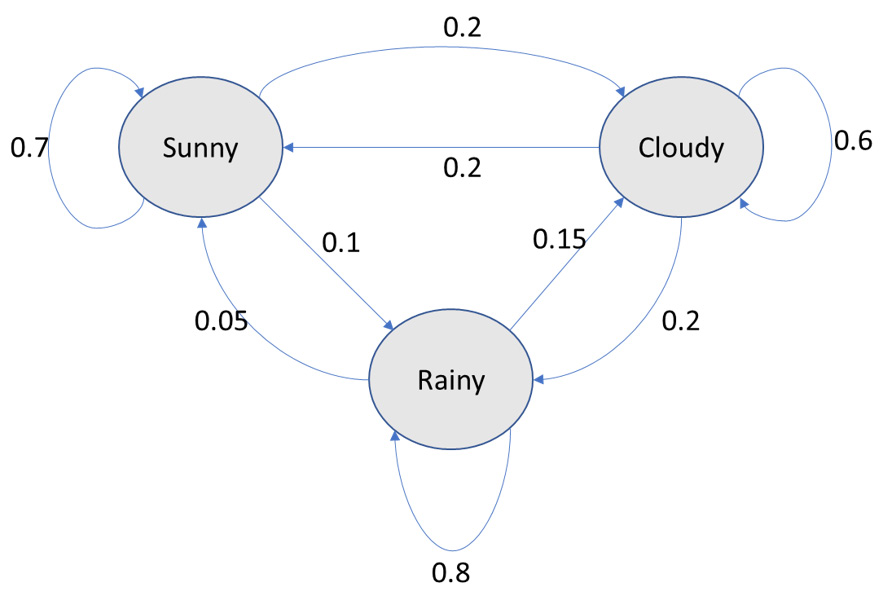


The successor function of a Markov chain is a random selection of a
successor state based on probabilities. For instance, consider that the
initial state is randomly selected as Rainy. The next state could be
Rainy (there is a 0.8 probability that the state stays Rainy). Then, the
next state could be Sunny (there is a 0.05 probability associated with
this transition). It could be Rainy again, and then it could be Cloudy,
and so on. Our sequence of states is **Rainy-Rainy-Sunny-Rainy-Cloudy**.
For each state, the successor state is found by a random selection; this
is called a random walk on the Markov chain.

Similarly, if we have a state space in which the states correspond to a
vocabulary, then a random walk on such a Markov chain will generate
text. Now, the vocabulary could have around 20,000 words. In this case,
the Markov chain will have 20,000 states. The probabilities in this case
will correspond to the likelihood of a word succeeding a given word. We
can begin with any state randomly drawn from among the words that could
be used for the first word of a sentence, for example, common words such
as \"the, \" \"a, \" \"I, \" \"he, \" \"she, \" \"if, \" \"this, \"
\"why, \" and \"where\". We then find its successor state in a random
way, followed by the next successor state found in a random way, and
continue in the same manner until we have generated a sequence of words
of the required length. In the next section, we will do an exercise
related to Markov chains to get a better understanding of them.

Exercise 7.01: Text Generation Using a Random Walk over a Markov Chain
----------------------------------------------------------------------

In this exercise, we will generate text with the help of Markov chains.
We will use Robert Frost\'s collection of poems, *North of Boston*,
available from Project Gutenberg, to specify the successor state(s) for
each state using a dictionary. We\'ll use a list to specify the
successor state(s) for any state so that the number of times a successor
state occurs in that list is directly proportional to the probability of
transitioning to that successor state.

Then, we will generate 10 phrases with three words in addition to an
initial word, and then generate another 10 phrases with four words in
addition to an initial word. The initial state or initial word will be
randomly selected from among these words: \"the,\" \"a,\" \"I,\" \"he,\"
\"she,\" \"if,\" \"this,\" \"why,\" and \"where.\" **Note** that since we
are generating text using a random walk over a Markov chain, in general,
the output you get will be different from the output shown in this
exercise. Each different output corresponds to new text generation.

**Note**

You can find the text file that\'s been used for this exercise at


Follow these steps to complete this exercise:

1.  Open a Jupyter notebook.

2.  Insert a new cell and add the following code to import the necessary
    libraries and read the dataset:


    ```
    import re
    import random
    OPEN_DATA_URL = '../data/robertfrost/pg3026.txt'
    f=open(OPEN_DATA_URL,'r',encoding='utf-8')
    text=f.read()
    f.close()
    ```


3.  Insert a new cell and add the following code to preprocess the text
    using regular expressions:


    ```
    HANDLE = '@\w+\n'
    LINK = 'https?://t\.co/\w+'
    SPECIAL_CHARS = '&lt;|&lt;|&amp;|#'
    PARA='\n+'
    def clean(text):
        #text = re.sub(HANDLE, ' ', text)
        text = re.sub(LINK, ' ', text)
        text = re.sub(SPECIAL_CHARS, ' ', text)
        text = re.sub(PARA, '\n', text)
        return text
    text = clean(text)
    ```


4.  Split the corpus into a list of words. Show the number of words in
    the corpus:

    ```
    corpus=text.split()
    corpus_length=len(corpus)
    corpus_length
    ```


    The preceding code generates the following output:

    ```
    19985
    ```


5.  Insert a new cell and add the following code to define the successor
    states for each state. Use a dictionary for this:

    ```
    succ_func={}
    corpus_counter=0
    for token in corpus:
        corpus_counter=corpus_counter+1
        if corpus_counter<corpus_length:
            if token not in succ_func.keys():
                succ_func[token]=[corpus[corpus_counter]]
            else:
                succ_func[token].append(corpus[corpus_counter])
    succ_func
    ```


    The preceding code generates an output as follows. **Note** that we\'re
    only displaying a part of the output here.
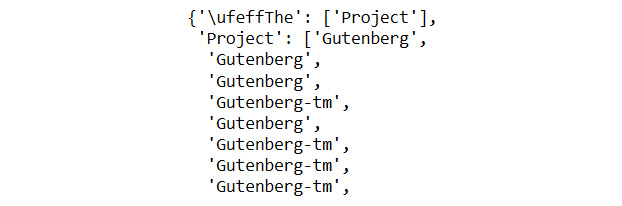


    We find that \"he\" is shown as a successor of \"who\" more than
    once. This is because this occurs more than once in the dataset. In
    effect, the number of times the successors occur in the list is
    proportional to their respective probabilities. Though it is not the
    only method, this is a convenient way to represent the successor
    function.

6.  Define the list of initial states. Then, define a function to select
    a random initial state from these and concatenate it with successor
    states. These successor states are randomly selected from the list
    containing successor states for a specific current state. Add the
    following code to do this:


    ```
    initial_states=['The','A','I','He','She','If',\
                    'This','Why','Where']
    def generate_words(k=5):
        initial_state=random.choice(initial_states)
        current_state=initial_state
        text=current_state+' '
        for i in range(k):
            succ_state=random.choice(succ_func[current_state])
            text=text+succ_state+' '
            current_state=succ_state
        print(text.split('.')[0])
    ```


7.  Insert a new cell and add the following code to generate text
    containing 10 phrases of four words (including the initial word) and
    10 phrases of five words (including the initial word):

    ```
    for k in range(3,5):
        for j in range(10):
            generate_words(k)
    ```


    The preceding code generates the following output:
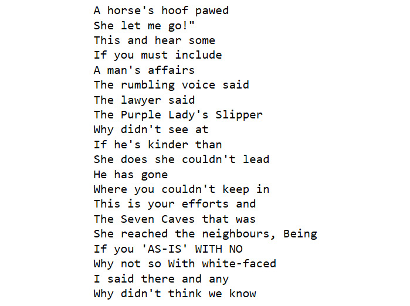


**Note**


It\'s quite interesting that we are able to generate text using a random
walk over a Markov chain. If we look more closely, we will see that only
a few of the phrases make sense. Broadly speaking, we are generating
text that has an element of Robert Frost\'s style. However, it can
hardly be said to correspond to a thought of any kind.

The practical utility of generating text using a Markov chain is
somewhat limited to generating spam (spam generators could use a Markov
chain) and generating something that is a little amusing. Nevertheless,
this exercise demonstrates the surprising results we can get by using a
simple approach in which nothing about the structure of a language is
explicitly taught to the machine.

In general, auto-complete is one positive use case and arguably the sole
positive use case for text generation given that other use cases
(besides spam) tend to include the generation of misinformation.

Paraphrasing involves replacing some text with different text that has
the same meaning. Now, intuitively, a machine will be able to tell
whether one piece of text is a paraphrase of another, but only if that
machine understands the meaning. So, one way of checking whether a
machine understands the meaning of a piece of text is to check if it can
tell if another different piece of text is a paraphrase of that first
text.

Benchmark datasets provide a standard touchstone for evaluating
approaches to solve a problem. The approaches are typically ranked in a
publicly available leaderboard. Even in the case of such benchmark
datasets, as of February 21, 2020, the SuperGLUE leaderboard
(<https://super.gluebenchmark.com/leaderboard>) sets human baselines at
the top when considered across a variety of tasks. This means that
humans are superior at paraphrasing than the most sophisticated
approaches even on the specified datasets. Paraphrasing is even tougher
outside of benchmark datasets because it is tougher to teach models in a
more general way so that the model is as effective for other datasets.
Thus, compared to machines, humans can paraphrase even better on other
datasets than machines can. In short, paraphrasing using NLP is
challenging and is currently of limited practical utility to the
practitioner. In the next section, we will learn about summarization.


Text Summarization
==================


Automated text summarization is the process of using NLP tools to
produce concise versions of text that preserve the key information
present in the original content. Good summaries can communicate the
content with less text by retaining the key information while filtering
out other information and noise (or useless text, if any). A shorter
text may often take less time to read, and thus summarization
facilitates more efficient use of time.

The type of summarization that we are typically taught in school is
abstractive summarization. One way to think of this is to consider
abstractive summarization as a combination of understanding the meaning
and expressing it in fewer sentences. It is usually considered as a
supervised learning problem as the original text and the summary are
both required. However, a piece of text can be summarized in more than
one way. This makes it hard to teach the machine in a general way. While
abstractive summarization is an active area of research, it is, for the
time being, not at a stage that will be of interest to the practitioner.

There is another form of summarization, called extractive summarization,
in which parts of the text are extracted to form a summary. There is no
paraphrasing in this form of summarization. This second type will be the
focus of the remainder of this section. We will look at the TextRank
algorithm, which is an unsupervised machine learning method. For
simplicity, we will focus on single-document summarization in this
lab. To implement this, we will be using the gensim library.

TextRank
--------

TextRank is a graph-based algorithm (developed by Rada Mihalcea and Paul
Tarau) used to find the key sentences in a piece of text. As we already
know, in graph theory, a graph has nodes and edges. In the TextRank
algorithm, we estimate the importance of each sentence and create a
summary with the sentences that have the highest importance.

The TextRank algorithm works as follows:

1.  Represent a unit of text (say, a sentence) as a node.

2.  Each node is given an arbitrary importance score.

3.  Each edge has a weight that corresponds to the similarity between
    two nodes (for instance, the sentences `Sx` and
    `Sy`). The weight could be the number of common words
    (say, *w*[k]{.subscript}) in the two sentences divided by the sum of
    the number of words in the two sentences. This can be represented as
    follows:
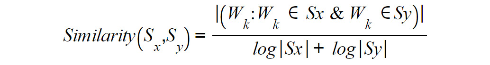


4.  For each node, we compute a new importance score, which is a
    function of the importance score of the neighboring nodes and the
    edge weights (*w*[ji]{.subscript}) between them. Specifically, the
    function (*f*) could be the edge-weighted average score of all the
    neighboring nodes that are directed toward that node that is
    adjusted by all the outward edge weights (*w*[jk]{.subscript}) and
    the damping factor (*d*). This can be represented as follows:
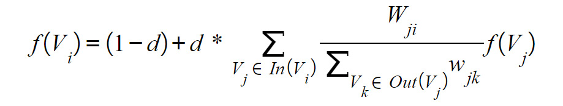


    *d*=0.85 is typically used as the damping factor. While we have used
    a directed graph here, an undirected graph could also be used with a
    TextRank algorithm.

5.  We repeat the preceding step until the importance score varies by
    less than a pre-defined tolerance level in two consecutive
    iterations.

6.  Sort the nodes in decreasing order of the importance scores.

7.  The top *n* nodes give us a summary.

The number of iterations required for convergence depends on the number
of nodes and the connectedness among the nodes. The number of iterations
required for an undirected graph is expected to be higher than the
number of iterations required for a directed graph since the edges
don\'t have a direction in the case of the former. We typically use a
directed graph in the TextRank algorithm. In general, around 20-40
iterations may be required for convergence. We can drop edges that have
less than a certain threshold weight for faster convergence since they
won\'t have much of an impact on the result anyway. The basic concept
underpinning the TextRank algorithm is that key parts of a document are
connected to form a coherent summary.


Key Input Parameters for TextRank
=================================


We\'ll be using the gensim library to implement TextRank. The following
are the parameters required for this:

-   `text`: This is the input text.
-   `ratio`: This is the required ratio of the number of
    sentences in the summary to the number of sentences in the input
    text.

The gensim implementation of the TextRank algorithm uses BM25---a
probabilistic variation of TF-IDF---for similarity computation in place
of the similarity measure described in *step 3* of the algorithm. This
will be clearer in the following exercise, in which you will summarize
text using TextRank.

Exercise 7.02: Performing Summarization Using TextRank
------------------------------------------------------

In this exercise, we will use the classic short story, *After Twenty
Years* by O. Henry, which is available on Project Gutenberg, and the
first section of the Wikipedia article on Oscar Wilde. We will summarize
each text separately so that we have 20% of the sentences in the
original text and then have 25% of the sentences in the original text
using the gensim implementation of the TextRank algorithm. In all, we
shall extract and print four summaries.

In addition to these libraries, you will need to import the following:

```
from gensim.summarization import summarize
summarize(text,ratio=0.20)
```

In the preceding code snippet, `ratio=0.20` means that 20% of
the sentences from the original text will be used to create the summary.


Complete the following steps to implement this exercise:

1.  Open a Jupyter notebook.

2.  Insert a new cell and add the following code to import the necessary
    libraries and extract the required text from *After Twenty Years*:

    ```
    from gensim.summarization import summarize
    import wikipedia
    import re
    file_url_after_twenty=r'../data/ohenry/pg2776.txt'
    with open(file_url_after_twenty, 'r') as f:
            contents = f.read()
    start_string='AFTER TWENTY YEARS\n\n\n'
    end_string='\n\n\n\n\n\nLOST ON DRESS PARADE'
    text_after_twenty=contents[contents.find(start_string):\
                               contents.find(end_string)]
    text_after_twenty=text_after_twenty.replace('\n',' ')
    text_after_twenty=re.sub(r"\s+"," ",text_after_twenty)
    text_after_twenty
    ```


    The preceding code generates the following output:
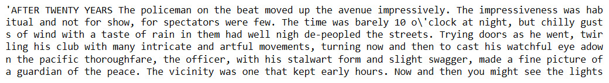


3.  Add the following code to extract the required text and print the
    summarized text, with the `ratio` parameter set to
    `0.2`:

    ```
    summary_text_after_twenty=summarize(text_after_twenty, \
                                        ratio=0.2)
    print(summary_text_after_twenty)
    ```


    The preceding code generates the following output:
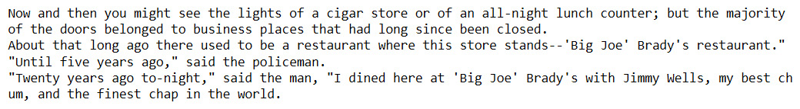


4.  Insert a new cell and add the following code to summarize the text
    and print the summarized text, with the `ratio` parameter
    set to `0.25`:

    ```
    summary_text_after_twenty=summarize(text_after_twenty, \
                                        ratio=0.25)
    print(summary_text_after_twenty)
    ```


    The preceding code generates the following output:
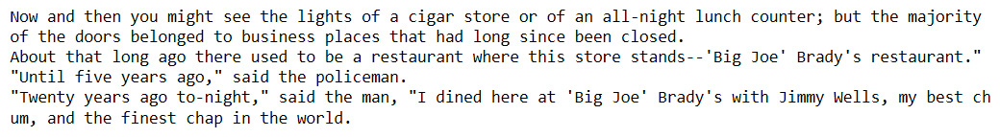


5.  Insert a new cell and add the following code to extract the required
    text from the Wikipedia page for Oscar Wilde:

    ```
    #text_wiki_oscarwilde=wikipedia.summary("Oscar Wilde")
    file_url_wiki_oscarwilde=r'../data/oscarwilde/'\
                              'ow_wikipedia_sum.txt'
    with open(file_url_wiki_oscarwilde, 'r', \
              encoding='latin-1') as f:
            text_wiki_oscarwilde = f.read()
    text_wiki_oscarwilde=text_wiki_oscarwilde.replace('\n',' ')
    text_wiki_oscarwilde=re.sub(r"\s+"," ",text_wiki_oscarwilde)
    text_wiki_oscarwilde
    ```


    The preceding code generates the following output:
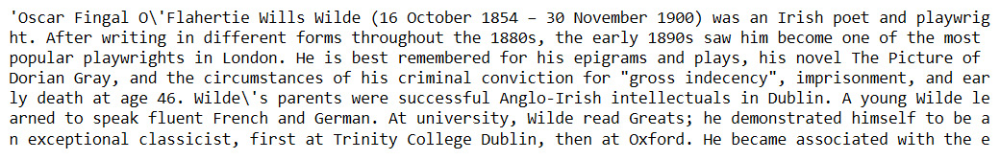


6.  Insert a new cell and add the following code to summarize the text
    and print the summarized text using `ratio=0.2`:

    ```
    summary_wiki_oscarwilde=summarize(text_wiki_oscarwilde, \
                                      ratio=0.2)
    print(summary_wiki_oscarwilde)
    ```


    The preceding code generates the following output:
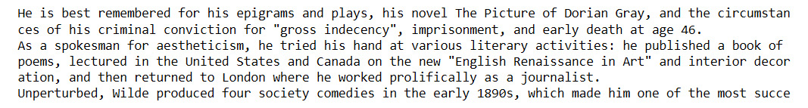


7.  Add the following code to summarize the text and print the
    summarized text using `ratio=0.25`:

    ```
    summary_wiki_oscarwilde=summarize(text_wiki_oscarwilde, \
                                      ratio=0.25)
    print(summary_wiki_oscarwilde)
    ```


    The preceding code generates the following output:
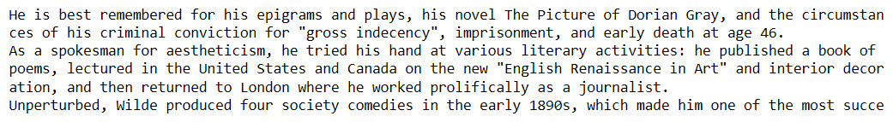


**Note**


We find that the summary for the Wikipedia article is much more coherent
than the short story. We can also see that the summary with a
`ratio` of `0.20` is a subset of a summary with a
`ratio` of `0.25`. Would extractive summarization
work better for a children\'s fairytale than it does for an O. Henry
short story? Let\'s explore this in the next exercise.

Exercise 7.03: Summarizing a Children\'s Fairy Tale Using TextRank
------------------------------------------------------------------

In this exercise, we consider the fairy tale *Little Red Riding Hood* in
two variations for the input texts. The first variation is from
*Children\'s Hour with Red Riding Hood and Other Stories*, edited by
Watty Piper, while the second variation is from *The Fairy Tales of
Charles Perrault*, both of which are available on Project Gutenberg\'s
website. The aim of this exercise is to explore how TextRank (gensim)
performs on this summarization.


Complete the following steps to implement this exercise:

1.  Open a Jupyter notebook.

2.  Insert a new cell and add the following code to import the required
    libraries:


    ```
    from gensim.summarization import summarize
    import re
    ```


3.  Insert a new cell and add the following code to fetch Watty Piper\'s
    version of *Little Red Riding Hood*:

    ```
    file_url_grimms=r'../data/littleredrh/pg11592.txt'
    with open(file_url_grimms, 'r') as f:
            contents_grimms = f.read()
    start_string_grimms='LITTLE RED RIDING HOOD\n\n\n'
    end_string_grimms='\n\n\n\n\nTHE GOOSE-GIRL'
    text_grimms=contents_grimms[contents_grimms.find(\
                                start_string_grimms):\
                                contents_grimms.find(\
                                end_string_grimms)]
    text_grimms=text_grimms.replace('\n',' ')
    text_grimms=re.sub(r"\s+"," ",text_grimms)
    text_grimms
    ```


    The preceding code generates the following output:
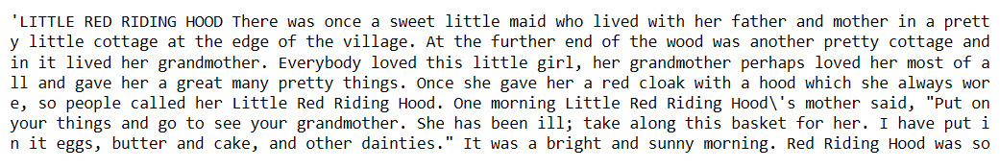

    Riding Hood

4.  Insert a new cell, add the following code, and fetch the Perrault
    fairy tale version of *Little Red Riding Hood*:

    ```
    file_url_perrault=r'../data/littleredrh/pg29021.txt'
    with open(file_url_perrault, 'r') as f:
            contents_perrault = f.read()
    start_string_perrault='Little Red Riding-Hood\n\n'
    end_string_perrault='\n\n_The Moral_'
    text_perrault=contents_perrault[contents_perrault.find(\
                                    start_string_perrault):\
                                    contents_perrault.find(\
                                    end_string_perrault)]
    text_perrault=text_perrault.replace('\n',' ')
    text_perrault=re.sub(r"\s+"," ",text_perrault)
    text_perrault
    ```


    The preceding code generates the following output:
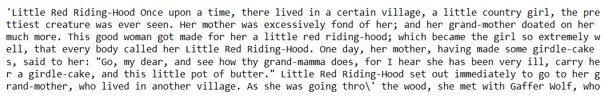

    Hood

5.  Insert a new cell and add the following code to generate the two
    summaries with a `ratio` of `0.20`:


    ```
    llrh_grimms_textrank=summarize(text_grimms,ratio=0.20)
    llrh_perrault_textrank=summarize(text_perrault,ratio=0.20)
    ```


6.  Insert a new cell and add the following code to print the TextRank
    summary (`ratio` of `0.20`) of Grimm\'s version
    of *Little Red Riding Hood*:

    ```
    print(llrh_grimms_textrank)
    ```


    The preceding code generates the following output:
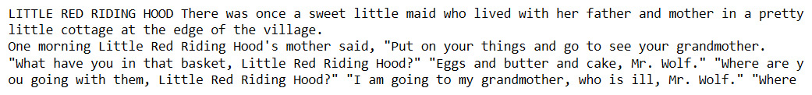

    variation

7.  Insert a new cell and add the following code to print the TextRank
    summary (`ratio` of `0.20`) of Perrault\'s
    version of *Little Red Riding Hood*:

    ```
    print(llrh_perrault_textrank)
    ```


    The preceding code generates the following output:
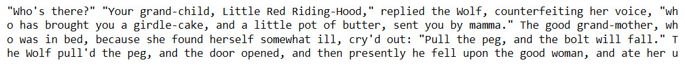

    version

8.  Add the following code to generate two summaries with a
    `ratio` of `0.5`:


    ```
    llrh_grimms_textrank=summarize(text_grimms,ratio=0.5)
    llrh_perrault_textrank=summarize(text_perrault,ratio=0.5)
    ```


9.  Add the following code to print a TextRank summary
    (`ratio` of `0.5`) of Piper\'s version of
    *Little Red Riding Hood*:

    ```
    print(llrh_grimms_textrank)
    ```


    The preceding code generates the following output:
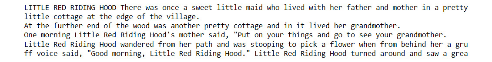

10. Add the following code to print a TextRank summary
    (`ratio` of `0.5`) of Perrault\'s version of
    *Little Red Riding Hood*:

    ```
    print(llrh_perrault_textrank)
    ```


    The preceding code generates the following output:
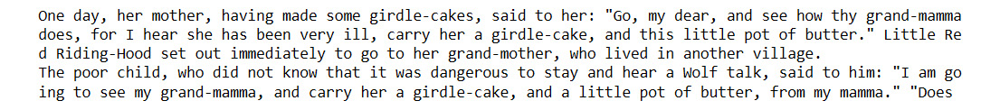


**Note**


With this, we\'ve found that the four summaries lack coherency and are
also incomplete. This is also true of the two summaries with a
`ratio` of `0.5`---that is, even when half of the
sentences are extracted for the summary. This might be because the
conversations in the fairytale are contextual in nature, as a sentence
often refers to the preceding sentence(s). This contextual aspect of
language makes NLP complex for machines.

Interestingly, extractive summarization works much better for an O.
Henry short story such as *After Twenty Years* than it does for a
children\'s fairytale such as *Little Red Riding Hood*. Furthermore,
this is not specific to the language used by a specific author, as we
have explored with two different variations of this fairytale. It seems
a fairytale is unsuitable for extractive summarization. Lets now do an
activity in which we\'ll use the TextRank algorithm to summarize
complaints that customers have written against some organizations.

Activity 7.01: Summarizing Complaints in the Consumer Financial Protection Bureau Dataset
-----------------------------------------------------------------------------------------

The Consumer Financial Protection Bureau publishes consumer complaints
made against organizations in the financial sector. This original
dataset is available at
<https://www.consumerfinance.gov/data-research/consumer-complaints/#download-the-data>.
To complete this activity, you will summarize a few complaints using
TextRank.

**Note**

To complete the activity, you will need the `.csv` file in the `data` folder for this lab in your localdirectory.

Follow these steps to implement this activity:

1.  Import the summarization libraries and instantiate the summarization
    model.
2.  Load the dataset from a `.csv` file into a pandas
    DataFrame. Drop all columns other than `Product`,
    `Sub-product`, `Issue`, `Sub-issue`,
    and `Consumer complaint narrative`.
3.  Select 12 complaints corresponding to the rows `242830`,
    `1086741`, `536367`, `957355`,
    `975181`, `483530`, `950006`,
    `865088`, `681842`, `536367`,
    `132345`, and `285894` from the 300,000 odd
    complaints with a narrative. **Note** that since the dataset is an
    evolving dataset, the use of a version that\'s different from the
    one in the `data` folder could give different results
    because the input texts could be different.
4.  Add a column with the TextRank summary. Each element of this column
    corresponds to a summary, using TextRank, of the complaint narrative
    in the corresponding column. Use a `ratio` of
    `0.20`. Also, use a `try-except` clause since
    the gensim implementation of the TextRank algorithm throws
    exceptions with summaries that have very few sentences.
5.  Show the DataFrame. You should get an output similar to the
    following figure:

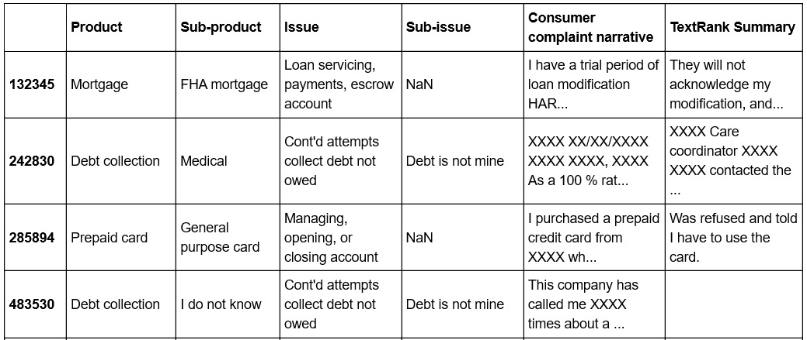


**Note**

The full solution to this activity can be found below.


Recent Developments in Text Generation and Summarization
========================================================


Alan Turing (for whom the equivalent of the Nobel Prize in Computer
Science is named) proposed a test for artificial intelligence in 1950.
This test, known as the Turing Test, says that if humans ask questions
and cannot distinguish between text responses generated by a machine and
a human, then that machine can be deemed to be intelligent.

Text generation using very large models, such as the GPT-2 (with around
1.5 billion parameters) and **BERT** (**Bidirectional Encoder
Representation from Transformers**) (with around 340 million
parameters), can aid in auto-completion tasks. Auto-completion presents
unique ethical challenges. While it can offer convenience, it can also
reinforce biases in the data. This is accentuated by the fact that most
user experience layouts can show only a limited number of options.
Furthermore, auto-completion can controversially suggest responses that
are different from what the sender originally wants to type.

Unfortunately, most use cases for text generation are negative use cases
for generating spam and misinformation. Given that the Turing Test may
not be passed any time soon, we are clearly nowhere near considering
text generation as a proxy for thought within a machine and there is no
widely accepted benchmark for text generation.

Since late 2018, with the invention of self-attention, transformers, and
BERT, these approaches are generally considered the best way to teach a
machine about some of the most challenging NLP tasks. Self-attention is
a technique in which a word is combined with other words in its
neighborhood by matrix multiplications. Such multiplications are
possible because of vector representations of words. Using such combined
representations for all the words in a sentence allows us to represent a
sentence in a way that captures context. This allows us to build much
larger models that have a significantly higher capacity to learn. A
transformer is a combination of attention units and includes position
information for each word, that is, multiple self-attention layers and
position information are used to capture the context better.

BERT is a transformer that learns the sequential structure of a text in
both directions, that is, from left to right and from right to left.
This is achieved by randomly masking the words while the model is
trained, much like how children are often taught a language by using
fill-in-the-blanks exercises. Such is the generalized learning of BERT
that it can be used even for translation-related tasks, even though it
has not been specifically taught translation as a task. BERT and other
large models, such as GPT-2, require a huge computing infrastructure,
which is generally not available to most people outside of leading
universities and the biggest technology corporations. Pre-trained models
fill the void in such cases. The TextRank algorithm considers each
sentence to be a bag of words. With the advent of BERT, it is possible
for us to have a superior sentence representation that captures meaning
much better than the bag of words model.

In the case of summarization, even though there is a benchmark called
**Recall-Oriented Understudy for Gisting Evaluation** (**ROUGE**),
summarization is best evaluated qualitatively given that there isn\'t
only one correct way to summarize text. In February 2020, Microsoft\'s
Turing NLG model, which has 17 billion parameters, generated abstractive
summaries for three examples, which were shared publicly. However, the
model is not publicly available currently and so the results cannot be
reproduced.

Furthermore, we don\'t know how the Microsoft NLG model does with a
naïve test such as the Little Red Riding Hood test. In general,
extractive summarization of the kind discussed earlier in this lab
is by far the most useful for practitioners compared with the utility of
the state-of-the-art technology in text generation and paraphrasing. Due
to this, in the next section, we\'ll largely focus on practical
challenges in extractive summarization.


Practical Challenges in Extractive Summarization
================================================


Given the rapid pace of development in NLP, it is even more important to
use compatible versions of the libraries that we use. Evaluation of a
document\'s suitability for extractive summarization can be undertaken
manually. Often, we would like to summarize multiple pieces of text, all
of which could be short in length. The TextRank algorithm will not work
well in such cases.

All unverified claims reported in this field ought to be taken with a
grain of salt until the claim has been verified. Such claims ought to be
subjected by practitioners to naïve tests such as the Little Red Riding
test. We can only use a model if it works and if the limitations related
to scope and any biases are considered.


Summary
=======


In this lab, we learned about text generation using Markov chains
and extractive summarization using the TextRank algorithm. We also
explored both the power and limitations of various advanced approaches.
In the next lab, we will learn about sentiment analysis.

