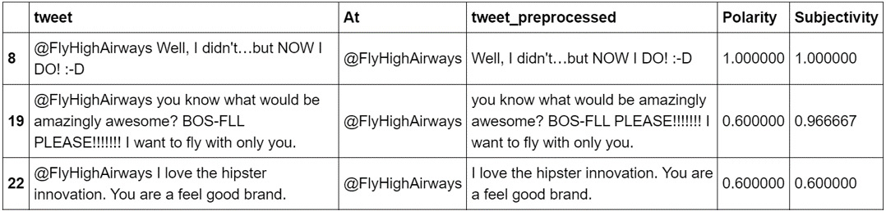
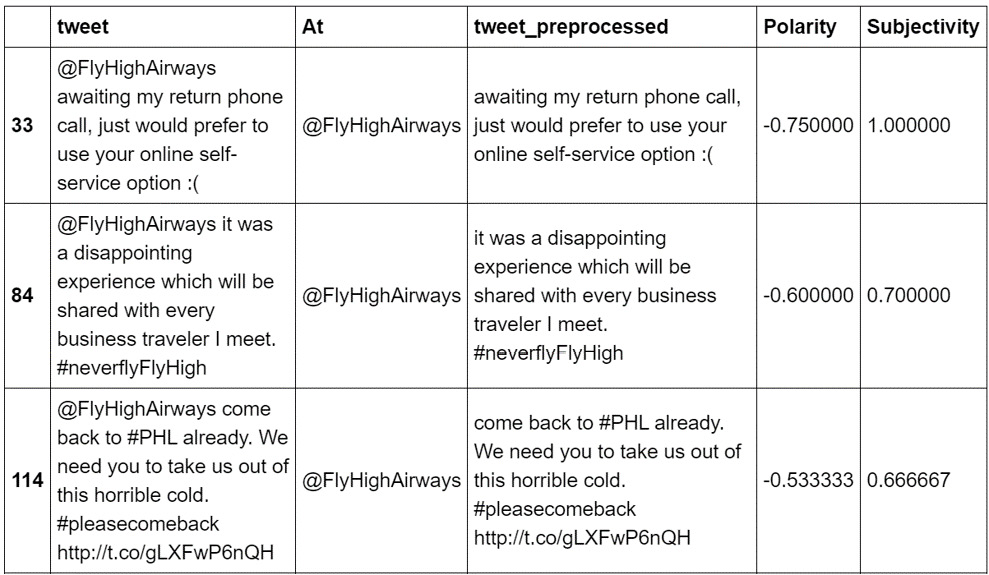
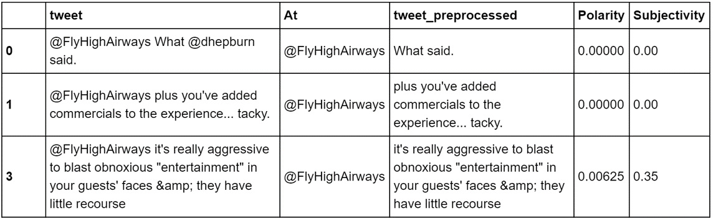
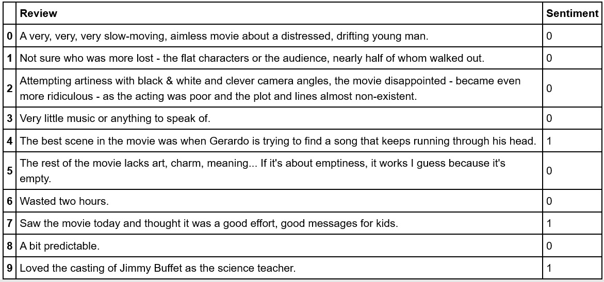
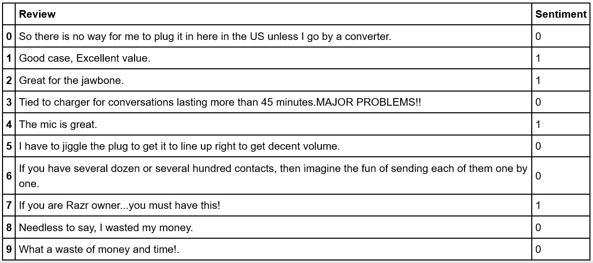
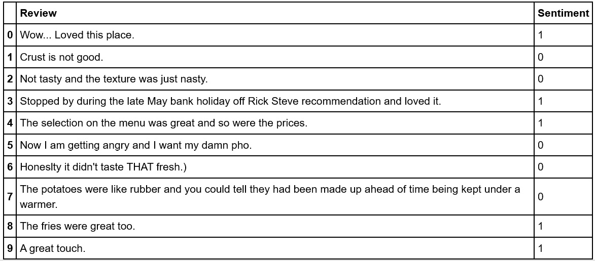

Lab 8. Sentiment Analysis
==========================


Overview

This lab introduces you to one of the most exciting applications of
natural language processing---that is, sentiment analysis. You will
explore the various tools used to perform sentiment analysis, such as
popular NLP libraries and deep learning frameworks. You will then
perform sentiment analysis on given text data using the powerful
`textblob` library. You will load textual data and perform
preprocessing on it to fine-tune the results of your sentiment analysis
program. By the end of the lab, you will be able to train a
sentiment analysis model.


Introduction
============


In the previous lab, we looked at text generation, paraphrasing, and
summarization, all of which can be immensely useful in helping us focus
on only the essential and meaningful parts of the text corpus. This, in
turn, helps us to further refine the results of our NLP project. In this
lab, we will look at **sentiment analysis**, which, as the name
suggests, is the area of NLP that involves teaching computers how to
identify the sentiment behind written content or parsed audio---that is,
audio converted to text. Adding this ability to automatically detect
sentiment in large volumes of text and speech opens new possibilities
for us to write useful software.

In sentiment analysis, we try to build models that detect how people
feel. This starts with determining what kind of feeling we want to
detect. Our application may attempt to determine the level of human
emotion (most often, whether a person is sad or happy; satisfied or
dissatisfied; or interested or disinterested and so on). The common
thread here is that we measure how sentiments vary in different
directions. This is also called polarity. Polarity signifies the
emotions present in a sentence, such as joy or anger. For example, \"I
love oranges\" implies an emotionally positive statement, whereas \"I
hate politics\" is a strong negative emotion.


Why Is Sentiment Analysis Required?
-----------------------------------

In machine learning projects, we try to build applications that work
similarly to a human being. We measure success in part by seeing how
close our application is to matching human-level performance. Generally,
machine learning programs cannot exceed human-level performance by a
significant margin---especially if our training data source is
human-generated.

Let\'s say that we want to carry out a sentiment analysis of product
reviews. The sentiment analysis program should detect how reviewers
feel. Obviously, it is impractical for a person to read thousands of
movie reviews. This is where automated sentiment analysis enters the
picture. Artificial intelligence is useful when it is impractical for
people to perform the task. In this case, the task is reading thousands
of reviews.


The Growth of Sentiment Analysis
--------------------------------

The field of sentiment analysis is driven by a few main factors.
Firstly, it\'s driven by the rapid growth in online content that\'s used
by companies to understand and respond to how people feel. Secondly,
since sentiment drives human decisions, businesses that understand their
customers\' sentiments have a major advantage in predicting and shaping
purchasing decisions. Finally, NLP technology has improved
significantly, allowing the much wider application of sentiment
analysis.


The Monetization of Emotion
---------------------------

The growth of the internet and internet services has enabled new
business models to work with human connection, communication, and
sentiment. In January 2020, Facebook had about 61.3% of the social media
traffic and has been one of the most successful social media platforms
at connecting people across the world and providing features that enable
users to express their thoughts and post memorable moments from their
life online. Similarly, although Twitter had just 14.51% of the traffic,
it has still proved to be an influential way to display sentiment
online.

There are now large amounts of information on social media about what
people like or dislike. This data is of significant value not only in
business but also in political campaigns. This means that sentiment has
significant business value and can be monetized.


Types of Sentiments
-------------------

There are various sentiments that we can try to detect in language
sources. Let\'s discuss a few of them in detail.


### Emotion

Sentiment analysis is often used to detect the emotional state of a
person. It checks whether the person is happy or sad, or content or
discontent. Businesses often use it to improve customer satisfaction.
For example, let\'s look at the following statement:

\"I thought I would have enjoyed the movie, but it left me feeling that
it could have been better.\"

In this statement, it seems as though the person who has just watched a
movie is unhappy about it. A sentiment detector, in this case, would be
able to classify the review as negative and allow the business (the
movie studio, for instance) to adjust how they make movies in the
future.

**Action Orientation versus Passivity**

This is about whether a person is prone to action or not. This is often
used to determine how close a person is to making a choice. For example,
using a travel reservation chatbot, you can detect whether a person
needs to make a reservation urgently or is simply making passive queries
and is therefore less likely to book a ticket right now. The level of
action orientation or passivity provides additional clues to detect
intention. This can be used to make smart business decisions.

**Tone**

Speech and text are often meant to convey certain impressions that are
not necessarily factual and not entirely emotional. Examples of this are
sarcasm, irony, and humor. This may provide useful additional
information about how a person thinks. Although tone is tricky to
detect, there might be certain words or phrases that are often used in
certain contexts. We can use NLP algorithms to extract statistical
patterns from document sources. For example, we can use sentiment
analysis to detect whether a news article is sarcastic.

**Subjectivity versus Objectivity**

You may want to detect whether the given text source is subjective or
objective. For example, you might want to detect whether a person has
issued and expressed an opinion, or whether their statement reads more
like a fact and can only be true or false. Let\'s look at the following
two statements to get a better understanding:

-   Statement 1: \"The duck was overcooked, and I could hardly taste the
    flavor.\"
-   Statement 2: \"Ducks are aquatic birds.\"

In these two statements, statement 1 should be recognized as a
subjective opinion and statement 2 as an objective fact. Determining the
objectivity of a statement helps us decide on the appropriate response
to the statement.


Key Ideas and Terms
-------------------

Let\'s look at some of the key ideas and terms that are used in
sentiment analysis.

**Classification**

As we learned in *Lab 3*, *Developing a Text Classifier*,
classification is the NLP technique of assigning one or more classes to
text documents. This helps in separating and sorting the documents. If
you use classification for sentiment analysis, you assign different
sentiment classes such as positive, negative, or neutral. Sentiment
analysis is a type of text classification that aims to create a
classifier trained on a set of labeled pairs -- text and its
corresponding sentiment (label). Upon training such a classifier on a
large labeled dataset, the sentiment analysis model generalizes well and
can classify unseen text into appropriate sentiment categories.

**Supervised Learning**

As we have already seen, in **supervised learning**, we create a model
by supplying data and labeled targets to the training algorithms. The
algorithms learn using this supply. When it comes to sentiment analysis,
we provide the training dataset with the labels that represent the
sentiment. For example, for each text in a dataset, we would assign a
value of 1 if the sentiment is positive, and a value of 0 if the
statement is negative.

**Polarity**

Polarity is a measure of how negative or positive the sentiment is in a
given language. Polarity is used because it is simple and easy to
measure and can be easily translated to a simple numeric scale. It
usually ranges between -1 and 1. Values close to 1 reflect documents
that have positive sentiments, whereas values close to -1 reflect
documents that have negative sentiments. Values around 0 reflect
documents that are neutral in sentiment.

It\'s worth noting that the polarity detected by a model depends on how
it has been trained. On political Reddit threads, the opinions tend to
be highly polarized. On the other hand, if you use the same model on
business documents to measure sentiments, the scores tend to be neutral.
So, you need to choose models that are trained in similar domains.

**Intensity**

In contrast to polarity, which is measured from negative to positive,
intensity is measured in terms of arousal, which ranges from low to
high. Most often, the level of intensity is included in the sentiment
score. It is measured by looking at the closeness of the score to 0 or
1.


Applications of Sentiment Analysis
----------------------------------

There are various applications of sentiment analysis.

**Financial Market Sentiment**

Financial markets operate partially on economic fundamentals but are
also heavily influenced by human sentiment. Stock market prices, which
tend to rise and fall, are influenced by the opinions of news articles
regarding the overall market or any specific securities.

Financial market sentiment helps measure the overall attitude of
investors toward securities. Market sentiment can be detected using news
or social media articles. We can use NLP algorithms to build models that
detect market sentiment and use those models to predict future market
prices.

**Product Satisfaction**

Sentiment analysis is commonly used to determine how customers feel
about products and services. For example, Amazon makes use of its
extensive product reviews dataset. This not only helps to improve its
products and services but also acts as a source of training data for its
sentiment analysis services.

**Social Media Sentiment**

A really useful area of focus for sentiment analysis is social media
monitoring. Social media has become a key communication medium with
which most people around the world interact every day, and so there is a
large and growing source of human language data available there. More
importantly, the need for businesses and organizations to be able to
process and understand what people are saying on social media has only
increased. This has led to an exponential growth in demand for sentiment
analysis services.

**Brand Monitoring**

A company\'s brand is a significant asset and companies spend a lot of
time, effort, and money maintaining their brand value. With the growth
of social media, companies are now exposed to considerable potential
brand risks from negative social media conversations. On the other hand,
there is also the potential for positive brand growth from positive
interactions and messages on social media. For this reason, businesses
deploy people to monitor what is said about them and their brands on
social media. Automated sentiment analysis makes this significantly
easier and also more efficient.

**Customer Interaction**

Organizations often want to know how their customers feel during an
interaction in an online chat or a phone conversation. In such cases,
the objective is to detect the level of satisfaction with the service or
the products. Sentiment analysis tools help companies handle large
volumes of text and voice data that are generated during customer
interaction. Every company, irrespective of the domain, wants to utilize
the data at their disposal to glean valuable insights, as there is
potential revenue to be had if companies can gain insights into customer
satisfaction.


Tools Used for Sentiment Analysis
=================================


There are a lot of tools capable of analyzing sentiment. Each tool has
its advantages and disadvantages. We will look at each of them in
detail.


NLP Services from Major Cloud Providers
---------------------------------------

Online sentiment analysis is carried out by all major cloud services
providers, such as Amazon, Microsoft, Google, and IBM. You can usually
find sentiment analysis as a part of their text analysis services or
general machine learning services. Online services offer the convenience
of packaging all the necessary algorithms behind the provider\'s API.
These algorithms are capable of performing sentiment analysis. To use
such services, you need to provide the text or audio sources, and in
return, the services will provide you with a measure of the sentiment.
These services usually return a standard, simple score, such as
positive, negative, or neutral. The score usually ranges between 0 and
1.

The following are the advantages and disadvantages of NLP services from
major cloud providers:

**Advantages**

-   You require almost no knowledge of NLP algorithms or sentiment
    analysis. This results in fewer staffing needs.
-   Sentiment analysis services provide their own computation, reducing
    your own computational infrastructure needs.
-   Online services can scale well beyond what regular companies can do
    on their own.
-   You gain the benefits of automatic improvements and updates to
    sentiment analysis algorithms and data.

**Disadvantages**

-   Online services require---at least temporarily---a reduction in
    privacy since you must provide the documents to be analyzed by the
    service. Depending on your project\'s privacy needs, this may or may
    not be acceptable. There might also be laws that restrict data
    crossing into another national jurisdiction.
-   The service provided by cloud providers is like
    one-solution-fits-all and is considered very generic, so it won\'t
    necessarily apply to niche use cases.


Online Marketplaces
-------------------

Recently, AI marketplaces have emerged that offer different algorithms
from third parties. Online marketplaces differ from cloud providers. An
online marketplace allows third-party developers to deploy sentiment
analysis services on their platform.

Here are the advantages and disadvantages of online marketplaces:

**Advantages**

-   AI marketplaces provide the flexibility of choosing between
    different sentiment analysis algorithms instead of just one
    algorithm. This enables users to try out different techniques and
    see which one fits their business needs the best.
-   Using algorithms from an AI marketplace reduces the need for
    dedicated data scientists for your project.

**Disadvantages**

-   Algorithms from third parties are of varying quality.
-   Since the algorithms are provided by smaller companies, there is no
    guarantee that they won\'t disappear. And for businesses, this is a
    big risk since their solution has a direct dependency on a third
    party that is outside their control.


Python NLP Libraries
--------------------

There are a few NLP libraries that need to be integrated into your
project instead of being called upon as services. These are called
dedicated NLP libraries and they usually include many NLP algorithms
from academic research. Sophisticated NLP libraries used across the
industry are spaCy, gensim, and AllenNLP.

Here are the advantages and disadvantages of Python NLP libraries:

**Advantages**

-   It\'s usually state-of-the-art research that goes into these
    libraries, and they usually have well-chosen datasets.
-   They provide a framework that makes it much easier to build projects
    and do rapid experiments.
-   They offer out-of-the-box abstractions that are required for all NLP
    projects, such as Token and Span.
-   They are easy to scale to real-world deployment.

**Disadvantages**

-   This won\'t be considered a true disadvantage since libraries are
    meant to be general-purpose, but for complex use cases, developers
    would have to write their own implementations as required.


Deep Learning Frameworks
------------------------

Deep learning libraries such as PyTorch and TensorFlow are meant to be
used to build complex models for a wide range of applications, not
limited to just NLP. These libraries provide you with more advanced
algorithms and mathematical functions, helping you develop powerful and
complex models.

The advantages and disadvantages of these frameworks are explained here:

**Advantages**

-   You have the flexibility to develop your sentiment analysis model to
    meet complex business needs.
-   You can integrate the latest and the most advanced algorithms when
    they are available in general-purpose libraries.
-   You can make use of transfer learning, which takes a model trained
    on a large text source, to fine-tune the training as per your
    project\'s needs. This allows you to create a sentiment analysis
    model that is more suitable for your needs.

**Disadvantages**

-   This approach requires you to have in-depth knowledge of machine
    learning and complex topics such as deep learning.
-   Deep learning libraries require a large volume of rich annotated
    datasets along with an intense computational infrastructure to train
    and experiment with different modeling techniques to get a
    generalized model that\'s fit to be deployed in production. So,
    there is a requirement for training on non-CPU hardware such as
    GPUs/TPUs.

Now that we\'ve learned about the various tools available for sentiment
analysis, let\'s explore the most popular Python libraries.


The textblob library
====================


`textblob` is a Python library used for NLP, as we\'ve seen in
the previous chapters. It has a simple API and is probably the easiest
way to begin with sentiment analysis. `textblob` is built on
top of the NLTK library but is much easier to use. In the following
sections, we will do an exercise and an activity to get a better
understanding of how we can use `textblob` for sentiment
analysis.


Exercise 8.01: Basic Sentiment Analysis Using the textblob Library
------------------------------------------------------------------

In this exercise, we will perform sentiment analysis on a given text.
For this, we will be using the `TextBlob` class of the
`textblob` library. Follow these steps to complete this
exercise:

1.  Open a Jupyter notebook.

2.  Insert a new cell and add the following code to implement to import
    the `TextBlob` class from the `textblob`
    library:


    ```
    from textblob import TextBlob
    ```


3.  Create a variable named `sentence` and assign it a string.
    Insert a new cell and add the following code to implement this:


    ```
    sentence = "but you are Late Flight again!! "\
               "Again and again! Where are the  crew?" 
    ```


4.  Create an object of the `TextBlob` class. Add
    `sentence` as a parameter to the `TextBlob`
    container. Insert a new cell and add the following code to implement
    this:


    ```
    blob = TextBlob(sentence)
    ```


5.  In order to view the details of the `blob` object, insert
    a new cell and add the following code:


    ```
    print(blob)
    ```


    The code generates the following output:


    ```
    but you are Late Flight again!! Again and again! Where are the crew?
    ```


6.  To use the `sentiment` property of the
    `TextBlob` class (which returns a tuple), insert a new
    cell and add the following code:


    ```
    blob.sentiment
    ```


    The code generates the following output:


    ```
    Sentiment(polarity=—0.5859375, subjectivity=0.6
    ```


    **Note**

    

In the code, we can see the `polarity` and
`subjectivity` scores for a given text. The output indicates a
polarity score of -0.5859375, which means that negative sentiment has
been detected in the text. The subjectivity score means that the text is
somewhat on the subjective side, though not entirely subjective. We have
performed sentiment analysis on a given text using the
`textblob` library. In the next section, we will perform
sentiment analysis on tweets about airlines.


Activity 8.01: Tweet Sentiment Analysis Using the textblob library
------------------------------------------------------------------

In this activity, you will perform sentiment analysis on tweets related
to airlines. You will also be providing condition for determining
positive, negative, and neutral tweets, using the `textblob`
library.

**Note**

You can find the data to be used for this activity here:


Follow these steps to implement this activity:

1.  Import the necessary libraries.
2.  Load the CSV file.
3.  Fetch the `text` column from the DataFrame.
4.  Extract and remove the handles from the fetched data.
5.  Perform sentiment analysis and get the new DataFrame.
6.  Join both the DataFrames.
7.  Apply the appropriate conditions and view positive, negative, and
    neutral tweets.

After executing those steps, the output for positive tweets should be as
follows:

<div>





</div>

Figure 8.1: Positive tweets

As you can see from the preceding output, the `Polarity`
column shows a positive integer. This implies that the tweet displays
positive sentiment. The `Subjectivity` column indicates that
most tweets are found to be of a subjective nature.

The output for negative tweets is as follows:

<div>





</div>

Figure 8.2: Negative tweets

The preceding output shows a `Polarity` column with a negative
integer, implying that the tweet displays negative sentiment, while the
`Subjectivity` column shows a positive integer, which implies
the same as before---personal opinion or feeling.

The output for neutral tweets should be as follows:

<div>





</div>

Figure 8.3: Neutral tweets

The preceding output has a `Polarity` column and a
`Subjectivity` column with a zero or almost zero value. This
implies the tweet has neither positive nor negative sentiment, but
neutral; moreover, no subjectivity is detected for these tweets.

**Note**

The solution to this activity can be found below.

In the next section, we will explore more about performing sentiment
analysis using online web services.


Understanding Data for Sentiment Analysis
=========================================


Sentiment analysis is a type of **text classification**. Sentiment
analysis models are usually trained using **supervised datasets**.
Supervised datasets are a kind of dataset that is labeled with the
target variable, usually a column that specifies the sentiment value in
the text. This is the value we want to predict in the unseen text.


Exercise 8.02: Loading Data for Sentiment Analysis
--------------------------------------------------

In this exercise, we will load data that could be used to train a
sentiment analysis model. For this exercise, we will be using three
datasets---namely Amazon, Yelp, and IMDb.

**Note**

You can find the data being used in this exercise here:


Follow these steps to implement this exercise:

1.  Open a Jupyter notebook.

2.  Insert a new cell and add the following code to import the necessary
    libraries:


    ```
    import pandas as pd
    pd.set_option('display.max_colwidth', 200)
    ```


    This imports the `pandas` library. It also sets the
    display width to `200` characters so that more of the
    review text is displayed on the screen.

3.  To specify where the sentiment data is located, first load three
    different datasets from Yelp, IMDb, and Amazon. Insert a new cell
    and add the following code to implement this:


    ```
    DATA_DIR = 'data/sentiment_labelled_sentences/'
    IMDB_DATA_FILE = DATA_DIR + 'imdb_labelled.txt'
    YELP_DATA_FILE = DATA_DIR + 'yelp_labelled.txt'
    AMAZON_DATA_FILE = DATA_DIR + 'amazon_cells_labelled.txt'
    COLUMN_NAMES = ['Review', 'Sentiment']
    ```


    Each of the data files has two columns: one for the review text and
    a numeric column for the sentiment.

4.  To load the IMDb reviews, insert a new cell and add the following
    code:


    ```
    imdb_reviews = pd.read_table(IMDB_DATA_FILE, names=COLUMN_NAMES)
    ```


    In this code, the `read_table()` method loads the file
    into a DataFrame.

5.  Display the top `10` records in the DataFrame. Add the
    following code in the new cell:


    ```
    imdb_reviews.head(10)
    ```


    The code generates the following output:





    In the preceding figure, you can see that the negative reviews have
    sentiment scores of `0` and positive reviews have
    sentiment scores of `1`.

6.  To check the total number of records of the IMDb review file, use
    the `value_counts()` function. Add the following code in a
    new cell to implement this:


    ```
    imdb_reviews.Sentiment.value_counts()
    ```


    The expected output with total reviews should be as follows:


    ```
    1          386
    0          362
    Name:    Sentiment, dtype: int64
    ```


    In the preceding figure, you can see that the data file contains a
    total of `748` reviews, out of which `362` are
    negative and `386` are positive.

7.  Format the data by adding the following code in a new cell:


    ```
    imdb_counts = imdb_reviews.Sentiment.value_counts().to_frame()
    imdb_counts.index = pd.Series(['Positive', 'Negative'])
    imdb_counts
    ```


    The code generates the following output:


    We called `value_counts()`, created a DataFrame, and
    assigned `Positive` and `Negative` as index
    labels.

8.  To load the Amazon reviews, insert a new cell and add the following
    code:


    ```
    amazon_reviews = pd.read_table(AMAZON_DATA_FILE, \
                                   names=COLUMN_NAMES)
    amazon_reviews.head(10)
    ```


    The code generates the following output:





9.  To load the Yelp reviews, insert a new cell and add the following
    code:


    ```
    yelp_reviews = pd.read_table(YELP_DATA_FILE, \
                                 names=COLUMN_NAMES)
    yelp_reviews.head(10)
    ```


    The code generates the following output:





Figure 8.7: Reviews from the Yelp dataset

**Note**


We have learned how to load data that could be used to train a sentiment
analysis model. The review files mentioned in this exercise are an
example. Each file contains review text, plus a sentiment label for
each. This is the minimum requirement of a supervised machine learning
project: to build a model that is capable of predicting sentiments.
However, the review text cannot be used as is; it needs to be
preprocessed so that we can extract feature vectors out of it and
eventually provide it as input to the model.

Now that we have learned about loading the data, in the next section, we
will focus on training sentiment models.


Training Sentiment Models
=========================


The end product of any sentiment analysis project is a **sentiment
model**. This is an object containing a stored representation of the
data on which it was trained. Such a model has the ability to predict
sentiment values for text that it has not seen before. To develop a
sentiment analysis model, the following steps should be taken:

1.  The document dataset must be split into train and test datasets. The
    test dataset is normally a fraction of the overall dataset. It is
    usually between 5% and 40% of the overall dataset, depending on the
    total number of examples available. If the amount of data is too
    large, then a smaller test dataset can be used.
2.  Next, the text should be preprocessed by stripping unwanted
    characters, removing stop words, and performing other common
    preprocessing steps.
3.  The text should be converted to numeric vector representations in
    order to extract the features. These representations are used for
    training machine learning models.
4.  Once we have the vector representations, we can train the model.
    This will be specific to the type of algorithm being used. During
    the training, our model will use the test dataset as a guide to
    learn about the text.
5.  We can then use the model to predict the sentiment of documents that
    it has not seen before. This is the step that will be performed in
    production.

In the next section, we will train a sentiment model. We\'ll make use of
the `TfidfVectorizer` and `LogisticRegression`
classes, which we explored in one of the previous chapters.


Activity 8.02: Training a Sentiment Model Using TFIDF and Logistic Regression
-----------------------------------------------------------------------------

To complete this activity, you will build a sentiment analysis model
using the Amazon, Yelp, and IMDb datasets that you used in the previous
exercise. Use the TFIDF method to extract features from the text and use
logistic regression for the learning algorithm. The following steps will
help you complete this activity:

1.  Open a Jupyter notebook.

2.  Import the necessary libraries.

3.  Load the Amazon, Yelp, and IMDb datasets.

4.  Concatenate the datasets and take out a random sample of 10 items.

5.  Create a function for preprocessing the text, that is, convert the
    words into lowercase and normalize them.

6.  Apply the function created in the previous step on the dataset.

7.  Use `TfidfVectorizer` to convert the review text into
    TFIDF vectors and use the `LogisticRegression` class to
    create a model that uses logistic regression for the model. These
    should be combined into a `Pipeline` object.

8.  Now split the data into train and test sets, using 70% to train the
    data and 30% to test the data.

9.  Use the `fit()` function to fit the training data on the
    pipeline.

10. Print the accuracy score.

11. Test the model on these sentences: *\"I loved this place\"* and *\"I
    hated this place\"*.

    **Note**

    The full solution to this activity can be found below.


Summary
=======


We started our journey into NLP with basic text analytics and text
preprocessing techniques, such as tokenization, stemming, lemmatization,
and lowercase conversion, to name a few. We then explored ways in which
we can represent our text data in numerical form so that it can be
understood by machines in order to implement various algorithms. After
getting some practical knowledge of topic modeling, we moved on to text
vectorization, and finally, in this lab, we explored various
applications of sentiment analysis. This included different tools that
use sentiment analysis, from technologies available from online
marketplaces to deep learning frameworks. More importantly, we learned
how to load data and train our model to use it to predict sentiment.
